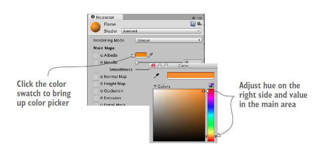
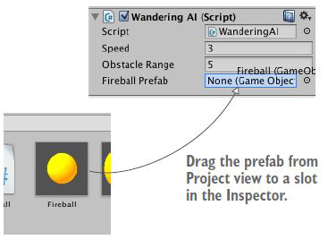

Con questo laboratorio, pensiamo alla creazione di un metodo per sparare tramite l'istanziazione di oggetti, creazione un prefabbricato di proiettili (come creare un materiale, sparare un proiettile e scontrarsi con un bersaglio), danneggiamento del giocatore e miglioramento del tuo prefabbricato con una particella.

## Consenti ai nemici di sparare
Aggiungi un'altra funzionalità ai nemici: facciamoli sparare. Il raycasting era solo uno degli approcci all'implementazione delle riprese: le riprese con il raycasting erano istantanee, registrando un colpo nel momento in cui si faceva clic con il mouse.

Un altro approccio prevede l'istanziazione di prefabbricati. Questa volta le riprese comporteranno un proiettile nella scena: in questo caso i nemici emetteranno "palle di fuoco" che volano in aria.

## Le "palle di fuoco" del nemico
Le palle di fuoco si muoveranno velocemente, ma non saranno istantanee, dando al giocatore la possibilità di schivarle. Invece di usare il raycasting, utilizzeremo il rilevamento delle collisioni.

Il codice genererà palle di fuoco nello stesso modo in cui si generano i nemici, istanziando il prefabbricato: quindi il primo passo è creare un oggetto nella scena che diventerà il prefabbricato. Creiamo la nostra palla di fuoco (una sfera chiamata "Fireball").

## Materiale per palle di fuoco
Non vogliamo solo una sfera grigia, vogliamo una "palla di fuoco", per questo daremo alla nostra sfera un colore arancione.

Le proprietà della superficie poiché il colore sono controllate dai materiali: un materiale è un pacchetto di informazioni che definisce le proprietà della superficie di qualsiasi oggetto 3D. Queste proprietà possono includere anche il colore.

Crea il nostro materiale in *Assets* e assegnagli il nome “Fiamma”.

## Impostazione del materiale
Seleziona il colore etichettato *Albedo* (termine tecnico che si riferisce al colore principale di una superficie) e usa il selettore colore.



Aggiungi il materiale alla nostra sfera nel componente *Mesh Renderer*. Ora puoi trasformare l'oggetto palla di fuoco in un prefabbricato trascinando l'oggetto in basso da *Hierarchy* a *Project*. Ora abbiamo il nostro proiettile!

## Sparare il proiettile
Facciamo alcuni aggiustamenti al nostro nemico per emettere palle di fuoco. Proprio come lo script *ReactiveTarget* (per il nemico), ora avremo bisogno di un nuovo script per riconoscere il giocatore: creare un nuovo script e nominarlo *PlayerCharacter* e allegare questo script all'oggetto giocatore nella scena. Ora iniziamo a modificare il nostro script *WanderingAI* per emettere palle di fuoco. Il codice modificato dovrebbe essere il seguente:
```csharp
...
// aggiungi questi due campi prima di qualsiasi metodo, proprio come in SceneController
[SerializeField] private GameObject fireballPrefab;
private GameObject _fireball;
...
if(Physics.SphereCast(ray, 0.75f, out hit)) {
    GameObject hitObject = hit.transform.gameObject;
    // il giocatore viene rilevato allo stesso modo dell'oggetto target in RayShooter
    if(hitObject.GetComponent<PlayerCharacter>()) {
        // la stessa logica GameObject nulla di SceneController
        if(_fireball == null) {
            // il metodo Instantiate() qui e' proprio come in SceneController
            _fireball = Instantiate(fireballPrefab) as GameObject;
            // posiziona la palla di fuoco davanti al nemico e punta nella stessa direzione
            _fireball.transform.position = transform.TransformPoint(Vector3.forward*1.5f);
            _fireball.transform.rotation = transform.rotation;
        }
    } else if(hit.distance < obstacleRange) {
        float angle = Random.Range(-110, 110);
        transform.Rotate(0, angle, 0);
    }
}
...
```
Da specificare che scrivere:
```csharp
...
if(hitObject.GetComponent<PlayerCharacter>()) {
...
```
equivale a scrivere:
```csharp
...
if(hitObject.GetComponent<PlayerCharacter>() != null) {
...
```
Il metodo non restituisce *true* o *false*, restituisce un oggetto o *null*.

## Attacca il prefabs della palla di fuoco
Una volta che tutto il nuovo codice è a posto, apparirà un nuovo slot prefabs *Fireball* quando ispezioni il componente nell'ispettore. Trascina il prefabs *Fireball* da *Project* nello slot nell'*Inspector* del prefab *Fireball*. Ora il nemico sparerà al giocatore quando il giocatore è direttamente davanti a lui, ma non succede nulla. Crea un nuovo script C# chiamato *Fireball*.
```csharp
using System.Collections;
using System.Collections.Generic;
using UnityEngine;

public class Fireball : MonoBehaviour {
    public float speed = 10.0f;
    public int damage = 1;

    void Start() { }

    void Update() {
        transform.Translate(0, 0, speed*Time.deltaTime);
    }

    void OnTriggerEnter(Collider other) {
        // questa funzione viene chiamata quando un altro oggetto entra in collisione con questo trigger
        PlayerCharacter player = other.GetComponent<PlayerCharacter>();
        // controlla se l'altro oggetto e' un PlayerCharacter
        if(player != null)
            Debug.Log("Player hit");
        Destroy(this.gameObject);
    }
}
```



## Metodo *OnTriggerEnter()*
Il metodo *OnTriggerEnter()* viene chiamato automaticamente quando l'oggetto ha una collisione, ad esempio con le pareti o con il giocatore.

Nella prossima diapositiva vedremo il codice del nostro *Fireball* ma in precedenza dobbiamo fare delle modifiche ai componenti su questo oggetto: la prima modifica consiste nel rendere il collisore un trigger facendo clic sulla casella di controllo *Is Trigger* nel componente *Sphere Collider*. Un componente *Collider* impostato come trigger reagirà comunque al contatto/sovrapposizione di altri oggetti, ma non impedirà più il passaggio fisico di altri oggetti. La palla di fuoco necessita anche di un componente *Rigidbody*, utilizzato dal sistema fisico in Unity, per garantire che il sistema fisico sia in grado di registrare i trigger di collisione per quell'oggetto: nell'*Inspector*, fai clic su Aggiungi componente e aggiungi *Physics -> Rigidbody* (ricorda di deselezionare *Use Gravity*).

## Il comportamento di *Fireball*
Premi il pulsante *Play* e vedrai che le palle di fuoco vengono distrutte quando colpiscono qualcosa. Il codice che emette palle di fuoco viene eseguito ogni volta che non c'è già una palla di fuoco nella scena. Ora determineremo come reagirà il giocatore al colpo: prima avevi creato uno script *PlayerCharacter* ma lo lasciavi vuoto, modifichiamo questo script. Il codice dovrebbe essere il seguente:
```csharp
using System.Collections;
using System.Collections.Generic;
using UnityEngine;

public class PlayerCharacter : MonoBehaviour
{
    private int _health;

    void Start() {
        // inizializza il valore dell'integrita'
        _health = 5;
    }

    void Update() { }

    public void Hurt(int damage) {
        // diminuisce la salute del giocatore
        _health -= damage;
        Debug.Log("Health: " + _health);
    }
}
```

## Danneggiando il giocatore
*PlayerCharacter.cs* definisce un campo per la salute del giocatore e riduce la salute quando viene chiamato il metodo *Hurt()*. Quindi torna allo script *Fireball* per chiamare il metodo *Hurt()* del giocatore sostituendo la riga di debug con *player.Hurt(damage)* per dire al giocatore che è stato colpito.

Ora aggiorniamo il prefabs della palla di fuoco con una particella. Trascina nella vista *Hierarchy* la prefabs della palla di fuoco, quindi aggiungi il sistema di particelle alla nostra palla di fuoco. Reimposta la posizione della particella su *(0,0,0)* (relativa alla palla di fuoco), ruota il sistema di particelle in modo che sembri muoversi lungo l'asse Z. Trova *Simulation Space* nelle impostazioni del sistema di particelle e passa da *Local* a *World*. Applica queste modifiche al nostro vecchio prefabs *Fireball* trascinando questo nuovo oggetto nel nostro prefabs *Fireball* ed elimina il nuovo oggetto creato dalla scena.

## Mirino generale e specifico
Per prima cosa, per il mirino generale dovrebbe essere solo la texture, non gli dobbiamo creare il materiale. Invece, per il mirino specifico, dobbiamo creare un materiale, da allegare allo script *RayShooter*, con shaders su *Unlit/Trasparent*, selezioniamo l'immagine per il mirino e impostiamo il *Render Queue* su *Trasparent* e con valore *3000*. Ora, il codice del *RayShooter* aggiornato dovrebbe essere il seguente:
```csharp
using System.Collections;
using System.Collections.Generic;
using UnityEngine;

public class Gun : MonoBehaviour
{
    float damage = 5f;
    float range = 20f; 

    public Texture cursor;
    bool sniperMode = false;
    public GameObject sniperScope;
    private Camera _camera;
    
    void Start()
    {
        _camera = GetComponent<Camera>();
        
        Cursor.lockState = CursorLockMode.Locked;
        Cursor.visible = false;
        (sniperScope.GetComponent<Renderer>()).enabled = false;

    }

    void Update()
    {
        if(Input.GetMouseButton(0)){
            shoot();
        }
        if(Input.GetMouseButtonDown(1) && !sniperMode){
            _camera.fieldOfView = 10f;
            MouseLook sensVert = GetComponent<MouseLook>();
            sensVert.senstivityVer = 1f;

            (sniperScope.GetComponent<Renderer>()).enabled = true;

            PlayerCharacter player = GetComponentInParent<PlayerCharacter>();
            MouseLook sensHor = player.GetComponent<MouseLook>();
            sensHor.senstivityHor = 1f;
            sniperMode = true;
        }

        if(Input.GetMouseButtonUp(1) && sniperMode){
            _camera.fieldOfView = 60f;
            MouseLook sensVert = GetComponent<MouseLook>();
            sensVert.senstivityVer = 9f;

            (sniperScope.GetComponent<Renderer>()).enabled = false;

            PlayerCharacter player = GetComponentInParent<PlayerCharacter>();
            MouseLook sensHor = player.GetComponent<MouseLook>();
            sensHor.senstivityHor = 9f;
            sniperMode = false;
        }
    }
    void shoot(){
        Vector3 point = new Vector3(_camera.pixelWidth/2, _camera.pixelHeight/2, 0);
        Ray ray = _camera.ScreenPointToRay(point);
        RaycastHit hit;
        if( Physics.Raycast(ray, out hit)){
            HitObject target = hit.transform.GetComponent<HitObject>();
            if(target != null){
                target.isHitted(damage);
                StartCoroutine(SphereIndicator(hit.point));
            }
            //StartCoroutine(SphereIndicator(hit.point));
        }
    }

   void OnGUI(){
       if(!sniperMode){
            int size = 12;
            float posX = _camera.pixelWidth/2 - size/4;
            float posY = _camera.pixelHeight/2 - size/4;
            GUI.Label(new Rect(posX,posY,size*4,size*4),cursor);
       }
    }
    private IEnumerator SphereIndicator(Vector3 pos){
        GameObject sphere = GameObject.CreatePrimitive(PrimitiveType.Sphere);
        sphere.transform.position = pos;
        yield return new WaitForSeconds(2);

        Destroy(sphere);
    }
}
```
