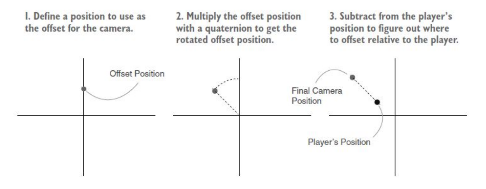
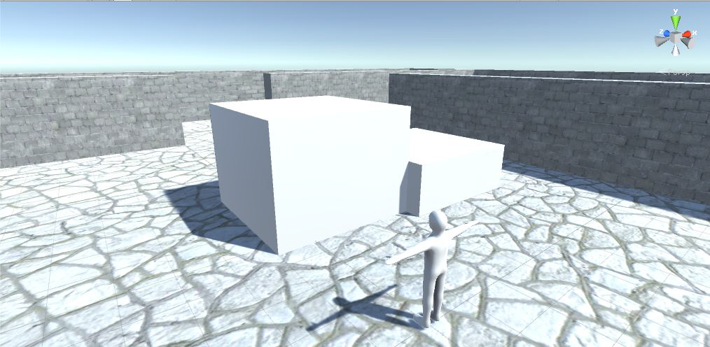
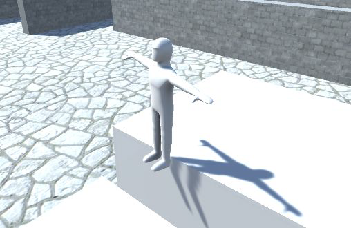

Con questo laboratorio, penseremo alla fare in modo che la telecamera orbita attorno al suo obiettivo, alla modifica della rotazione in modo fluido utilizzando la funzione *Lerp* e alla gestione del rilevamento del terreno per il salto.

## Prepara la nuova scena
Ora crea un nuovo progetto 3D. Durante questa lezione creerai un altro gioco 3D, ma questa volta lavorerai su un nuovo genere di gioco. Questa volta scriveremo un'altra demo di movimento e riguarderà il movimento in terza persona.

## Movimento in terza persona
La differenza più importante è il posizionamento della telecamera rispetto al giocatore: un giocatore vede attraverso gli occhi del proprio personaggio in prima persona ma la telecamera, in terza persona, è posizionata "fuori" dal personaggio.

## Personaggio
L'edificio è lo stesso, per questo possiamo utilizzare l'edificio creato nel nostro progetto precedente.
Useremo un modello che sembra un personaggio umanoide perché ora i giocatori possono vedere se stessi: per un personaggio umanoide la geometria della mesh è modellata in una testa, braccia, gambe e altri elementi.

Il piano di azione è il seguente:
- importare un modello di personaggio nella scena;
- implementare i controlli della telecamera per guardare il personaggio;
- scrivere uno script che permetta al giocatore di correre per terra: aggiungi la possibilità di saltare allo script del movimento.

## Importa il personaggio
Importa il file FBX, trascina il file nella vista *Project*. Quindi cerca in *Inspector* per regolare le impostazioni di importazione per il modello.

Più avanti, durante la prossima lezione, regolerai l'animazione importata ma, per ora, devi modificare il valore dello *Scale Factor* su 10. Più in basso troverai l'opzione *Normals*. Questa impostazione controlla come l'illuminazione e l'ombreggiatura appaiono sul modello, utilizzando il concetto 3D noto come "normali" di cui abbiamo già discusso: l'impostazione predefinita è *Import*, che utilizzerà le normali definite nella geometria della mesh importata. Ma questo modello non ha definito correttamente le normali, quindi cambia l'impostazione in *Calculate*, Unity calcolerà un vettore per la direzione di ogni poligono.

Dopo aver regolato queste due impostazioni, fai clic sul pulsante *Apply* in *Inspector*. Quindi importa il file TGA nel progetto e assegna questa immagine come texture in un materiale. Seleziona il materiale del lettore nella cartella dei materiali. Trascina l'immagine della trama sullo slot della trama vuoto nell'*Inspector*. La trama ha ombre dipinte che miglioreranno l'aspetto del modello. Trascina il modello del giocatore nella scena e imposta la posizione su *0, 1.1, 0*.
Abbiamo un personaggio in terza persona nella scena... in *T-pose*.

## Aggiunta di ombre alla scena
Seleziona la luce direzionale nella scena, quindi cerca nell'*Inspector* l'opzione *Shadow Type*. Se quell'impostazione è già su *Soft Shadows*, andiamo bene. Questo è tutto ciò di cui hai bisogno per impostare le ombre in questo progetto.

## In orbita con la fotocamera
Nella demo in prima persona, la telecamera è stata collegata all'oggetto giocatore nella vista *Hierarchy* in modo che ruotino insieme. Nel movimento in terza persona il personaggio del giocatore sarà rivolto in direzioni diverse indipendentemente dalla telecamera. Pertanto, **questa volta non vuoi trascinare la telecamera sul personaggio** del giocatore nella vista *Hierarchy*. Invece, il codice della telecamera sposterà la sua posizione insieme al personaggio ma **ruoterà indipendentemente dal personaggio**.

## Posiziona la fotocamera
Posizionare la telecamera impostando la posizione su *0, 3,5, -3,75* e reimpostare la rotazione su *0, 0, 0* se necessario.
Crea una cartella "Script" e quindi aggiungi uno script chiamato *OrbitCamera*.
Attacca il componente dello script alla telecamera e poi scriviamo uno script della telecamera per ruotare attorno a un bersaglio.

## Script *OrbitCamera*
Prima di tutto, dobbiamo definire il nostro obiettivo. Il codice deve sapere a quale oggetto far ruotare la telecamera, quindi questa variabile viene serializzata per avere il personaggio del giocatore collegato ad essa.
```csharp
using UnityEngine;
using System.Collections;

public class OrbitCamera : MonoBehaviour {
    [SerializeField] private Transform target;
    ...
```
La coppia successiva di variabili sono valori di rotazione che vengono utilizzati allo stesso modo del codice di controllo della telecamera (demo FPS), e c'è un valore di "offset", questo valore verrà impostato all'interno di Start() per memorizzare la differenza di posizione tra la fotocamera e l'obiettivo.
```csharp
    ...
    public float rotSpeed = 1.5f;
    private float _rotY;
    private Vector3 _offset;
    ...
```
Con questo valore di offset è possibile mantenere la posizione relativa della telecamera durante l'esecuzione dello script. Quindi la telecamera rimarrà alla distanza iniziale dal personaggio indipendentemente dal modo in cui ruota.
```csharp
    ...
    void Start() {
        _rotY = transform.eulerAngles.y;
        _offset = target.position - transform.position;
    }
    ...
```
Il resto del codice è all'interno della funzione *LateUpdate()*. *LateUpdate()* è un altro metodo fornito da *MonoBehaviour* ed è molto simile a *Update()*; è un metodo che esegue ogni fotogramma. La differenza, come suggerisce il nome, è che **_LateUpdate()_ viene chiamato su tutti gli oggetti dopo che _Update()_ è stato eseguito su tutti gli oggetti**. In questo modo, possiamo garantire che la telecamera si aggiorni dopo che il target si è spostato.

Innanzitutto, il codice incrementa il valore di rotazione in base ai controlli di input. Questo codice esamina due diversi controlli di input (tasti freccia orizzontali e movimento orizzontale del mouse), quindi viene utilizzato un condizionale per passare da uno all'altro.
```csharp
    ...
    void LateUpdate() {
        float horInput = Input.GetAxis("Horizontal");
        if (horInput != 0) {
        _rotY += horInput * rotSpeed;
        } else {
        _rotY += Input.GetAxis("Mouse X") * rotSpeed * 3;
        }
        ... 
```
Successivamente, il codice posiziona la telecamera in base alla posizione del target e al valore di rotazione: si noti che moltiplicando un vettore di posizione per un *Quaternion* si ottiene una posizione che viene spostata in base a quella rotazione. Questo vettore di posizione ruotato viene quindi aggiunto come offset dalla posizione del personaggio per calcolare la posizione per la telecamera.
```csharp
        ...
        Quaternion rotation = Quaternion.Euler(0, _rotY, 0);
        transform.position = target.position - (rotation * _offset);
        // la parte in parentesi moltiplica il vettore di offset per un Quaternion per ottenere la posizione di offset ruotata
        // quindi determinare la posizione della telecamera sottraendo l'offset ruotato dalla posizione del target
    } //LateUpdate
    ...
```



**La posizione della telecamera orbiterà attorno al personaggio senza guardarlo.** Perché il valore di rotazione calcolato in precedenza è stato utilizzato per posizionare la telecamera all'angolo corretto attorno al target, ma in quel passaggio la telecamera è stata solo posizionata e non ruotata.

Infine, possiamo usare il metodo *LookAt()* per puntare la telecamera verso il bersaglio. Questa funzione punta un oggetto (non solo telecamere) su un altro oggetto.
```csharp
        ...
        transform.LookAt(target);
    } //LateUpdate
...
```

## Movimento relativo alla fotocamera
Ora il modello del personaggio è importato in Unity e abbiamo scritto il codice per controllare la visuale della telecamera, è ora di programmare i controlli per spostarsi all'interno della scena.
Programmiamo i controlli relativi alla telecamera che sposteranno il personaggio in varie direzioni quando vengono premuti i tasti freccia, oltre a ruotare il personaggio per affrontare quelle diverse direzioni.

La telecamera in un gioco in prima persona è posizionata all'interno del personaggio e si muove con esso, quindi non esiste distinzione tra la sinistra del personaggio e la sinistra della telecamera.
La maggior parte dei giochi in terza persona rende i controlli relativi alla fotocamera. *Quando il giocatore preme il pulsante sinistro, il personaggio si sposta a sinistra dello schermo, non alla sinistra del personaggio:* generalmente i comandi sono più intuitivi e di più facile comprensione quando “sinistra” significa “lato sinistro dello schermo”.

L'implementazione dei controlli relativi alla telecamera prevede due passaggi principali: prima ruotare il personaggio del giocatore per affrontare la direzione dei controlli e quindi spostare il personaggio in avanti.
Per prima cosa scriveremo il codice per rendere il personaggio rivolto nella direzione dei tasti freccia. Crea uno script chiamato *RelativeMovement*.

## Script *RelativeMovement*
**Trascina lo script *RelativeMovement.cs* sul personaggio del giocatore**, quindi collega la telecamera alla proprietà target del componente dello script. Questo script ha bisogno di un riferimento all'oggetto rispetto al quale si sposterà.
```csharp
using UnityEngine;
using System.Collections;

public class RelativeMovement : MonoBehaviour {
    [SerializeField] private Transform target;
    ...
```
Prima di tutto abbiamo bisogno di un *Vector3* con valori a *0, 0, 0*: poi memorizziamo i controlli di input e inseriremo nel nostro *Vector3* i valori di movimento.
```csharp
    ...
    void Update() {
        Vector3 movement = Vector3.zero;
        float horInput = Input.GetAxis("Horizontal");
        float vertInput = Input.GetAxis("Vertical");
        ...
```
Successivamente controlliamo i controlli di input. Ecco dove vengono impostati i valori X e Z nel vettore di movimento. Inserendo quel valore nel vettore di movimento si imposta il movimento nella direzione positiva o negativa di quell'asse (l'asse X è sinistra-destra e l'asse Z è avanti-indietro).
```csharp
        ...
        if (horInput != 0 || vertInput != 0) {
            movement.x = horInput;
            movement.z = vertInput;
            ...
```
Qui il vettore di movimento viene regolato per essere relativo alla telecamera. *TransformDirection()* viene utilizzato per trasformare le coordinate locali in globali. Ci stiamo trasformando dal sistema di coordinate del bersaglio invece che dal sistema di coordinate del giocatore. Memorizza la rotazione del bersaglio per ripristinarla in seguito, quindi regola la rotazione in modo che sia solo attorno all'asse Y. Esegui la trasformazione e ripristina la rotazione del bersaglio.
```csharp
            ...
            Quaternion tmp = target.rotation;
            target.eulerAngles = new Vector3(0, target.eulerAngles.y, 0);
            movement = target.TransformDirection(movement);
            target.rotation = tmp;
            ...   
```
Tutto serviva per calcolare la direzione del movimento come vettore. L'ultima riga di codice applica quella direzione di movimento al personaggio convertendo Vector3 in un *Quaternion* usando *Quaternion.LookRotation()*.
```csharp
            ...
            transform.rotation = Quaternion.LookRotation(movement);
        } //if
    } //Update
} //RelativeMovement
```

## Rotazione regolare
La rotazione del personaggio scatta istantaneamente su diversi fronti. Vogliamo che il personaggio diventi liscio. Possiamo farlo usando un metodo *Lerp*. Per prima cosa aggiungi questa variabile allo script.
```csharp
    ...
    public float rotSpeed = 15.0f;
    ...
```
Quindi sostituisci l'ultima riga di codice del nostro *RelativeMovement.cs* con il codice seguente: invece di agganciare direttamente al valore *LookRotation()*, quel valore viene utilizzato indirettamente come direzione di destinazione per ruotare. Il metodo *Quaternion.Lerp()* ruota in modo fluido tra la rotazione corrente e quella target (con il terzo parametro che controlla la velocità di rotazione).
```csharp
            ...
            Quaternion direction = Quaternion.LookRotation(movement);
            transform.rotation = Quaternion.Lerp(transform.rotation,direction,
            rotSpeed * Time.deltaTime);
        } //if
    } //Update
} //RelativeMovement
```

## Cambia la posizione del giocatore
Attualmente il personaggio sta ruotando sul posto senza muoversi. Per spostare il giocatore sulla scena, dobbiamo aggiungere un componente controller del personaggio all'oggetto *player*. Vedremo cosa è necessario aggiungere nello script *RelativeMovement* per abilitare il movimento del giocatore.

Aggiungi un *RequireComponent()* nella parte superiore del codice, forzerà Unity ad assicurarsi che GameObject abbia un componente *CharacterController*. Quindi dichiara un valore di movimento e una variabile per memorizzare il nostro componente *CharacterController*.
```csharp
...
[RequireComponent(typeof(CharacterController))]
public class RelativeMovement : MonoBehaviour {
    ...
    public float moveSpeed = 6.0f;
    private CharacterController _charController;
    ...
```
Useremo *Start()* per ottenere l'accesso al nostro componente *CharacterController*.
```csharp
    ...
    void Start() {
        _charController = GetComponent<CharacterController>();
    }
    ...
```
Modifichiamo *Update()*: sovrascrivi le linee X e Z esistenti per applicare il valore della velocità di movimento, quindi limita il movimento diagonale alla stessa velocità del movimento lungo un asse. Il morsetto è necessario perché altrimenti il movimento diagonale avrebbe un'entità maggiore del movimento direttamente lungo un asse.
```csharp
        ...
        movement.x = horInput * moveSpeed;
        movement.z = vertInput * moveSpeed;
        movement = Vector3.ClampMagnitude(movement, moveSpeed);
        ...
```
Alla fine moltiplichiamo i valori di movimento per *deltaTime* in modo da ottenere un movimento indipendente dal *framerate*. Per fare in modo che il movimento passi i valori di movimento a *Move()*.
```csharp
            ...
        } //if
        movement *= Time.deltaTime;
        _charController.Move(movement);
    } //Update
} //RelativeMovement
```

## Azione di salto
Finora abbiamo definito tutto il movimento orizzontale del nostro giocatore, definiamo ora il movimento verticale. Aggiungiamo al nostro personaggio la possibilità di saltare. Prima di tutto dobbiamo aggiungere un paio di piattaforme alla scena, perché in realtà non c'è niente da saltare. Crea due oggetti cubo e poi modifica la loro posizione e scala per dare al giocatore piattaforme su cui saltare: **Cube1** (*Position* 5, 0.75, 5 - *Scale* 4, 1.5, 4) e **Cube2** (*Position* 1, 1.5, 5.5 - *Scale* 4, 1.5, 4).



Iniziamo aggiungendo nuove variabili all'inizio del nostro script *RelativeMovement* per vari valori di movimento e inizializziamo i valori correttamente.
```csharp
    ...
    public float jumpSpeed = 15.0f;
    public float gravity = -9.8f;
    public float terminalVelocity = -10.0f;
    public float minFall = -1.5f;
    private float _vertSpeed;
    ...
    void Start() {
        _vertSpeed = minFall;
        ...
    } //Start
    ...
```
In *Update()* aggiungeremo un'altra istruzione *if* per il movimento verticale (subito dopo il "se" utilizzato per il movimento orizzontale). Il codice verificherà se il personaggio è a terra, perché la velocità verticale verrà regolata in modo diverso a seconda che il personaggio sia a terra. *CharacterController* include *isGrounded* per verificare se il personaggio è a terra. Questo valore è vero se la parte inferiore del controller del carattere entra in collisione con qualcosa nell'ultimo fotogramma.
```csharp
        ...
        if (_charController.isGrounded) {
            if (Input.GetButtonDown("Jump")) {
                _vertSpeed = jumpSpeed;
            } else {
                _vertSpeed = minFall;
            }
        } else {
            _vertSpeed += gravity * 5 * Time.deltaTime;
            if (_vertSpeed < terminalVelocity) {
                _vertSpeed = terminalVelocity;
            }
        }
        movement.y = _vertSpeed;
        
        movement *= Time.deltaTime;
        _charController.Move(movement);
        ...
```
Se il personaggio è a terra, il valore della velocità verticale (la variabile *_vertSpeed*) dovrebbe essere reimpostato praticamente su nulla! Ma non è impostato su 0, in realtà è impostato su *minFall*, un movimento verso il basso in modo che il personaggio prema sempre contro il suolo mentre corre orizzontalmente. Se il personaggio non è a terra, la velocità verticale dovrebbe essere costantemente ridotta dalla gravità impostando un'accelerazione verso il basso.

## Rilevamento del suolo
Il codice crea un bel comportamento di caduta. Ora dobbiamo correggere un problema tecnico su come rilevare correttamente il terreno per evitare questo problema (mostrato in figura).



Come spiegato nelle diapositive precedenti, la proprietà *isGrounded* di *CharacterController* indica se la parte inferiore del controller del personaggio collide con qualcosa nell'ultimo fotogramma. Ma come mostrato nell'ultima figura, il personaggio sembra volare mentre esce dai bordi perché l'area di collisione del personaggio è una capsula. Stesso problema si verifica in pendenza. Provalo creando un blocco inclinato: **Slope1** (*Position* 1.5, 1.5, 5 - *Rotation* 0, 0, -25 - *Scale* 1, 4, 4).
Prova a saltare davanti al pendio, puoi scalare il pendio! E questo è un comportamento indesiderato.

La soluzione è utilizzare il raycasting per rilevare il suolo! Usiamolo per rilevare le superfici al di sotto del carattere. Lancia un raggio direttamente dalla posizione del giocatore. Se registra un colpo appena sotto i piedi del personaggio, significa che il giocatore è in piedi a terra. Modifichiamo il nostro *RelativeMovement.cs* come mostrato nelle diapositive seguenti.

Prima di tutto aggiungi una nuova variabile all'inizio del nostro script. Questa variabile viene utilizzata per memorizzare i dati sulle collisioni.

```csharp
    ...
    private ControllerColliderHit _contact;
    ...
```
Quindi dobbiamo prima eseguire il raycasting nel nostro *Update()* per verificare se il giocatore è a terra o meno. Quindi controlliamo quanto era lontano il raycast quando ha colpito qualcosa.
```csharp
    void Update () {
        ...
        bool hitGround = false;
        RaycastHit hit;
        if (_vertSpeed < 0 && Physics.Raycast(transform.position, Vector3.down, out hit)) {
            float check = (_charController.height + _charController.radius) / 1.9f;
            hitGround = hit.distance <= check;
        }
        ...
```
Dopo il raycasting possiamo usare *hitGround* invece di *isGrounded* nell'istruzione *if* per il movimento verticale: la maggior parte del codice del movimento verticale rimarrà lo stesso, ma aggiungiamo il codice per definire quando il controller del personaggio entra in collisione con il terreno anche se il giocatore non è sopra il terreno.

Aggiungeremo anche un nuovo condizionale *isGrounded*, ma nota che sarà nidificato all'interno di "else" del nostro condizionale *hitGround* in modo che *isGrounded* sia selezionato solo quando *hitGround* non rileva il terreno. E qui introdurremo due nuovi concept:
- la **proprietà normale** inclusa nei dati di collisione, che ci dice la direzione per allontanarci dal punto di collisione;
- la **funzione prodotto dot** (*Vector3.Dot()*) utilizza per calcolare il prodotto dot di due dati vettori: il prodotto dot è un valore *float* uguale alle grandezze dei due vettori moltiplicato insieme e quindi moltiplicato per il coseno dell'angolo tra di loro. Per i vettori normalizzati *Dot* restituisce 1 se puntano esattamente nella stessa direzione, -1 se puntano in direzioni completamente opposte e zero se i vettori sono perpendicolari.

Usando la *proprietà normale* e il *prodotto dot* possiamo allontanarci dal punto di contatto a seconda della direzione in cui si è già mosso il giocatore.
```csharp
        ...
        if (hitGround) {
            ...
        } else {
            ...
            if (_charController.isGrounded) {
                if (Vector3.Dot(movement, _contact.normal) < 0) {
                    movement = _contact.normal * moveSpeed;
                } else {
                    movement += _contact.normal * moveSpeed;
                }
            }
        } ...
```
Infine, vediamo da dove provengono le informazioni sulla collisione normale: queste informazioni risultano da una funzione chiamata *OnControllerColliderHit()* che fornisce *MonoBehaviour*. *OnControllerColliderHit* viene chiamato quando il controller colpisce un elemento di collisione durante l'esecuzione di un *Move*. Questo metodo memorizza i dati di collisione nel nostro *_contact* in modo che questi dati possano essere utilizzati in *Update()*.
```csharp
    ...
    void OnControllerColliderHit(ControllerColliderHit hit) {
        _contact = hit;
    }
    ...
```
