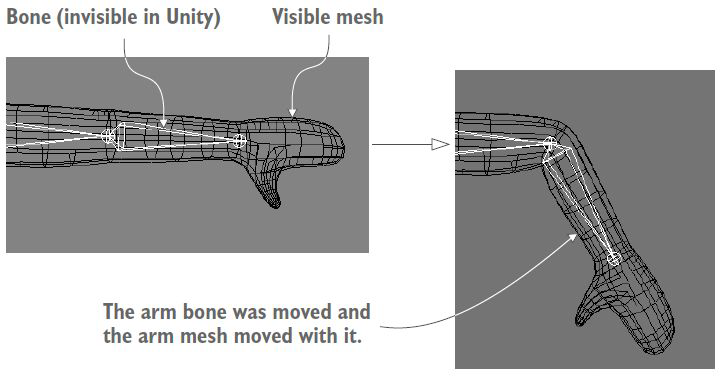
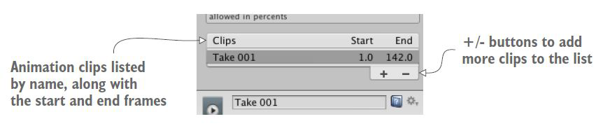
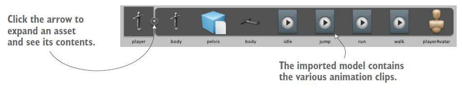
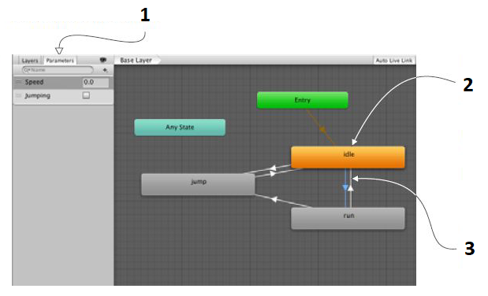
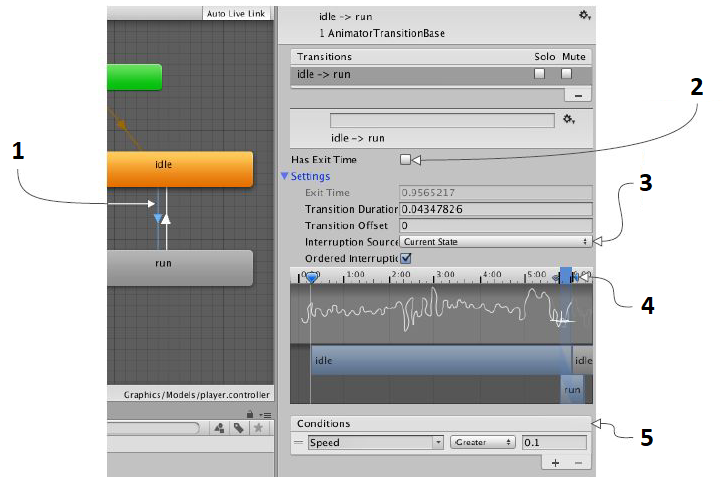

Con questo laboratorio, penseremo all'applicazione e controllo delle animazioni.

## Impostazione delle animazioni
Il personaggio si sta muovendo correttamente nella scena, quindi rimane solo una cosa: animare il personaggio fuori dalla posa a T. Un'**animazione** è un pacchetto di informazioni che definisce il movimento dell'oggetto 3D associato.

Il personaggio correrà per la scena, quindi assegnerai animazioni che fanno oscillare le braccia e le gambe avanti e indietro. La maggior parte dell'animazione dei personaggi nei giochi moderni utilizza una tecnica chiamata *animazione scheletrica (animazione o rigging basata sull'osso)*.

## Animazione scheletrica
L'animazione scheletrica è un tipo di animazione in cui una serie di ossa viene impostata all'interno del modello, quindi le ossa vengono spostate durante l'animazione. Quando un osso si muove, la superficie del modello collegata a quell'osso si muove con esso.



## Sistema di animazione Mecanim di Unity
Unity dispone di un sofisticato sistema per la gestione delle animazioni sui modelli, chiamato Mecanim. Mecanim si basa sull'animazione scheletrica.
Le animazioni che useremo sono tutte incluse nello stesso file FBX del nostro modello di personaggio, uno dei principali vantaggi dell'approccio di Mecanim è che puoi applicare animazioni da altri file FBX a un personaggio. Ad esempio, tutti i nemici umani possono condividere un unico set di animazioni.

## Flusso di lavoro di animazione
Il sistema di animazione di Unity si basa sul concetto di clip di animazione, che contengono informazioni su come determinati oggetti dovrebbero cambiare la loro posizione, rotazione o altre proprietà nel tempo. Ogni clip può essere pensata come una singola registrazione lineare. I clip di animazione da fonti esterne vengono creati da artisti o animatori con strumenti di terze parti.
Le clip di animazione vengono quindi organizzate in un sistema strutturato di diagrammi di flusso chiamato *Animator Controller*. L'*Animator Controller* funziona come una *State Machine* che tiene traccia di quale clip dovrebbe essere attualmente riprodotta e quando le animazioni dovrebbero cambiare.

## Animation Clips
**Animation Clips** sono uno degli elementi fondamentali del sistema di animazione di Unity. Unity supporta l'importazione di animazioni da fonti esterne e offre la possibilità di creare clip di animazione da zero all'interno dell'editor utilizzando la finestra *Animation*.

## Animator Controllers

**Animator Controller** ti consente di organizzare e mantenere una serie di animazioni per un personaggio o un altro oggetto di gioco animato.
Il controller ha riferimenti alle clip di animazione utilizzate al suo interno e gestisce i vari stati di animazione e le transizioni tra di loro utilizzando una *State Machine*.

## Prepara il personaggio
Innanzitutto definisci le animation clips nel file importato, quindi imposta il controller per riprodurre le clip di animazione e infine incorpora quel controller di animazione nel codice. Le animazioni sul modello del personaggio verranno riprodotte secondo lo script di movimento che hai già scritto nella lezione precedente.
Devi fare:
- seleziona il modello del giocatore nella vista *Project* per vedere le sue impostazioni di importazione nell'*Inspector*;
- seleziona la scheda *Animations* e assicurati che l'opzione *Import* animazione sia selezionata;
- quindi vai alla scheda *Rig* e cambia *Animation Type* da *Generic* a *Humanoid*.

## Definizione di animation clips
Il primo passo per impostare le animazioni per il nostro personaggio è definire le varie clip di animazione che verranno riprodotte. Se pensi a un personaggio realistico, possono verificarsi movimenti diversi in momenti diversi: a volte il giocatore sta correndo, a volte il giocatore sta saltando su piattaforme e a volte il personaggio è semplicemente in piedi con le braccia abbassate (*idle*). Ciascuno di questi movimenti è una "clip" separata che può essere riprodotta individualmente.

## Dividi le animation clips
A volte le animazioni importate si presentano come una singola clip lunga che può essere tagliata in animazioni individuali più brevi. Per dividere le clip di animazione, seleziona prima la scheda *Animations* in *Inspector*. Vedrai un pannello *Clip*, questo elenca tutte le clip di animazione definite. **Crea quattro clip per questo personaggio.**



## Imposta animation clip dell'*idle*
Quando selezioni una clip, le informazioni su quella clip appariranno nell'area sotto l'elenco. La parte superiore di quest'area delle informazioni mostra il nome di questa clip ed è possibile digitare un nuovo nome.

La procedura è la seguente:
- assegna un nome al nostro primo clip *idle*;
- definisci i fotogrammi di inizio e fine per questa animation clip (*3 - 141*);
- l'animazione *idle* si ripete, quindi seleziona sia *Loop Time* che *Loop Pose*;
- ora fai clic su *Apply* e hai aggiunto una animation clip inattiva al tuo personaggio.

## Impostazioni di Loop e Root
*Loop* include un'opzione per fondere insieme le pose iniziale e finale. La corrispondenza in loop indica quando le pose di inizio e fine corrispondono: il *verde* è molto abbinato, il *giallo* è pose simili, il *rosso* è pose completamente diverse.

Sotto le impostazioni del ciclo ci sono una serie di impostazioni relative alla trasformazione radice: l'oggetto radice è l'oggetto base a cui tutto il resto è connesso.

## Imposta clip di animazione di *walk*, *run* e *jump*
Selezionare gli altri clip creati in precedenza:
- la clip denominata "cammina" inizia al fotogramma 144 e termina al 169 - Loop Time e Pose selezionati;
- la clip denominata "run" inizia a 171 e termina a 190 - Loop Time e Pose selezionati;
- la clip denominata "salto" non è un loop, quindi non selezionare *Loop Time*. Imposta inizio a 190,5 e fine a 191. Questa è una posa a fotogramma singolo, ma Unity richiede che *Inizio* e *Fine* siano diversi!

Fare clic su *Apply* per confermare i nuovi clip di animazione.

## Creazione del animator controller
Il prossimo passo è creare il controller dell'animatore per questo personaggio. Questo passaggio ci consente di impostare stati di animazione e creare transizioni tra questi stati. Vari animation clips vengono riprodotti durante diversi stati di animazione, quindi i nostri script faranno sì che il controller si sposti tra gli stati di animazione.

Inizia creando una nuova risorsa controller animatore *Assets -> Create -> Animator Controller* e denomina questa risorsa "player".

## Animator Component
Seleziona il personaggio nella scena e noterai che questo oggetto ha un componente chiamato *Animator*. Qualsiasi modello che può essere animato ha questo componente, oltre al componente Trasforma e qualsiasi altra cosa tu abbia aggiunto. Il componente *Animator* ha uno slot *Controller* per collegare un controller animatore specifico, quindi trascina qui la tua nuova risorsa controller.

## Animator Controller
Il controller animatore è un albero di nodi connessi che puoi vedere e manipolare aprendo la vista *Animator*. Questa è un'altra vista, proprio come *Scene* o *Project*, tranne per il fatto che questa vista non è aperta per impostazione predefinita. Seleziona *Animator* dal menu *Window*. Inizialmente ci sono solo due nodi predefiniti, per *Entry* e *Any State*. Non utilizzerai il nodo *Any State*. Invece, trascinerai clip di animazione per creare nuovi nodi.

## Crea nuovi nodi
Nella vista *Project*, fai clic sulla freccia sul lato dell'asset del modello per espandere l'asset e vedere cosa contiene. Quindi trascina i clip *idle*, *run* e *jump* nella vista *Animator*.



## Gestione dei nodi
Fare clic con il pulsante destro del mouse sul nodo *idle* e selezionare *Set As Layer Default State*. Quel nodo diventerà arancione mentre gli altri nodi rimarranno grigi; lo stato di animazione predefinito è dove inizia la rete di nodi prima che il gioco abbia apportato modifiche.

Dovrai collegare i nodi insieme con linee che indicano le transizioni tra gli stati di animazione; fare clic con il pulsante destro del mouse su un nodo e selezionare *Make Transition* per iniziare a trascinare una freccia su cui è possibile fare clic su un altro nodo per connettersi.

Queste linee di transizione determinano il modo in cui gli stati di animazione si collegano tra loro e controllano i cambiamenti da uno stato all'altro durante il gioco.

## Stabilisci le connessioni



1. Qui è possibile creare una serie di valori numerici o booleani per controllare le animazioni. Le transizioni attualmente attive tra gli stati sul grafico quando questi valori cambiano;
2. Ogni nodo sul grafico è uno stato di animazione. La clip di animazione denominata viene riprodotta quando il controller è in quello stato (il nodo arancione è lo stato di animazione predefinito, prima che avvenga qualsiasi transizione);
3. Le linee che connettono i nodi sono "transizioni". Le transizioni hanno una direzione per passare da A a B.

## Parametri
Le transizioni si basano su un insieme di valori di controllo, quindi creiamo quei parametri. Fare clic sulla scheda *Parameters* (in alto a sinistra) per visualizzare un pannello con un pulsante *+* per l'aggiunta di parametri. Aggiungi un float chiamato *Speed* e un boolean chiamato *Jumping*. Questi valori verranno modificati nel codice e attiveranno le transizioni tra gli stati di animazione.

## Linee di transizione
Fai clic sulle linee di transizione per vedere le loro impostazioni nell'*Inspector*. Qui regoleremo il modo in cui gli stati dell'animazione cambiano quando cambiano i parametri: ad esempio, fai clic sulla transizione *Idle-to-Run* per regolare le condizioni di quella transizione, in *Conditions*, scegli *Speed*, *Greater* e 0.1 (che imporrebbe la riproduzione del animazione fino alla fine) e quindi fare clic sulla freccia accanto all'etichetta *Settings* per visualizzare l'intero menù.



1. Fare clic su una transizione per selezionarla e visualizzarne le impostazioni;
2. Deseleziona questo valore per la maggior parte delle transizioni, in modo che l'animazione possa essere interrotta;
3. Modificare questa impostazione se è possibile interrompere anche la transizione stessa;
4. Queste frecce controllano la durata della transizione (tieni premuto *Alt* per navigare in questo grafico);
5. Definire le condizioni per la transizione tra gli stati di animazione quando i parametri cambiano.

Imposta le condizioni per tutte le transizioni in questo controller animatore come mostrato qui:
- *Idle-to-Run* (Condition: Speed greater than 0.1 - Interruption: Current State);
- *Run-to-Idle* (Condition: Speed less than 0.1 - Interruption: Current State);
- *Idle-to-Jump* (Condition: Jumping is true - Interruption: None);
- *Run-to-Jump* (Condition: Jumping is true - Interruption: None);
- *Jump-to-Idle* (Condition: Jumping is false - Interruption: None).

## Tempo di transizione
Appena sopra l'impostazione *Condition* puoi trovare il grafico del tempo di transizione che ti consente di regolare visivamente la durata nel tempo di una transizione.

Il tempo di transizione predefinito sembra corretto per entrambe le transizioni tra *Idle* e *Run*, ma tutte le transizioni da e verso il salto dovrebbero essere più brevi in modo che il personaggio scatti più velocemente tra l'animazione del salto.

L'area ombreggiata del grafico indica quanto tempo impiega la transizione; per vedere più dettagli, usa *Alt+clic* con il tasto sinistro del mouse per scorrere il grafico e *Alt+clic* con il tasto destro per ridimensionarlo.

Usa le frecce sopra l'area ombreggiata per impostarla a meno di 4 millisecondi per tutte e tre le transizioni di salto.

## Velocità
Selezionando i nodi dell'animazione, uno alla volta, l'ispettore mostrerà altre impostazioni come velocità di riproduzione, quindi se l'animazione sembra troppo lenta puoi modificare questo valore: le nostre animazioni hanno un aspetto migliore a 1,5 di velocità.

## Impostazione dei valori dallo script
Il controller di animazione è impostato, quindi possiamo utilizzare le animazioni dallo script di movimento. Ora aggiungerai metodi allo script *RelativeMovement*.

La maggior parte del lavoro di impostazione degli stati di animazione viene eseguita nel controller di animazione. È necessaria solo una piccola quantità di codice per far funzionare un sistema di animazione ricco e fluido.

## Script *RelativeMovement*
Lo script necessita di un riferimento al componente *Animator*.
```csharp
    ...
    private Animator _animator;
    void Start() {
        ...
        _animator = GetComponent<Animator>();
    }
    ...
```
Quindi il codice in *Update()* imposta i valori (float o booleani) sull'animatore.
```csharp
        ...
        _animator.SetFloat("Speed", movement.magnitude);
        if (hitGround) {
            if (Input.GetButtonDown("Jump")) {
                _vertSpeed = jumpSpeed;
            } else {
                _vertSpeed = minFall;
                _animator.SetBool("Jumping", false);
            }
        } else {
            ...
            _animator.SetBool("Jumping", true);
            if (_charController.isGrounded) { ... }
            ...
```
