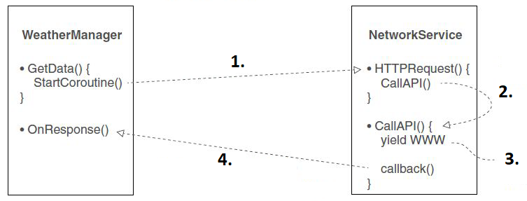

Con questo laboratorio, penseremo alla come inviare e ricevere dati su una rete e al download dei dati utilizzando gli oggetti *UnityWebRequest* nelle coroutine.

## Richieste HTTP e fonti dati da Internet
Unity supporta molteplici approcci alla comunicazione di rete. Questa lezione tratterà l'approccio generale utilizzato per la comunicazione Internet, utilizzando le richieste HTTP.

I videogiochi hanno spesso requisiti di prestazioni molto più severi rispetto alle applicazioni Web e queste differenze possono influenzare le decisioni di progettazione.
Le scale temporali possono essere molto diverse tra *app web* e *videogiochi*: mezzo secondo può sembrare una breve attesa per l'aggiornamento di un sito web, ma fermarsi anche solo per una frazione di quel tempo può essere fondamentale durante un gioco d'azione. Quindi il concetto di "connessione veloce" è relativo alla situazione.

Per questo laboratorio, ci collegheremo ad alcune fonti di dati Internet disponibili gratuitamente, inclusi i dati meteorologici ed esaminiamo le richieste HTTP in modo che tu possa imparare come funzionano all'interno di Unity.

Quindi vogliamo un cielo in grado di reagire ai dati meteorologici, scriveremo il codice per richiedere i dati meteo da Internet e analizzeremo la risposta e modificheremo la scena in base ai dati.

## Skybox shader

Durante una delle lezioni precedenti abbiamo già scaricato le immagini di skybox. Questa volta abbiamo bisogno delle immagini per il *DarkStormy* oltre al *TropicalSunnyDay* che usiamo ancora nel nostro progetto: importa queste texture nella vista *Project* e imposta la loro *Wrap Mode* su *Clamp*.

Lo **skybox shader** integrato in Unity ha una limitazione significativa: le immagini non possono mai cambiare, risultando in un cielo che appare completamente statico.
Le immagini del set *TropicalSunnyDay* sono perfette per una giornata di sole, ma cosa succede se vogliamo passare da una giornata di sole a una nuvolosa.
Ciò richiederà un secondo set di immagini del cielo, con immagini di un cielo nuvoloso, quindi abbiamo bisogno di un nuovo shader per lo skybox.

Abbiamo bisogno di creare un nuovo shader che prenda due serie di immagini skybox e le transizioni. Ma scrivere shader non è il nostro lavoro, perché la programmazione Shader è un argomento di computer grafica piuttosto avanzato.

In Unity crea un nuovo script di shader: vai al menu *Create* proprio come quando crei un nuovo script C#, ma seleziona invece *Shader* (**shader standard**): denomina la risorsa *SkyboxBlended* e quindi fai doppio clic sullo shader per aprire lo script. La riga superiore dice Shader *Skybox/Blended*, che dice a Unity di aggiungere il nuovo shader nell'elenco degli shader nella categoria Skybox.

Ora puoi impostare il tuo materiale sullo shader *Skybox Blended*. Ci sono 12 slot per texture, in due set di sei immagini. Assegna le immagini *TropicalSunnyDay* alle prime sei trame proprio come prima; per le trame rimanenti, usa il set di immagini skybox di *DarkStormy*.

Questo nuovo shader ha anche aggiunto un cursore *Blend* nella parte superiore delle impostazioni. Il valore *Blend* controlla quanto di ogni set di immagini skybox si desidera visualizzare; quando si sposta il cursore da un lato all'altro, lo skybox passerà da una giornata di sole a una giornata nuvolosa. Quindi scriviamo il nostro codice per abilitare la transizione nel cielo.

## *WatherController*
Crea un nuovo script e chiamalo *WeatherController*. Trascina quello script sull'oggetto vuoto *Controller*: iniziamo a definire il materiale "cielo" e una luce "sole", per il materiale vogliamo fare riferimento al materiale skybox miscelato e per la luce vogliamo fare riferimento alla nostra luce principale, la luce direzionale.

```csharp
using UnityEngine;
using System.Collections;

public class WeatherController : MonoBehaviour {
    [SerializeField] private Material sky;
    [SerializeField] private Light sun;
    private float _fullIntensity;
    private float _cloudValue = 0f;
    ...
```

All'avvio, lo script inizializza l'intensità della luce. Lo script memorizzerà il valore iniziale e lo considererà un'intensità "piena". Quindi il codice incrementa un valore ogni fotogramma e utilizza quel valore per regolare il cielo. In particolare, chiama *SetOvercast()* ogni frame.

```csharp
    ...
    void Start() {
        _fullIntensity = sun.intensity;
    }
    void Update() {
        SetOvercast(_cloudValue);
        _cloudValue += .005f;
    }
    ...
```

Definiamo il nostro metodo *SetOvercast*: il metodo chiave è *SetFloat()*, questo metodo imposta un valore numerico sul materiale. Il valore è il primo parametro, in questo caso il materiale ha una proprietà chiamata *Blend* (le proprietà del materiale nel codice iniziano con un carattere di sottolineatura). L'ultima riga regola l'intensità della luce.

```csharp
    ...
    private void SetOvercast(float value) {
        sky.SetFloat("_Blend", value);
        sun.intensity = _fullIntensity - (_fullIntensity * value);
    }
} // WeatherController
```

## Sistema di illuminazione
L'avanzato sistema di illuminazione in Unity tiene conto dello skybox per ottenere risultati realistici.
Questo approccio all'illuminazione non funzionerà correttamente con uno skybox che cambia, quindi potresti voler disattivarlo: nella finestra *Lighting* puoi disattivare la *Continuous Baking* (deseleziona "auto" in basso). Quindi imposta sul materiale dello skybox il valore *Blend* al centro e quindi fai clic su *Build* nella finestra di illuminazione per cuocere le mappe di luce.

Ricordati di allegare il tuo nuovo script *WeatherController* al nostro oggetto *Controller*. Ora riproduci la scena per guardare il codice in esecuzione: vedrai la scena passare da una giornata di sole a una giornata buia. È divertente osservare la transizione della scena da soleggiato a nuvoloso, ma il nostro obiettivo è sincronizzare il tempo nel gioco con le condizioni meteorologiche reali.

## Dati meteorologici da Internet
Per raggiungere il nostro obiettivo dobbiamo iniziare a scaricare i dati meteo da internet. Scriveremo il codice che scaricherà i dati meteorologici e modificheremo la scena in base a tali dati: questa attività fornirà un buon esempio di recupero dei dati utilizzando le richieste HTTP. Un servizio web per i dati meteo gratuiti è *OpenWeatherMap*.

Il codice che scriverai sarà strutturato attorno alla stessa architettura *Manager* utilizzata durante l'ultima lezione. Questa volta avrai una classe *WeatherManager* che viene inizializzata dallo script *Managers* principale. *WeatherManager* si occuperà del recupero e della memorizzazione dei dati meteorologici, ma per fare ciò dovrà comunicare con internet. Per farlo, creerai una classe di utilità chiamata *NetworkService*.

## *NetoworkService*
Questa classe gestirà i dettagli della connessione a Internet e dell'esecuzione di richieste HTTP. ***WeatherManager* può quindi dire a *NetworkService* di effettuare tali richieste.** Quindi crea un nuovo script chiamato *NetworkService* (lascialo vuoto per ora, lo compilerai in seguito).

Quindi creiamo lo script *WeatherManager*. Crea un nuovo script C#. Per ora è solo l'importo minimo che *IGameManager* richiede che la classe implementi: dichiarare la proprietà di stato dall'interfaccia, oltre a implementare la funzione *Startup()*.

```csharp
using UnityEngine;
using System.Collections;
using System.Collections.Generic;

public class WeatherManager : MonoBehaviour, IGameManager {
    public ManagerStatus status {get; private set;}
    private NetworkService _network;
    
    public void Startup() {
        Debug.Log("Weather manager starting...");
        _network = new NetworkService();
        status = ManagerStatus.Started;
    }
}
```
Modifica lo script *Managers.cs* per avviare *WeatherManager* aggiungendo le seguenti righe di codice.
```csharp
    ...
    public static WeatherManager Weather {get; private set;}
    ...
    Void Awake() {
        ...
        Weather = GetComponent<WeatherManager>();
        ...
        _startSequence.Add(Weather);
        StartCoroutine(StartupManagers());
    }
    ...
```

*NetworkService* è attualmente uno script vuoto, quindi puoi scriverci codice per effettuare richieste HTTP: Unity fornisce la classe *UnityWebRequest* per comunicare con internet. L'istanza di un oggetto *UnityWebRequest* utilizzando un URL invierà una richiesta a tale URL. Le coroutine possono lavorare con la classe *UnityWebRequest* per attendere il completamento della richiesta: la produzione di una coroutine con *UnityWebRequest* interromperà la funzione fino al completamento della richiesta di rete. Prima invii una richiesta, poi continui ad eseguire il resto del codice e dopo qualche tempo ricevi una risposta.

*GetWeatherXML()* è il metodo coroutine che il codice esterno può utilizzare per dire a *NetworkService* di effettuare una richiesta HTTP: *GetWeatherXML()* non ha un'istruzione *yield*. Le coroutine vengono messe in pausa dall'istruzione *yield*, il che implica che ogni coroutine deve cedere da qualche parte. Si scopre che la resa può precipitare attraverso più metodi. Se lo stesso metodo coroutine iniziale chiama un altro metodo e quell'altro metodo restituisce parte dello script, la coroutine si fermerà all'interno di quel secondo metodo e riprenderà da lì. Pertanto l'istruzione *yield* in *CallAPI()* mette in pausa la coroutine che è stata avviata in *GetWeatherXML()*.

```csharp
using UnityEngine;
using System.Collections;
using System;

public class NetworkService {
    private const string xmlApi = "http://api.openweathermap.org/data/2.5/weather?q=Cosenza,it&
        mode=xml&appid=e17b870eb05c8c85896ff6ca22e9d10d";
    
    public IEnumerator GetWeatherXML(Action<string> callback) {
        return CallAPI(xmlApi, callback);
    }
}
```

Quando la coroutine viene avviata, il metodo viene chiamato con un parametro chiamato callback e callback ha il tipo *Action*.
Il tipo *Action* è un delegato. I delegati sono riferimenti a qualche altro metodo. Consentono di memorizzare la funzione in una variabile e di passare quella funzione come parametro a un'altra funzione.
I delegati ti consentono di passare le funzioni proprio come fai con i numeri e le stringhe. Senza delegati, non puoi passare le funzioni da chiamare in seguito. Con i delegati puoi indicare al codice altri metodi da chiamare in seguito. Questo è utile per implementare le funzioni di callback.

Un callback è una funzione utilizzata per comunicare di nuovo all'oggetto chiamante. L'oggetto A potrebbe dire all'oggetto B uno dei metodi in A. B potrebbe in seguito chiamare un metodo per comunicare di nuovo ad A.



1. Il *Manager* dice al *Service* di effettuare una richiesta (farlo avviando la coroutine);
2. In *Service*, un metodo ne chiama un altro;
3. *Coroutine* si ferma all'istruzione *yield* nel secondo metodo;
4. Il *Service* invia la risposta HTTP al *Manager*.

In questo caso il callback viene utilizzato per comunicare i dati di risposta dopo aver atteso il completamento della richiesta HTTP. In *CallAPI()* il codice effettua prima una richiesta HTTP, quindi restituisce fino al completamento della richiesta e infine utilizza *callback()* per restituire la risposta. Il tipo scritto con la sintassi <> dichiara i parametri necessari per adattarsi a questa azione. In questo caso il parametro è una stringa, quindi il metodo di callback deve avere una firma come questa: *MethodName(string value)*.

```csharp
using UnityEngine;
using System.Collections;
using System;

public class NetworkService {
    private const string xmlApi =
    "http://api.openweathermap.org/data/2.5/weather?q=Cosenza,it&
        mode=xml&appid=e17b870eb05c8c85896ff6ca22e9d10d";
    
    private IEnumerator CallAPI(string url, Action<string> callback){
        UnityWebRequest www = UnityWebRequest.Get(url);
        yield return www.SendWebRequest();
        if (!IsResponseValid(www)){
        yield break;
        }
        callback(www.downloadHandler.text);
    }
    
    public IEnumerator GetWeatherXML(Action<string> callback) {
        return CallAPI(xmlApi, callback);
    }
}
```

*IsResponseValid()* verifica la presenza di errori nella risposta HTTP. Esistono due tipi di errori: una cattiva connessione a Internet o i dati restituiti potrebbero essere in qualche modo malformati. Viene dichiarato un valore *const* con l'URL per effettuare la richiesta.

```csharp
    ...
    public class NetworkService {
        private bool IsResponseValid(UnityWebRequest www) {
            if (www.error != null) {
                Debug.Log("bad connection");
                return false;
            } else if string.IsNullOrEmpty(www.downloadHandler.text)) {
                Debug.Log("bad data");
                return false;
            } else {
                return true;
            }
        }
        
        ... // CallAPI
        ... // GetWeatherXML
    } // NetworkService
```

## Configura *WeatherManager*
Ora utilizziamo *NetworkService* nel nostro script *WeatherManager*. Vengono apportate tre modifiche principali al codice in questo manager: avviare una *coroutine* per scaricare dati da internet, impostare uno stato di avvio diverso e definire un metodo di callback per ricevere la risposta.
```csharp
    ...
    public void Startup() {
        Debug.Log("Weather manager starting...");
        _network = new NetworkService ();
        StartCoroutine(_network.GetWeatherXML(OnXMLDataLoaded));
        status = ManagerStatus.Initializing;
    }
    
    public void OnXMLDataLoaded(string data) {
        Debug.Log(data);
        status = ManagerStatus.Started;
    }
} // WeatherManager
```
La maggior parte della complessità dietro le coroutine era già gestita in *NetworkService*, quindi chiamare *StartCoroutine()* è tutto ciò che devi fare qui. In questo caso, il metodo *coroutine* necessita di una funzione di callback come parametro unico. Useremo *OnXMLDataLoaded()* per il callback; si noti che questo metodo ha un parametro stringa, che si adatta alla dichiarazione *Action<string>* di *NetworkService*. La funzione di callback non fa molto in questo momento; la riga di debug stampa semplicemente i dati ricevuti sulla console per verificare che i dati siano stati ricevuti correttamente. Quindi l'ultima riga della funzione cambia lo stato di avvio del manager per dire che è completamente avviato.

Supponendo che tu abbia una connessione internet, dovresti vedere apparire un sacco di dati nella console. Questi dati sono semplicemente una stringa lunga, ma la stringa è formattata in un modo specifico.

## Analisi XML
I dati che esistono come una lunga stringa di solito hanno singoli bit di informazioni incorporati all'interno della stringa. Estraete quei bit di informazioni analizzando i dati e dividendoli in parti separate di informazioni, quindi analizzando questi dati.

Unity fornisce funzionalità per l'analisi XML: i dati meteorologici che abbiamo richiesto sono formattati in XML, quindi aggiungeremo codice a *WeatherManager* per analizzare la risposta ed estrarre la nuvolosità. Inserisci l'URL in un browser web per vedere il codice, siamo interessati solo al nodo che contiene qualcosa come:
```csharp
<clouds value="56" name="broken cloud"/>
```

Analizziamo i dati XML nello script *WeatherManager* nel metodo *OnXMLDataLoaded*: definiamo una proprietà per *cloudValue*.
```csharp
...
using System;
using System.Xml;
public class WeatherManager : MonoBehaviour, IGameManager {
    ...
    public float cloudValue {get; private set;}
    ...
```

Crea un nuovo documento XML vuoto; questo è un contenitore vuoto che puoi riempire con una struttura XML. La riga successiva analizza la stringa di dati in una struttura contenuta nel documento XML. Quindi iniziamo dalla radice dell'albero XML in modo che tutto possa cercare nell'albero nel codice successivo.

```csharp
    ...
    XmlDocument doc = new XmlDocument();
    doc.LoadXml(data);
    XmlNode root = doc.DocumentElement;
    ...
```
A questo punto puoi cercare i nodi all'interno della struttura XML per estrarre singole informazioni. In questo caso, *<clouds>* è l'unico nodo che ci interessa: prima trova quel nodo nel documento XML, quindi estrai l'attributo *value* da quel nodo.

```csharp
    ...
    XmlNode node = root.SelectSingleNode("clouds");
    string value = node.Attributes["value"].Value;
    ...
```
Questi dati definiscono il valore del *cloud* come un numero intero 0-100, ma ne avremo bisogno come float 0-1 per regolare la scena in un secondo momento.

```csharp
    ...
    cloudValue = Convert.ToInt32(value) / 100f;
    Debug.Log("Value: " + cloudValue);
    ...
```

## Usa il sistema di messaggistica
Utilizzeremo lo stesso sistema di messaggistica che abbiamo utilizzato nelle lezioni precedenti: questo perché una volta scaricati e analizzati i dati meteorologici, dobbiamo ancora informare la scena al riguardo. Aggiungiamo allo script *GameEvent* il nostro evento.

```csharp
    ...
    public const string WEATHER_UPDATED = "WEATHER_UPDATED";
    ...
```
Quindi regola lo script *WeatherManager* aggiungendo un messaggio *Broadcast* per informare gli altri script.

```csharp
    ...
    Debug.Log("Value: " + cloudValue);
    Messenger.Broadcast(GameEvent.WEATHER_UPDATED);
    status = ManagerStatus.Started;
    ...
```

## Cambiamenti meteorologici sulla scena
Una volta estratto il valore di nuvolosità dai dati di risposta, possiamo utilizzare quel valore nel metodo *SetOvercast()* di *WeatherController*: il metodo *SetOvercast()* prende un numero come parametro. In precedenza utilizzavamo un numero incrementato ad ogni frame, ma potevamo semplicemente utilizzare facilmente il numero restituito dall'API meteo.

Inizia ad aggiungere e rimuovere un listener. Questo listener chiama il metodo *OnWeatherUpdated()* quando viene ricevuto quel messaggio. *OnWeatherUpdated()* recupera il valore di nuvolosità da *WeatherManager* e chiama *SetOvercast()* utilizzando quel valore. Modifichiamo il nostro *WeatherController* come mostrato di seguito.

```csharp
using UnityEngine;
using System.Collections;

public class WeatherController : MonoBehaviour {
    [SerializeField] private Material sky;
    [SerializeField] private Light sun;
    private float _fullIntensity;
    
    void Awake() {
        Messenger.AddListener(GameEvent.WEATHER_UPDATED, OnWeatherUpdated);
    }
    
    void OnDestroy() {
        Messenger.RemoveListener(GameEvent.WEATHER_UPDATED, OnWeatherUpdated);
    }
    
    void Start() {
        _fullIntensity = sun.intensity;
    }
    
    private void OnWeatherUpdated() {
        SetOvercast(Managers.Weather.cloudValue);
    }
    
    private void SetOvercast(float value) {
        sky.SetFloat("_Blend", value);
        sun.intensity = _fullIntensity - (_fullIntensity * value);
    }
}
```
Ora l'aspetto della scena è controllato dai dati meteo scaricati.
