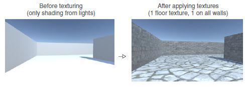
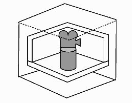
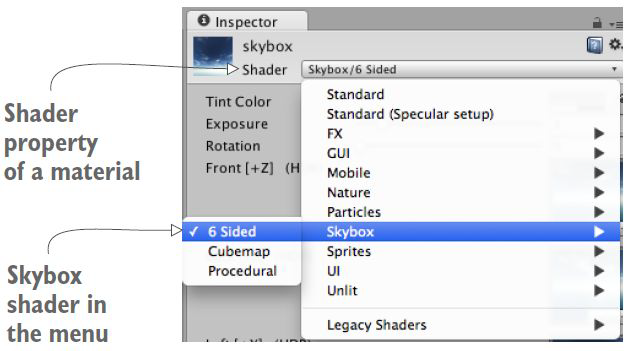
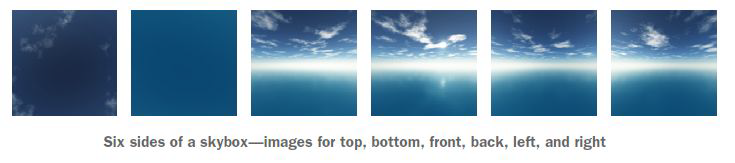
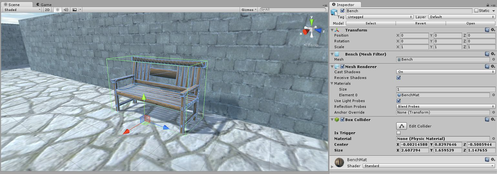
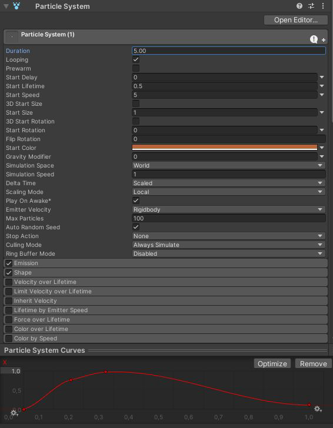

Con questo laboratorio, pensiamo alla comprensione del whiteboxing, all'utilizzo di immagini 2D in [[Unity3D]], alla creazione di uno Skybox, alla lavorazione con modelli 3D personalizzati e all'utilizzo di sistemi di particelle per creare effetti visivi.

## Art Assets
Questo corso è incentrato sulla programmazione di giochi in Unity, ma è importante per capire come lavorare e migliorare la grafica. Gli elementi visivi in un gioco sono chiamati **Art Assets**. Una risorsa artistica può essere: immagine 2D, modello 3D (oggetti mesh), materiale, animazione, sistema di particelle (Particle Systems).

## Mesh, materiali (materials), shader e texture
Il rendering in Unity utilizza **mesh, materiali, shader e texture** (hanno una stretta relazione). Le trame vengono applicate alle *mesh* utilizzando i *materiali*. I *materiali* utilizzano programmi grafici specializzati chiamati *shader* per eseguire il rendering di una trama sulla superficie della mesh.

### Mesh
Le **mesh 3D** sono le principali primitive grafiche di Unity. Definiscono la **forma di un oggetto**.

*Le mesh costituiscono gran parte dei tuoi mondi 3D. Unity fornisce uno strumento di modellazione chiamato **ProBuilder** e ci sono anche alcuni plug-in di modellazione di asset store, come Mesh Deformer, UModeler e Mesh Editor.*

Il **Mesh Filter** prende una mesh dalle tue risorse e la passa al **Mesh Renderer** per il rendering sullo schermo.

### Materiali (materials)
I **materiali** definiscono il modo in cui una superficie deve essere renderizzata, includendo riferimenti alle **textures** che utilizza, informazioni sulla **piastrellatura**, tinte di **colore** e altro ancora. Le opzioni disponibili per un materiale dipendono dallo shader utilizzato dal materiale.

*I materiali vengono utilizzati insieme a Mesh Renderers, Particle Systems e altri componenti di rendering utilizzati in Unity. Svolgono un ruolo essenziale nella definizione di come viene visualizzato il tuo oggetto.*

### Shader
Gli **shader** sono piccoli script che contengono i calcoli matematici e gli algoritmi per calcolare il colore di ogni pixel renderizzato, in base all'input di illuminazione e alla configurazione del materiale.
Le proprietà visualizzate da una **finestra di ispezione Material** sono determinate dallo shader utilizzato dal materiale.

*Gli shader possono implementare effetti di illuminazione e colorazione per simulare superfici lucide o irregolari.*

### Texture
Le **texture** sono immagini bitmap. Un materiale può contenere riferimenti a texture, in modo che lo shader del materiale possa utilizzare le trame mentre calcola il colore della superficie di un *GameObject*. Oltre al colore di base (Albedo) della superficie di un *GameObject*, le *texture* possono rappresentare molti altri aspetti della superficie di un materiale come la sua **riflettività o rugosità**.

*Normalmente, la geometria della mesh di un oggetto fornisce solo un'approssimazione approssimativa della forma mentre la maggior parte dei dettagli fini è fornita da texture.*

### Modelli 3D
Un **modello** è un oggetto virtuale 3D. L'*oggetto mesh* si riferisce strettamente alla geometria dell'oggetto 3D. Il *modello* spesso include altri attributi dell'oggetto. *I termini sono spesso usati in modo intercambiabile.*

### [[Animazioni]]
Un'**animazione** è un pacchetto di informazioni che definisce il movimento dell'oggetto associato.
Questi movimenti possono essere definiti indipendentemente dall'oggetto stesso.
*Le [[Animazioni|animazioni]] possono essere incluse direttamente nel modello 3D.*

### Sistema di particelle
Un **sistema di particelle** è un meccanismo per creare e controllare un gran numero di oggetti in movimento. Un sistema di particelle simula e rende molte piccole immagini o Mesh, chiamate particelle, per produrre un effetto visivo, come fuoco o fumo.

*Per la maggior parte degli effetti, le particelle saranno un quadrato che mostra un'immagine (una scintilla di fiamma o uno sbuffo di fumo, per esempio).*

## Whiteboxing (o grayboxing)
Quando iniziamo con lo sviluppo di un gioco, costruiamo la nostra scena con elementi geometrici vuoti, questo è il primo passo per costruire un livello: questa attività è associata all'attività di *level design*, la disciplina di pianificare e creare scene nel gioco. In effetti, un flusso di lavoro comune per la creazione di livelli prevede che il designer di livelli crei una prima versione del livello tramite **whiteboxing**.

Utilizzando la fase di *whiteboxing*, il livello raggiunge uno stato giocabile molto rapidamente: i programmatori possono avanzare rapidamente con lo sviluppo. Nel frattempo, gli artisti 2D/3D possono investire il loro tempo per realizzare un lavoro dettagliato sugli *Art Asserts*.

### Struttura la scena
La nostra scena ora è uno schizzo! Il prossimo passo è applicare le texture per migliorare l'aspetto del livello: una texture è un'immagine 2D utilizzata per migliorare la grafica 3D. L'uso più comune per le texture è quello di essere visualizzato sulla superficie dei modelli 3D.

### Formati di file 2D
[[Unity3D]] supporta l'uso di molti formati di file diversi: PNG, JPG, GIF, BMP, TGA, TIFF, PICT, PSD. Alcuni di questi supportano il canale alfa, utilizzato per memorizzare le informazioni sulla trasparenza in un'immagine. Un altro aspetto fondamentale è la compressione dell'immagine: la **compressione lossless** preserva la qualità dell'immagine mentre la **compressione con perdita** riduce la qualità dell'immagine e le dimensioni del file.

### Livelli di texture
Le immagini utilizzate per i livelli di texture sono solitamente **affiancabile (ripetibile)**: un'immagine è "affiancabile" quando i bordi opposti combaciano quando è affiancata. In questo modo l'immagine può essere ripetuta e può coprire l'intera superficie. 
Puoi trovare su Google “tileable ground texture” oppure “seamless ground texture”.

Le trame dovrebbero essere dimensionate in potenze di *2*, per motivi di efficienza tecnica i chip grafici amano gestire trame di dimensioni $2^N$.

Dopo il download del tuo file, puoi trascinare il file nel tuo progetto Unity, Unity importerà il file come texture e verrà utilizzato nella scena 3D.

### Organizzare i tuoi assets
I tuoi progetti iniziano a diventare più complessi, per questo motivo è il momento di separare le tue risorse in diverse cartelle: crea le cartelle per *Script*, *Texture*, *Prefabs* e *Materials*, quindi trascina i file nella loro nuova cartella.

### Creare un Materials
- Tasto destro sulla vista *Project* -> Create -> Material;
- Per settare la texture, clicca sul puntino vicino ad *Albedo* e selezioniamo la texture che vogliamo.

### Creare l'effetto rilievo di un Materials
- **Si ripetono gli stessi passi del paragrafo precedente;**
- Prendiamo al nostra texture e duplichiamola;
- Impostiamo questa texture duplicata con *Texture Type* su *Normal map* e *Texture Shape* su *2D*;
- Per impostare l'altezza si mette la spunta su *Create from Grayscale* impostando *Bumpiness* su *0.18*;
- Per inserirlo all'interno del material, clicca sul puntino vicino a *Normal Map* e selezioniamo la texture duplicata e modificata che vogliamo.

### Proprietà *Tiling*
Se l'oggetto è troppo grande dobbiamo ripetere la nostra texture perché, applicando il materiale, le immagini sulla superficie appaiono allungate e sfocate.

Possiamo risolvere questo problema usando la proprietà *Tiling* del materiale: cambia il numero di *Tiling* nell'ispettore del materiale, puoi usare valori X e Y separati per piastrellare in ciascuna direzione.

Per ogni materiale cambia i numeri di *Tiling* finché non sembra buono.

## Skybox
Abbiamo applicato materiali per pareti e pavimenti e ora il nostro gioco è più realistico, ma se vogliamo ottenere un aspetto più naturale dobbiamo creare un vero cielo: utilizzeremo per farlo uno speciale approccio di texturing che utilizza le immagini del cielo.

Uno **skybox** è un cubo con immagini del cielo su ogni lato. Una raffigurazione grafica è la seguente:

Le nuove scene arrivano con uno skybox molto semplice già assegnato, in cui il cielo ha una sfumatura dal blu chiaro al blu scuro. È possibile accedere alle impostazioni dello skybox dalla finestra di illuminazione (*Window -> Rendering -> Lighting*)

### Shader
Come accennato in precedenza, uno shader è un insieme di istruzioni software per disegnare una superficie includendo eventuali trame. Lo Skybox utilizza anche un materiale con uno shader Skybox.

Ogni materiale ha uno *Shader* che lo controlla e ogni nuovo materiale è impostato sullo *Shader* standard.

### Materiale
Crea un nuovo materiale, quindi seleziona *skybox shader*. Ci sono diversi shader ma useremo lo shader *6 Sided*: il materiale *Skybox* ora ha sei slot per texture e questi corrispondono ai sei lati di un cubo.

Importa le immagini dello *Skybox* in Unity trascinando i file nella vista *Project* (o fai clic con il pulsante destro del mouse in *Project* e seleziona *Import new asset*).

Seleziona le textures importate e cambia l'impostazione *Wrap Mode* da *Repeat* a *Clamp*, quindi premi applica: puoi affiancare la trama (Repeat) o mappare una singola trama sull'oggetto (Clamp).

Ora puoi trascinare queste immagini negli slot delle texture del materiale skybox. Per applicare questo nuovo materiale skybox puoi aprire la finestra di illuminazione e trascinare il materiale nello slot assegnato.

## Oggetti e modelli 3D

### Formati di file
Ora importeremo una mesh 3D di un semplice oggetto 3D. Proprio come con le immagini 2D, in [[Unity3D]] sono disponibili diversi formati di file da importare: FBX, OBJ, 3DS e molti altri. L'opzione consigliata, quando disponibile, è il formato FBX, che potrebbe contenere *Mesh* e *Animation*.

### Impostazioni di importazione
Trascina il file FBX dal computer nella vista *Project* (o fai clic con il pulsante destro del mouse su *Project*, quindi scegli *Import New Asset*). Il modello 3D ora è pronto per essere inserito nella scena.

Prima di tutto imposta il fattore di scala corretto per l'oggetto importato e puoi anche selezionare la casella di controllo *Generate Collider*: selezionare *Generate Collider* è un optional, senza collider puoi camminare attraverso l'oggetto o puoi aggiungere in seguito il componente box collider nell'ispettore (la nostra soluzione).

### Material e texture
Quando Unity ha importato il file, ha anche creato un materiale per l'oggetto 3D (un materiale vuoto). Quindi importa nella vista *Project* la nostra trama e aggiungi la trama al materiale. Il nostro oggetto è ora pronto per essere posizionato nella nostra scena.

### Box Collider
Per evitare che il giocatore e i nemici camminino attraverso l'oggetto dobbiamo inserire nell'ispettore del nostro oggetto un *Box Collider*.

## Sistema di particelle
Un altro tipo di contenuto visivo creato dagli artisti del gioco sono i sistemi di particelle. La maggior parte delle risorse artistiche vengono create con strumenti esterni e importate nel progetto Unity, i sistemi di particelle vengono creati all'interno di Unity stesso.

### Creare un sistema di particelle
Nella vista *Hierarchy* crea, dal menu *GameObject*, un nuovo sistema di particelle, quindi osserva l'effetto predefinito. Vedremo ora l'elenco dei parametri che possiamo utilizzare per personalizzare l'effetto.

Esamineremo le impostazioni rilevanti per creare l'effetto fuoco: inizialmente solo il primo pannello viene espanso, gli altri pannelli vengono compressi. Alcune impostazioni sono controllate da una curva visualizzata nella parte inferiore dell'*Inspector*. Quella curva rappresenta come il valore cambia nel tempo.

### Parametri delle particelle
- **Looping:** il sistema di particelle continua a giocare per sempre;
- **Lifetime:** per quanto tempo esiste la particella;
- **Speed:** quanto velocemente si muove la particella;
- **Size:** quanto è grande la particella;
- **Color:** colora le particelle. Vogliamo un'arancia, con i valori RGB *182, 101, 58*;
- **Emission:** quanto velocemente vengono emesse le particelle;
- **Shape:** la forma dell'area emessa. Vogliamo una piccola scatola (*0.2, 0.2, 0.2*);
- **Size over Lifetime:** la particella cresce e si restringe mentre si muove;
- **Renderer:** imposta l'aspetto di ciascuna particella.

### Applicazione di un nuovo materiale
Importando una nuova immagine in Unity, quindi creare un nuovo materiale utilizzando uno shader di particelle legacy (*Additive Soft*). Nelle impostazioni dei sistemi di particelle aggiungi questo nuovo materiale nella proprietà del renderer.
