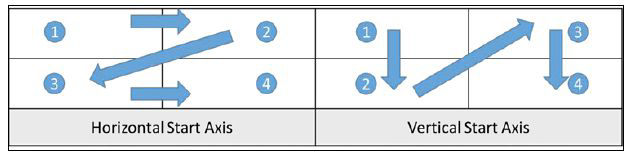
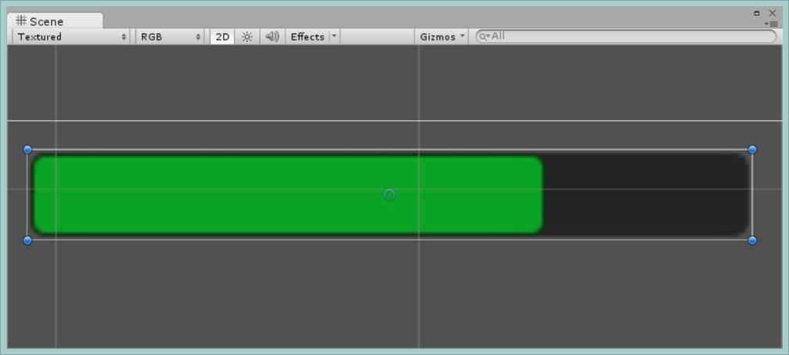

Con questo laboratorio, penseremo all'introduzione della componente Auto Layout, alla creazione di FPS counter e alla creazione di una health bar (barra della vita).

## Auto Layout
Il sistema di layout *Rect Transform* è abbastanza flessibile da gestire molti tipi diversi di layout e consente anche di posizionare gli elementi in una forma libera completa.

Il sistema di layout automatico consente di posizionare gli elementi in gruppi di layout nidificati come gruppi orizzontali, gruppi verticali o griglie. Consente inoltre di ridimensionare automaticamente gli elementi in base al contenuto contenuto.

## Gruppi di layout
Un gruppo di layout funziona come un controller di layout che controlla le dimensioni e le posizioni dei suoi elementi di layout figlio. Ad esempio, un gruppo di layout orizzontale posiziona i suoi figli uno accanto all'altro e un gruppo di layout griglia posiziona i suoi figli in una griglia. I componenti dei gruppi di layout sono:
- **gruppo di layout orizzontale**;
- **gruppo di layout verticale**;
- **gruppo di layout a griglia**.

### Horizontal Layout Group (gruppo di layout orizzontale)
Il componente *Horizontal Layout Group* posiziona i suoi elementi figli uno accanto all'altro, fianco a fianco.

### Vertical Layout Group (gruppo di layout verticale)
Il componente *Vertical Layout Group* posiziona i suoi elementi di layout figlio uno sopra l'altro.

### Grid Layout Group (gruppo di layout a griglia)
Il componente *Grid Layout Group* posiziona i suoi elementi di layout figlio in una griglia.

A differenza di altri gruppi di layout, il *Grid Layout Group* assegna a tutti una dimensione fissa definita con la proprietà *Cell Size* del *Grid Layout Group* stesso.

Il *Grid Layout Group* è leggermente più avanzato rispetto ai gruppi di layout orizzontale e verticale, offrendoti maggiore flessibilità e controllo.

Le opzioni aprono nuove possibilità su come organizzare i figli della griglia; tutte queste impostazioni determineranno quante celle appariranno all'interno di *Rect Transform* della griglia e come sono disposte:
- **Cell Size:** questo definisce la dimensione della cella interna degli elementi figlio;
- **Spacing:** come con gli altri gruppi di layout, puoi definire la spaziatura tra gli elementi figlio;
- **Start Corner:** questa proprietà imposta quale è la prima cella all'interno della griglia da cui vengono disegnati i bambini;
- **Child Alignment:** puoi elementi figlio all'interno delle celle della griglia attorno a uno qualsiasi dei bordi o al centro;
- **Start Axis:** con Start Corner, puoi anche definire il flusso per le celle disegnando prima in direzione orizzontale (partendo dal Start Corner) oppure puoi disegnare prima in direzione verticale; 
    
- **Constraint:** se si desidera limitare il numero di righe o colonne, la griglia mostrerà che è possibile impostare questa proprietà su *Fixed Row Count* o *Fixed Column Count*, che aprirà un'ulteriore proprietà *Constraint Count* per fornire il numero vincolato. L'impostazione predefinita è flessibile, che è sostanzialmente non vincolato.

## Opzioni di layout
Il comportamento predefinito dei componenti del *gruppo di layout* è buono per la maggior parte delle situazioni, ma per altre si desidera aggiungere un livello di controllo più fine. Per queste situazioni, Unity ha fornito diverse sostituzioni del layout per limitare l'uso dei controlli all'interno di un gruppo o come elemento autonomo dell'interfaccia utente:
- **Layout Controllers:** *Content Size Fitter* e *Aspect Ratio Fitter*;
- **Scroll Rects**;
- **Masks**.

## Controllori di layout
I controller di layout sono componenti che controllano le dimensioni e possibilmente le posizioni di uno o più elementi di layout, ovvero gli *Game Objects* con *Rect Transforms*.

Un controller di layout può controllare il proprio elemento di layout (lo stesso *Game Objects* che è su se stesso) o può controllare elementi di layout figlio.

Esempi di componenti del controller di layout che utilizzano le informazioni fornite dagli elementi di layout sono *Content Size Fitter* e i vari componenti del gruppo di layout.

## Content Size Fitter
**Content Size Fitter** funziona come un controller di layout che controlla la dimensione del proprio elemento di layout. La dimensione è determinata dalle dimensioni minime o preferite fornite dai componenti degli elementi di layout sul *GameObject*

Quando aggiungi *Content Size Fitter* a un *GameObject*, ottieni tre opzioni per asse:
- **Unconstrained:** non fare nulla, Content Size Fitter non controlla questo asse;
- **MinSize:** questo espone il contenuto e limita la larghezza o l'altezza di *Rect Transforms* ai valori minimi del contenuto di *GameObjects* e/o dei bambini
- **PreferredSize:** questo espone il contenuto e limita la larghezza o l'altezza di *Rect Transforms* ai valori preferiti del contenuto di *GameObjects* e/o dei bambini.

Creiamo, per esempio, una finestra di testo che aumenterà e si ridurrà automaticamente in base al testo al suo interno:

1. aggiungi una tela alla scena (*Create -> UI -> Canvas*) o usane una che hai già;
2. fare clic con il pulsante destro del mouse sul *Canvas* e selezionare *UI -> Image*: questo è lo sfondo della nostra finestra di testo;
3. fare clic con il pulsante destro del mouse sull'immagine e selezionare *UI -> Text* per aggiungere un componente di testo figlio;
4. seleziona l'immagine nella *Hierarchy* e nell'*Inspector* fai clic sul pulsante *Add Component* e quindi seleziona *Layout -> Vertical layout Group*;
5. sempre con l'immagine selezionata, fai clic su *Add Component* e seleziona *Layout -> Content Size Fitter*;
6. modificare l'*Horizontal Fit* di *Content Size Fitter* a *Preferred Size*.

## Aspect Ratio Fitter
**Aspect Ratio Fitter** funziona come un controller di layout che controlla le dimensioni del proprio elemento di layout. Può regolare l'altezza per adattarla alla larghezza o viceversa, oppure può adattare l'elemento all'interno del genitore o all'involucro del genitore.

L'*Aspect Ratio Fitter* ha diverse modalità:
- **None:** questo non fa niente; 
- **Width Controls Height:** in questa modalità, l'*Aspect Radio* altererà l'altezza della *Rect Transform* a cui è collegato in base alla sua larghezza. Quindi, *Height = (Width*Aspect Ratio)*;
- **Height Controls Width:** in questa modalità, l'*Aspect Ratio* altererà la larghezza della *Rect Transform* a cui è collegato in base alla sua altezza. Quindi, *Width = (Height*Aspect Ratio)*;
- **Fit In Parent:** questa modalità ridimensionerà una *Rect Transform* entro i limiti del suo genitore in base al *Aspect Ratio*;
- **Envelope Parent:** la modalità *Envelope Parent* è la stessa della modalità *Fit In Parent*, ma invece di lavorare all'interno della *Rect Transform* padre, applica la sua logica per essere al di fuori della *Rect Transform* padre. Quindi funziona verso l'esterno dal genitore.

## Scroll Rect
Quando un gruppo di layout deve essere più grande di quanto il display possa gestire, è qui che entra in gioco *Scroll Rect*. Ciò fornisce all'utente un'area con cui può interagire che fornisce la capacità di scorrimento al contenuto *Rect Transform* selezionato.

Facciamo un esempio di utilizzo:
- aggiungi un *Canvas* alla scena;
- fare clic con il pulsante destro del mouse sull'area di disegno e selezionare *Create Empty* per aggiungere un *GameObject* vuoto dal figlio;
- rinominare il nuovo oggetto *GameObject* vuoto in *ScrollRectArea*;
- impostare la larghezza di *ScrollRectArea* su 300, questo formerà l'area dello schermo con cui l'utente può interagire;
- con *ScrollRectArea* selezionata e aggiungervi un componente *Scroll Rect*;
- aggiungi un altro *GameObject* vuoto come figlio a *ScrollRectArea* e rinominalo in *Content*;
- impostare la larghezza del contenuto *GameObject* su 1000 o superiore;
- seleziona *Content* del *GameObject* e aggiungi un gruppo di layout orizzontale;
- aggiungi più immagini come figli del *Content* del *GameObject* e impostale su colori diversi;
- selezionare *ScrollRectArea* del *GameObject* e trascinare il *Content* del *GameObject* appena creato dalla gerarchia alla proprietà *Content* dello *Scroll Rect*.

## Masks
Una maschera limita il disegno dei componenti figli alla *Rect Transform* del *GameObject* a cui è collegata.

Se aggiungi un componente *Masks* al *GameObject* del *ScrollRectArea* (e un componente Immagine senza impostare un'immagine sorgente, poiché la maschera richiede un componente grafico), mostrerebbe solo l'*Content Area* entro i limiti del *Rect Transform* del *GameObject* della *ScrollRectArea*.

## FPS counter
L'esempio di testo più semplice utilizzato nella maggior parte dei giochi è un contatore FPS, quindi creiamo uno script per quello. Inizia creando un nuovo script *C#* nel tuo progetto chiamato *FPSCounter*.

Abbiamo bisogno di un componente *Text* collegato al *GameObject*, per questo utilizziamo l'attributo *RequireComponent*, aggiungiamo anche il namespace *UnityEngine.UI* che contiene tutte le funzionalità dell'interfaccia utente:
```csharp
using UnityEngine;
using UnityEngine.UI;
using System.Collections;

[RequireComponent(typeof(Text))]
public class FPSCounter : MonoBehaviour {
    ...
}
```
Aggiungeremo alcune semplici proprietà per tracciare l'FPS:
```csharp
...
private Text textComponent;
private int frameCount = 0;
private float fps = 0;
private float timeLeft;
private float accum = 0f;
private float updateInterval = 0.5f;
...
```
Abbiamo bisogno di catturare il nostro componente *Text* usato da *GameObject*, lo facciamo nella funzione *Start()*:
```csharp
...
void Start() {
    textComponent = GetComponent<Text>();
    timeLeft = updateInterval;
}
...
```
Infine, abbiamo bisogno di un ciclo di aggiornamento per calcolare l'FPS e impostare la variabile *Text* sul controllo *Text*:
```csharp
void Update() {
    // contatore del numero di fotogrammi renderizzati
    frameCount += 1;
    // tempo rimasto per l'intervallo corrente
    timeLeft -= Time.deltaTime;
    // il numero di FPS accumulati nell'intervallo
    accum += Time.timeScale / Time.deltaTime;
    if (timeLeft <= 0f) {
        fps = (int) accum / frameCount;
        timeLeft = updateInterval;
        accum = 0f;
        frameCount = 0;
    }
    if (fps < 30) { textComponent.color = Color.red; }
    else if (fps < 60) { textComponent.color = Color.yellow; }
    else { textComponent.color = Color.green; }
    textComponent.text = fps.ToString();
}
```
Il codice totale dovrebbe essere il seguente:
```csharp
using System.Collections;
using System.Collections.Generic;
using UnityEngine;
using UnityEngine.UI;

[RequireComponent(typeof(Text))]
public class FPSCounter : MonoBehaviour {
    private Text textComponent;
    private int frameCount = 0;
    private float fps = 0;
    private float timeLeft;
    private float accum = 0;  
    private float updateInterval = 0.5f;  

    void Start() {
        textComponent = GetComponent<Text>();
        timeLeft = updateInterval;
    }

    void Update() {
        frameCount += 1;
        timeLeft -= Time.deltaTime;
        accum += Time.timeScale / Time.deltaTime;
        if(timeLeft <= 0f) {
            fps = (int) accum/frameCount;
            timeLeft = updateInterval;
            accum = 0f;
            frameCount = 0;
        }
        if(fps < 30) { textComponent.color = Color.red; }
        else if(fps < 60) { textComponent.color = Color.yellow; }
        else { textComponent.color = Color.green; }
        textComponent.text = fps.ToString();
    }
}

```

## Barra della salute
Andremo a vedere come si crea l'oggetto dell'interfaccia utente della barra della salute:
- aggiungi un nuovo *Slider* alla scena;
- espandere il controllo *Slider* nella gerarchia ed eliminare l'*Handle Slide Area*;
- selezionare lo *Slider* e fare clic sulla proprietà *Handle Rect*. Se dice "Missing Rect Transform", premi *Elimina* (per cancellare la proprietà poiché non abbiamo handle);
- impostare il *Target Graphic* del *Slider* su *Fill GameObject*;
- impostare la proprietà larghezza dello *Slider* su 200;
- impostare la proprietà altezza dello *Slider* su 25;
- selezionare il background del *GameObject* nella *Hierarchy* e impostare la proprietà *Colore* dell'immagine su *Nero*;
- ridimensionare *Rect Transform* del background del *GameObject* per riempire l'area dello *Slider* del *GameObject*;
- selezionare nuovamente lo *Slider* e impostare la proprietà *Max Value* su *100*;
- seleziona la casella *Whole Numbers* sullo *Slider*;
- seleziona il *Fill GameObject* nella gerarchia del progetto e imposta la proprietà *Colore* dell'immagine su *Verde*;
- ridimensionare il *Rect Transform* del *FillArea GameObject* per riempire l'area dello *Slider GameObject*.



Iniziamo ad analizzare una soluzione per rendere interattiva la nostra barra della salute. Innanzitutto apri il nostro *PlayerCharacter.cs* e definisci ciò di cui abbiamo bisogno.
```csharp
public int health;
[SerializeField] private Slider healthBar;
[SerializeField] private Image fillImg;
[SerializeField] private Text gameOver;
[SerializeField] private Image damageImage;
private Color flashColor = new Color(1f, 0f, 0f, 0.1f);
private float flashSpeed = 5f;
private float barValueDamage;
private Image healthBarBackground;
private bool damaged;
```
Quindi nel nostro *Start()* inizializza il *barValueDamage* e prendi il nostro componente *healthBarBackground*: il primo definisce la quantità di decremento per il nostro valore della barra, in modo generico, il secondo ci fornisce il componente *Image UI* del nostro sfondo della barra della salute:
```csharp
void Start() {
    barValueDamage = healthBar.maxValue / health;
    healthBarBackground = healthBar.GetComponentInChildren <Image>();
}
```
Il metodo *Hurt()* viene chiamato dallo script *Fireball.cs* quando il nostro oggetto fireball entra in collisione con un oggetto che ha il componente *PlayerCharacter*.
Qui dobbiamo definire lo stato "danneggiato" e aggiornare i valori per la salute del giocatore e per la barra della salute:
```csharp
public void Hurt(int damage) {
    // per il colore di danno
    damaged = true;
    health -= damage;
    healthBar.value -= barValueDamage;
}
```
In *Update()*, controlliamo se il giocatore "è morto" dopo che il giocatore è stato danneggiato e quindi avviamo l'effetto video:
```csharp
void Update () {
    if(health <= 0) { Death (); }
    if(damaged) {
        damageImage.color = flashColor;
    } else {
        // colore trasparente (nello specifico, pulisce il vecchio colore)
        damageImage.color = Color.Lerp (damageImage.color, Color.clear, flashSpeed * Time.deltaTime);
    }
    damaged = false;
}
```
Se il giocatore è morto chiamiamo il nostro metodo della morte:
```csharp
public void Death() {
    // cacciamo la barra
    fillImg.enabled = false;
    // mostriamo la scritta "Game Over"
    gameOver.enabled = true;
    // blocca il tempo, non ti fa piu' muovere
    Time.timeScale = 0;
    healthBarBackground.color = Color.red;
}
```
