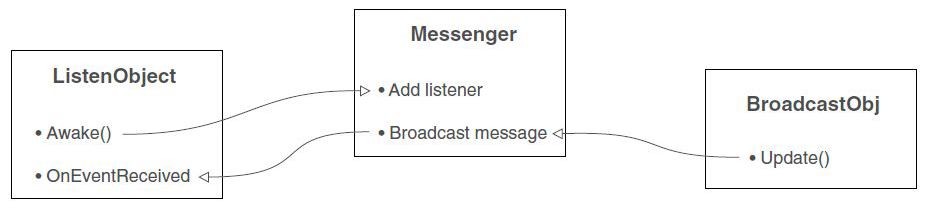

Con questo laboratorio, penseremo al rispondere a un altro evento del mouse, a fare in modo che l'HUD influenzi il gioco e a come mettere in pausa il nostro gioco.

## Rispondere ad altri eventi del mouse
*OnClick* è l'unico evento esposto dal componente pulsante, ma gli elementi dell'interfaccia utente possono rispondere a una serie di interazioni diverse utilizzando un componente *EventTrigger*. Aggiungi un nuovo componente all'oggetto pulsante e cerca la sezione *Event* del menu del componente, troverai il componente *EventTrigger*.

Sebbene l'*OnClick* del pulsante abbia risposto solo a un clic completo (il pulsante del mouse è stato premuto e quindi rilasciato), proviamo a rispondere al pulsante del mouse premuto ma non rilasciato.

## Componente *EventTrigger*
Esegui gli stessi passaggi di *OnClick*, rispondendo solo a un evento diverso. Innanzitutto aggiungi un altro metodo a UIController cioè *OnPointerDown()*:
```csharp
public void OnPointerDown() {
    Debug.Log("pointer down");
}
```
Ora fai clic su *Add New Event Type* per aggiungere un nuovo tipo al componente *EventTrigger*. Scegli *Pointer Down* per l'evento. Questo creerà un pannello vuoto per quell'evento, proprio come *OnClick*. Fare clic sul pulsante *+* per aggiungere un elenco di eventi, trascinare l'oggetto controller su questa voce e selezionare *OnPointerDown()* nel menu.

## Fare in modo che l'HUD influenzi il gioco
I controlli che abbiamo creato durante la lezione precedente generano output di debug, ma in realtà non influiscono sul gioco. Ora, l'HUD e il gioco principale si sono ignorati a vicenda.

L'obiettivo è mantenerli abbastanza indipendenti l'uno dall'altro limitando i riferimenti tra gli oggetti nella scena e gli oggetti della nostra UI.

## Sistema di eventi di trasmissione
Vedremo come funziona un sistema di eventi di trasmissione come mostrato in questo diagramma.



- **ListenObject:** gli oggetti possono registrarsi per ascoltare eventi specifici, assegnando una funzione come callback;
- **Messenger:** è un modulo centrale che instrada i messaggi tra emittenti e ascoltatori;
- **BroadcastObj:** un altro oggetto può dire al Messenger di trasmettere eventi specifici. Messenger indirizzerà il messaggio a tutto ciò che è in ascolto per quell'evento.

Per avvisare l'interfaccia utente delle azioni nella scena (o viceversa), utilizzeremo un sistema di messaggistica broadcast.

Il diagramma illustra come funziona questo sistema di messaggistica degli eventi: gli script possono registrarsi per ascoltare un evento, un altro codice può trasmettere un evento e gli ascoltatori verranno avvisati dei messaggi trasmessi.

## Integrazione di un sistema di eventi
Vogliamo un sistema di trasmissione di messaggistica, in cui le trasmissioni possono provenire da qualsiasi luogo. Unity non ha un sistema di trasmissione di messaggistica integrato.

Un sistema di messaggistica è ottimo per fornire un modo disaccoppiato di comunicare gli eventi al resto del programma. Quando un codice trasmette un messaggio, quel codice non ha bisogno di sapere nulla sugli ascoltatori, consentendo una grande flessibilità nell'aggiunta di oggetti.

## Script *GameEvent*
Devi anche creare uno script chiamato *GameEvent*. Lo script definisce una costante per un paio di messaggi di evento; i messaggi sono più organizzati in questo modo e non devi ricordare e digitare la stringa del messaggio dappertutto. Il codice dovrebbe essere il seguente:
```csharp
public static class GameEvent {
    public const string ENEMY_HIT = "ENEMY_HIT";
    public const string SPEED_CHANGED = "SPEED_CHANGED";
}
```

## Trasmettere dalla scena
Ora il sistema di messaggistica degli eventi è pronto per l'uso, quindi iniziamo a usarlo. Per prima cosa comunicheremo **dalla scena all'HUD**, quindi andremo nell'altra direzione.

Finora il display del punteggio ha visualizzato un timer come test della funzionalità di visualizzazione del testo. Ma vogliamo visualizzare un conteggio dei nemici colpiti, quindi modifichiamo il codice in *UIController*: per prima cosa **elimina l'intero contenuto di *Update()***, perché quello era il codice di test; quando un nemico muore, emetterà un evento, quindi *UIController* ascolterà quell'evento.

Il codice da aggiungere nell'*UIController* è il seguente:
```csharp
...
private int _score;

void Awake() {
    // dichiara quale metodo risponde all'evento ENEMY_HIT
    Messenger.AddListener(GameEvent.ENEMY_HIT, OnEnemyHit);
}

void OnDestroy() {
    // quando un oggetto viene distrutto, utilizzare il listener di pulizia per evitare errori
    Messenger.RemoveListener(GameEvent.ENEMY_HIT, OnEnemyHit);
}

void Start() {
    // inizializza il punteggio a 0
    _score = 0; scoreLabel.text = _score.ToString();
    settingsPopup.Close();
}
private void OnEnemyHit() {
    // aumentare il punteggio in risposta all'evento
    _score += 1;
    scoreLabel.text = _score.ToString();
}
...
```

## *Awake()* e *OnDestroy()*
Come *Start()* e *Update()*, ogni *MonoBehaviour* risponde automaticamente quando l'oggetto si risveglia o viene rimosso. Un listener viene aggiunto e rimosso in *Awake()/OnDestroy()*. Questo listener fa parte del sistema di messaggistica broadcast e chiama *OnEnemyHit()* quando viene ricevuto quel messaggio.

*OnEnemyHit()* incrementa il punteggio e quindi inserisce quel valore nella visualizzazione del punteggio.

## Trasmetti un messaggio
Gli *event listeners* sono impostati nel codice *UIController*, quindi ora dobbiamo trasmettere quel messaggio ogni volta che un nemico viene colpito. **Dove lo scriviamo?** Il codice per rispondere ai risultati è in *RayShooter.cs*, quindi emetti il messaggio come mostrato qui:
```csharp
...
if(target != null){
    target.ReactToHit();
    // trasmissione del messaggio aggiunta per la risposta al successo
    Messenger.Broadcast(GameEvent.ENEMY_HIT);
} else {
...
```
Gioca dopo aver aggiunto quel messaggio e guarda il display del punteggio quando spari a un nemico.

Dovresti vedere il conteggio aumentare ogni volta che fai un colpo. Ciò copre l'invio di messaggi dal gioco 3D all'interfaccia 2D.

Ma vogliamo anche un esempio che vada nella direzione opposta.

## Trasmissione dall'HUD
Nelle diapositive precedenti, un evento è stato trasmesso dalla scena e ricevuto dall'HUD.

In modo simile, i controlli dell'interfaccia utente possono trasmettere un messaggio ascoltato sia dai giocatori che dai nemici. In questo modo, il pop-up delle impostazioni può influenzare le impostazioni del gioco.

Apri *WanderingAI.cs* e aggiungi il codice mostrato qui:
```csharp
...
// velocita' di base che viene regolata dall'impostazione della velocita'
public const float baseSpeed = 3.0f;
...
void Awake() {
    Messenger<float>.AddListener(GameEvent.SPEED_CHANGED, OnSpeedChanged);
}

void OnDestroy() {
    Messenger<float>.RemoveListener(GameEvent.SPEED_CHANGED, OnSpeedChanged);
}
...
private void OnSpeedChanged(float value) {
    // metodo dichiarato nel listener per l'evento SPEED_CHANGED
    speed = baseSpeed * value;
}
...
```

## *WanderingAI.cs* e *FPSInput.cs*
Il codice in *UIController.cs* utilizzava solo un evento generico, ma il sistema di messaggistica può passare un valore insieme al messaggio.

Supportare un valore nell'ascoltatore è semplice, nota il *<float>* aggiunto al comando del *listener*.

Ora apporta le stesse modifiche in *FPSInput.cs* per influenzare la velocità del giocatore. Il codice in *WanderingAI.cs* è quasi esattamente lo stesso, tranne per il fatto che il giocatore ha un numero diverso per *baseSpeed*.

Apri *FPSInput.cs* e aggiungi il codice mostrato qui:
```csharp
...
public const float baseSpeed = 6.0f;
...
void Awake() {
    Messenger<float>.AddListener(GameEvent.SPEED_CHANGED, OnSpeedChanged);
}
void OnDestroy() {
    Messenger<float>.RemoveListener(GameEvent.SPEED_CHANGED, OnSpeedChanged);
}
...
private void OnSpeedChanged(float value) {
    speed = baseSpeed * value;
}
...
```

## Trasmetti messaggio dal *SettingsPopup*
Infine, trasmetti i valori di velocità da *SettingsPopup* in risposta allo slider:
```csharp
public void OnSpeedValue(float speed) {
    // invia il valore dello slider come evento <float>
    Messenger<float>.Broadcast(GameEvent.SPEED_CHANGED, speed);
    ...
```
Ora il nemico e il giocatore cambiano la loro velocità quando regoli il cursore.

## Nemici generati
Attualmente il valore della velocità viene aggiornato solo per i nemici già nella scena e non per i nemici appena generati; i nuovi nemici non vengono creati con l'impostazione di velocità corretta.

Per risolvere il problema con i nuovi nemici creati, dobbiamo aggiungere un listener nel nostro script *SceneControllerN*:
```csharp
void Awake() {
    Messenger<float>.AddListener(GameEvent.SPEED_CHANGED, UpdateNewEnemiesSpeed);
}

void OnDestroy() {
    Messenger<float>.RemoveListener(GameEvent.SPEED_CHANGED, UpdateNewEnemiesSpeed);
}
```
Ora gli event listeners sono impostati nello script *SceneControllerN*, quindi quando *SettingsPopup* trasmette i valori di velocità, in risposta allo slider, i nuovi nemici verranno aggiornati con il nuovo valore di velocità aggiunto durante la fase di spawn: 
```csharp
_enemies[i].GetComponent<WanderingAI>().speed = speed;
```

Ricordarsi di definire nello script *SceneControllerN* il metodo di cui abbiamo bisogno per aggiornare il valore di velocità:
```csharp
private void UpdateNewEnemiesSpeed(float value) {
    speed = WanderingAI.baseSpeed * value;
}
```

## Utilizzare il campo di immissione
Nel nostro pop-up delle impostazioni abbiamo il campo di input per definire il nome del giocatore. Per fare ciò dobbiamo inserire nella nostra tela un altro oggetto Text UI chiamato "PlayerName" a cui andremo a seleziona un colore bianco, aggiungere l'addetto alle dimensioni del contenuto del componente, aggiungere un'ombra componente e posizionare l'interfaccia utente di testo davanti alla health bar.

Quindi definiamo come aggiornare il nome del giocatore nel nostro script *SettingsPopup*.

Prendi il componente Text UI del nostro PlayerName UI Object. Quindi modificare il metodo *OnSubmitName()* per aggiornare il nome del giocatore:

```csharp
...
[SerializeField] private Text nameLabel;
...
public void OnSubmitName(string name) {
    nameLabel.text = name;
}
...
```

## Metti in pausa il gioco
Dobbiamo fermare il gioco che entra nel nostro *Settings pop-up*: per farlo possiamo impostare la scala temporale uguale a 0 e fermare ogni input da mouse e tastiera (evitando il problema di input da mouse e tastiera durante la gestione del nostro *Settings pop-up*).

Possiamo anche disabilitare il cursore del mouse e aprire il metodo *Settings pop-up Open* facendo clic sul pulsante "Esc"; per disabilitare il nostro cursore del mouse in Start() dello script *RayShooter* aggiungiamo (di nuovo):
```csharp
...
Cursor.lockState = CursorLockMode.Locked;
Cursor.visible = false;
...
```
Usando l'input da tastiera possiamo aprire il *Settings pop-up*, nel nostro *UIController.cs* definiamo *Update()* per farlo:
```csharp
void Update () {
    if (Input.GetKeyDown(KeyCode.Escape)){
        settingsPopup.Open();
    }
}
```
Nella nostra classe *GameEvent.cs* definire un nuovo bool statico *isPaused*, sarà utile per conoscere lo stato del nostro gioco, se è in pausa o meno:
```csharp
...
public static bool isPaused = false;
...
```
Aggiungi due metodi *PauseGame* e *UnPauseGame* al nostro script **SettingsPopup**:
```csharp
public void PauseGame (){
    GameEvent.isPaused = true;
    Cursor.lockState = CursorLockMode.None;
    Cursor.visible = true;
    Time.timeScale = 0f;
}

public void UnPauseGame (){
    GameEvent.isPaused = false;
    Cursor.lockState = CursorLockMode.Locked;
    Cursor.visible = false;
    Time.timeScale = 1f;
}
```
Ora durante l'esecuzione dei metodi *Open* e *Close* in *SettingsPopup* possiamo mettere in pausa e annullare la pausa del gioco:
```csharp
public void Open() {
    gameObject.SetActive(true);
    PauseGame();
}

public void Close() {
    gameObject.SetActive(false);
    UnPauseGame();
}
```
Ora possiamo bloccare lo script *MouseLook* usando il nostro stato in pausa:
```csharp
void Update() {
    if(!GameEvent.isPaused) {
        ...
    }
}
```
Ora possiamo bloccare lo script *FPSInput* usando il nostro stato in pausa. Allo stesso modo del nostro *MouseLook*:
```csharp
void Update() {
    if(!GameEvent.isPaused) {
        ...
    }
}
```

## Metodo *Death()*
Infine nel metodo *Death()* del nostro *PlayerCharacter.cs* abilita i nostri cursori del mouse quando il "gioco è finito", quindi metti in pausa il gioco:
```csharp
public void Death (){
    fillImg.enabled = false;
    gameOver.enabled = true;
    healthBarBackground.color = Color.red;
    
    Cursor.visible = true;
    Cursor.lockState = CursorLockMode.None;
    Time.timeScale = 0;
    GameEvent.isPaused = true;
}
```
