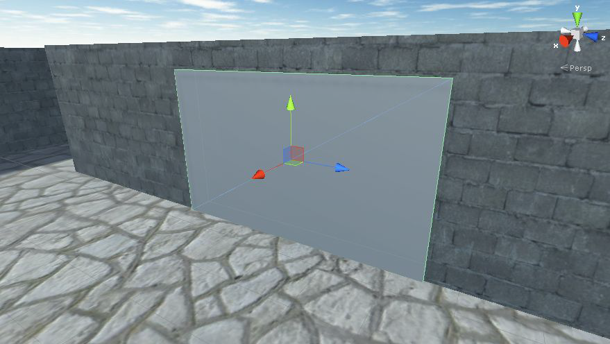
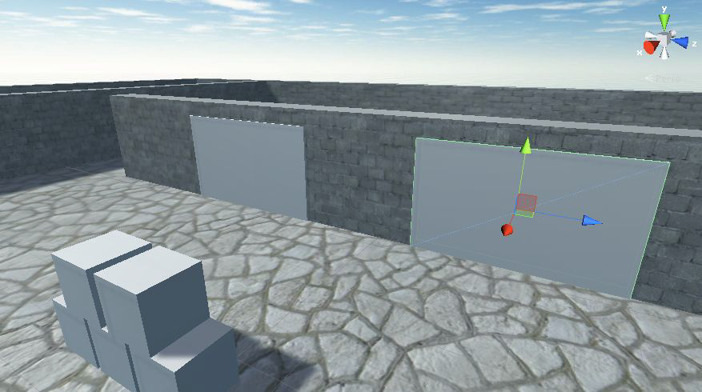
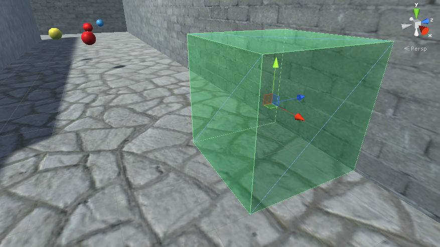

Con questo laboratorio, penseremo a come visualizzare le immagini scaricate da Internet, all'invio di dati a un server web e all'analisi dei dati JSON.

## Caricamento immagini da Internet
Creiamo un cartellone che mostra un'immagine scaricata da Internet. È necessario codificare due passaggi: **scaricare** un'immagine da visualizzare e **applicare** quell'immagine all'oggetto *Billboard*. Quindi, come terzo passaggio, migliorerai il codice in modo che l'immagine venga archiviata per essere utilizzata su **più cartelloni**.

Stai per scaricare alcune immagini pubbliche. L'architettura del codice per il download di un'immagine è molto simile all'architettura per il download dei dati: il nuovo modulo manager (chiamato *ImagesManager*) verrà utilizzato per scaricare le immagini da visualizzare. Ancora una volta, i dettagli della connessione a Internet e dell'invio di richieste HTTP verranno sviluppati in *NetworkService* e *ImagesManager* chiamerà *NetworkService* per scaricare le immagini.

Il codice per scaricare un'immagine sarà quasi identico al codice per scaricare i dati. La differenza principale è il tipo di metodo di callback; nota che questa volta il callback prende un **Texture2D** invece di una stringa.
```csharp
    ... 
    private const string webImage = "https://upload.wikimedia.org/wikipedia/commons/thumb/2/2b/Unical-cubi.jpg/ 
        1920px-Unical-cubi.jpg";
    ... 
    public IEnumerator DownloadImage(Action<Texture2D> callback) {
        UnityWebRequest www = UnityWebRequestTexture.GetTexture(webImage);
        yield return www.SendWebRequest();
        Texture2D downloadedTexture = DownloadHandlerTexture.GetContent(www);
        callback(downloadedTexture);
    }
    ... 
```

## Script *ImagesManager*
Creiamo un nuovo script C# chiamato *ImagesManager*: iniziamo a definire questo nuovo manager.

```csharp
using UnityEngine;
using System.Collections;
using System.Collections.Generic;
using System;

public class ImagesManager : MonoBehaviour, IGameManager {
    public ManagerStatus status {get; private set;}
    private NetworkService _network;
    private Texture2D _webImage;
    
    public void Startup() {
        Debug.Log("Images manager starting...");
        _network = new NetworkService ();
        status = ManagerStatus.Started;
    }
    ... 
```
La parte più interessante di questo codice è ***GetWebImage()***; tutto il resto in questo script è costituito da proprietà e metodi standard che implementano l'interfaccia del gestore: quando viene chiamato *GetWebImage()*, restituirà l'immagine web. Per prima cosa verificherà se *_webImage* ha già un'immagine archiviata: in caso contrario, invocherà la chiamata di rete per scaricare l'immagine. Se *_webImage* ha già un'immagine memorizzata, *GetWebImage()* invierà l'immagine memorizzata.
```csharp
    ... 
    public void GetWebImage(Action<Texture2D> callback) {
        if (_webImage == null) {
            StartCoroutine(_network.DownloadImage(callback));
        } else {
            callback(_webImage);
        }
    }
} // ImagesManager
```
*ImagesManager* deve essere aggiunto a *Managers*: applica le seguenti modifiche al tuo *Managers.cs* e ricorda di allegare lo script *ImagesManager* all'oggetto *Game Manager* nel tuo progetto.
```csharp
... 
[RequireComponent(typeof(ImagesManager))]
... 
    public static ImagesManager Images {get; private set;}
    ... 
    void Awake() {
        ... 
        Images = GetComponent<ImagesManager>();
        ... 
        _startSequence.Add(Images);
        StartCoroutine(StartupManagers());
    } // Awake
    ... 
```
Il *ImagesManager* che abbiamo scritto ora non fa nulla, quindi creeremo un oggetto billboard che chiamerà i metodi nell'*ImagesManager*.
Ma prima di tutto crea un nuovo cubo, chiama questo cubo *Billboard* e poi posizionalo nella scena: ho usato *Posizione* -10.7, 1.5, -5, *Rotazione* 0, 90, 0 e *Scala* 5, 3, 0.5.
Creerai un dispositivo che funzioni proprio come il monitor che cambia colore: anche qui utilizzeremo il nostro script *DeviceOperator* allegato al nostro lettore durante le lezioni precedenti. Quello script funzionerà sui dispositivi vicini quando viene premuto il pulsante *Alt*.



Crea uno script per il cartellone chiamato *WebLoadingImage*: inserisci quello script sull'oggetto *Billboard*. Questo script chiama *ImagesManager.GetWebImage()* quando il dispositivo viene utilizzato e applica l'immagine dalla funzione di callback.

```csharp
using UnityEngine;
using System.Collections;

public class WebLoadingImage : MonoBehaviour {
    public void Operate() {
        Managers.Images.GetWebImage(OnWebImage);
    }
    
    private void OnWebImage(Texture2D image) {
        GetComponent<Renderer>().material.mainTexture = image;
    }
}
```

## Memorizza immagine scaricata
*ImagesManager* **non memorizza ancora** l'immagine scaricata.
Ciò significa che l'immagine verrà scaricata sempre per più cartelloni pubblicitari. Questo è inefficiente! Regoleremo *ImagesManager* per memorizzare nella cache le immagini che sono state scaricate.
La chiave è fornire una funzione di callback in *ImagesManager* che prima salva l'immagine e quindi chiama la callback da *WebLoadingImage*.
Non c'è modo di scrivere un metodo in *ImagesManager* che chiami un metodo specifico in *WebLoadingImage* perché il codice non conosce il nostro oggetto *Billoboard*. Il modo è usare le **funzioni lambda**.

Una **funzione lambda** (chiamata anche **funzione anonima**) è una funzione che non ha un nome. Tali funzioni vengono solitamente create al volo all'interno di altre funzioni: utilizzando una funzione lambda per il callback in *ImagesManager*, il codice può creare al volo la funzione di callback utilizzando il metodo passato da *WebLoadingImage*.

La modifica principale era nella funzione passata a *NetworkService.DownloadImage()*, ora il callback inviato a *NetworkService* era una funzione lambda separata dichiarata sul posto che chiamava il metodo da *WebLoadingImage*.
```csharp
    ... 
    public void GetWebImage(Action<Texture2D> callback) {
        if (_webImage == null) {
            // StartCoroutine(_network.DownloadImage(callback));
            StartCoroutine(_network.DownloadImage((Texture2D image) => {
                _webImage = image;
                callback(_webImage);
            }));
        }
        else {
            callback(_webImage);
        }
    }
} // ImagesManager
```
Rendere il callback una funzione separata ha permesso di fare di più che chiamare il metodo in *WebLoadingImage*; in particolare, **la funzione lambda memorizza anche una copia locale dell'immagine scaricata**.
Quindi *GetWebImage()* deve scaricare l'immagine solo la prima volta; tutte le chiamate successive utilizzeranno l'immagine memorizzata localmente.
L'effetto sarà rilevante solo su più cartelloni, duplichiamo l'oggetto *Billboard* in modo che ci sia un secondo cartellone nella scena (come mostrato nella diapositiva seguente).



Ora gioca e **guarda cosa succede**. Quando si aziona il primo cartellone, ci sarà una pausa durante il download dell'immagine da Internet. Ma quando vai al secondo cartellone, l'immagine apparirà immediatamente perché è già stata scaricata.

## Invio di dati su un server web
Abbiamo esaminato più esempi di download di dati, ma abbiamo ancora bisogno di vedere un esempio di **invio di dati**. Ora il nostro obiettivo sarà pubblicare i dati meteorologici sul server quando il giocatore raggiunge un checkpoint nella scena.

Questo checkpoint sarà un trigger, proprio come il trigger della porta: devi **creare un nuovo oggetto cubo**, posizionare l'oggetto nella scena, impostare il collisore su *Trigger* e applicare un materiale *semitrasparente* come hai fatto nella lezione precedente (come mostrato nella figura seguente). Chiama questo nuovo oggetto *CheckpointTrigger*.



Per completare questa attività è necessario disporre di un server per l'invio delle richieste: è possibile scaricare un software open source per configurare un server da testare, XAMPP
- vai su *www.apachefriends.org* per scaricare XAMPP;
- una volta installato e il server è in esecuzione, creare una cartella *virtualreality* nella cartella *htdocs* di XAMPP, qui inseriremo il nostro script lato server.

Ora il server è in esecuzione e l'oggetto trigger è nella scena, scriviamo i nostri script.

Come per il codice per il download dei dati, il codice per l'invio dei dati coinvolge ***WeatherManager*** che dice a ***NetworkService*** di effettuare la richiesta, perché *NetworkService* gestisce i dettagli della comunicazione HTTP. Nelle prossime slide vedremo come modificare lo script *NetworkService* per raggiungere il nostro obiettivo.

```csharp
    ... 
    private const string localApi = "http://localhost/virtualreality/api.php";
    ... 
    private IEnumerator CallAPI(string url, Hashtable args, Action<string> callback) {
        UnityWebRequest www;
        if (args == null) {
            www = UnityWebRequest.Get(url);
        } else {
            WWWForm form = new WWWForm();
            foreach(DictionaryEntry arg in args) {
                form.AddField(arg.Key.ToString(), arg.Value.ToString());
            }
            www = UnityWebRequest.Post(url, form);
        }
        yield return www.SendWebRequest();
        if (!IsResponseValid (www)) {
            yield break;
        }
        callback (www.downloadHandler.text);
    }
    ... 
    public IEnumerator GetWeatherXML(Action<string> callback) {
        return CallAPI(xmlApi, null, callback);
    }
    ... 
    public IEnumerator LogWeather(string name, float cloudValue, Action<string> callback) {
        Hashtable args = new Hashtable();
        args.Add("message", name);
        args.Add("cloud_value", cloudValue);
        args.Add("timestamp", DateTime.UtcNow);
        return CallAPI(localApi, args, callback);
    }
} // NetworkService
```
Si noti che *CallAPI()* ha un nuovo parametro. Questa è una tabella di argomenti da inviare insieme alla richiesta HTTP. Nel metodo *CallAPI()* è possibile creare un oggetto *WWWForm* in base a quella tabella di argomenti. **Abbiamo utilizzato *UnityWebRequest* per inviare una richiesta GET**, ma l'utilizzo di ***WWWForm*** la cambierà in una **richiesta POST per inviare dati**. Tutte le altre modifiche nel codice reagiscono a quella modifica centrale (ad esempio, modificando il codice *GetWeatherXML()* in base ai parametri *CallAPI()*).

Aggiungiamo il codice a *WeatherManager* che invia i dati:
```csharp
    ... 
    public void LogWeather(string name) {
        StartCoroutine(_network.LogWeather(name, cloudValue, OnLogged));
    }
    private void OnLogged(string response) {
        Debug.Log(response);
    }
} // WeatherManager
```

## Script *CheckpointTrigger*
Infine, dobbiamo aggiungere uno script di checkpoint al volume del trigger nella scena. Crea uno script chiamato *CheckpointTrigger*, inserisci quello script sull'oggetto trigger:
```csharp
using UnityEngine;
using System.Collections;

public class CheckpointTrigger : MonoBehaviour {
    public string identifier;
    private bool _triggered;
    void OnTriggerEnter(Collider other) {
        if (other.GetComponent<CharacterController> ()) {
            if (_triggered) { return; }
            Managers.Weather.LogWeather (identifier);
            _triggered = true;
        }
    }
}
```
Nell'*Inspector* apparirà uno slot *Identifier*; chiamalo qualcosa come *checkpointA*. Esegui il codice e i dati verranno inviati quando entri nel checkpoint. La risposta indicherà un errore, perché non c'è uno script sul server per ricevere la richiesta.

## Script lato server
Il server deve disporre di uno script per ricevere i dati inviati dal gioco. Gli script del server di codifica non sono il nostro scopo! Ma abbiamo bisogno di un piccolo script PHP per ricevere i dati, questo è l'approccio più semplice. Creare nella cartella *C:/xampp/htdocs/virtualreality* un file di testo e nominare il file api.php: quindi modificare questo file (io ho usato *Sublime Text*).

Questo script scrive i dati ricevuti in *data.txt*. Una volta che *api.php* è a posto, vedrai apparire i registri meteorologici in *data.txt* quando attivi i checkpoint nel gioco:

```php
<?php
$message = $_POST['message'];
$cloudiness = $_POST['cloud_value'];
$timestamp = $_POST['timestamp'];

$combined = $message." cloudiness=".$cloudiness." time=".$timestamp."
";

$filename = "data.txt";

file_put_contents($filename, $combined, FILE_APPEND | LOCK_EX);

echo "Logged";
?>
```

## Analisi JSON
XML è un formato comune per i dati trasferiti su Internet, ma un altro formato comune è JSON. Sono disponibili numerosi buoni parser JSON che puoi scaricare, come **MiniJSON**.

Crea uno script chiamato *MiniJSON* e incolla il codice. Ora puoi usare questa libreria per analizzare i dati JSON. Abbiamo ricevuto XML dall'API *OpenWeatherMap*, ma possono anche inviare gli stessi dati formattati come JSON.

Per ricevere i dati JSON è necessario **modificare lo script *NetworkService***. Prima di tutto **modificare l'URL**, è lo stesso ma senza ***&mode=xml***. I dati restituiti da questa richiesta hanno gli stessi valori, ma sono formattati in modo diverso: questa volta cerchiamo *"clouds":{"all":40}*.

```csharp
    ... 
    private const string jsonApi = 
    "http://api.openweathermap.org/data/2.5/ 
    weather?q=Roma,it&appid=e17b870eb05c8c85896ff6ca22e9d10d";
    ... 
```

Aggiungiamo anche il nuovo metodo *GetWeatherJSON*: questo metodo è lo stesso di *GetWeatherXML* ma prende come parametro *jsonApi* invece di *xmlApi*.
```csharp
    ... 
    public IEnumerator GetWeatherJSON(Action<string> callback) {
        return CallAPI(jsonApi, null, callback);
    }
    ... 
```
Ora **modifichiamo *WeatherManager*** per richiedere dati JSON anziché XML: la prima modifica riguarda il metodo *Startup*.
```csharp
... 
Using MiniJSON;
... 
    public void Startup() {
        Debug.Log("Weather manager starting...");
        _network = new NetworkService ();
        // StartCoroutine(_network.GetWeatherXML(OnXMLDataLoaded));
        StartCoroutine(_network.GetWeatherJSON(OnJSONDataLoaded));
        status = ManagerStatus.Initializing;
    }
    ... 
```
Quindi dobbiamo definire il nuovo metodo *OnJSONDataLoaded*: il parser JSON funziona con un *Dictionary* standard ed è presente anche un comando per deserializzare.

```csharp
    ... 
    public void OnJSONDataLoaded(string data) {
        Dictionary<string, object> dict;
        dict = (Dictionary<string,object>)Json.Deserialize(data);
        Dictionary<string, object> clouds = (Dictionary<string,object>)dict["clouds"];
        cloudValue = Convert.ToInt32(clouds["all"]) / 100f;
        Debug.Log("Value: " + cloudValue);
        Messenger.Broadcast(GameEvent.WEATHER_UPDATED);
        status = ManagerStatus.Started;
    }
    ... 
```

```