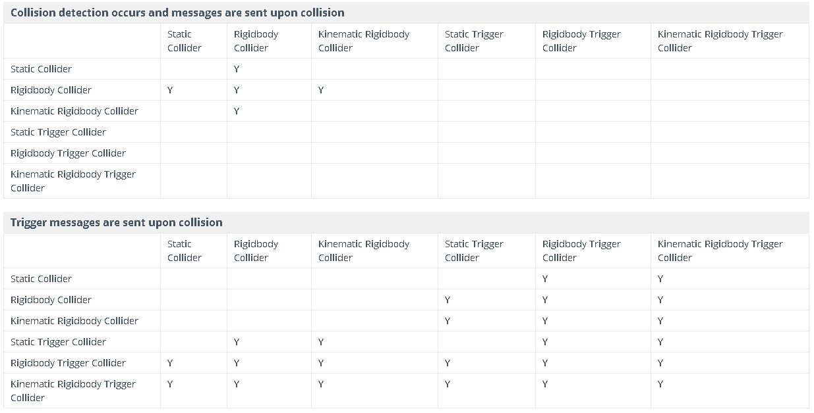

Con questo laboratorio, pensiamo all'utilizzo di componenti coinvolti nella fisica cioè **Collider**, **Rigidbodies** (corpi rigidi) e **Joints** (giunti).

## Colliders
I componenti del *collider* definiscono la forma di un oggetto utile per le collisioni fisiche: generalmente non è necessario che il collisore abbia la stessa forma dell'oggetto 3D (ad esempio, la panchina). Abbiamo vari tipi di collisore primitivi: **Box Collider**, **Sphere Collider** e **Capsule Collider**. **Mesh Colliders** abbina la forma della mesh dell'oggetto.

### Mesh Colliders
I **Mesh Colliders** hanno alcune limitazioni:
- questi colliders sono molto più pesanti dal punto di vista computazionale dei tipi primitivi: *Mesh Colliders* possono essere usati anche come **Convex** (se spuntato, colpisce anche i particolari);
- i *GameObject* a cui è collegato un componente **Rigidbody** supportano solo **Convex Mesh Colliders**;
- i *Mesh Collider* non possono entrare in collisione tra loro: per abilitare la collisione tra due *Mesh Collider*, uno di essi dovrebbe essere *Convex*.

### Compound Colliders (collider composti)
I collider più semplici (e meno intensivi per il processore) sono tipi di collider primitivi e puoi aggiungerne un numero qualsiasi a un singolo *GameObject* per creare **collider composti**.

I collider composti approssimano la forma di un *GameObject* mantenendo un basso sovraccarico del processore. Per ottenere ulteriore flessibilità, puoi aggiungere ulteriori collider su *GameObjects* figlio.

Quando crei un collisore composto come questo, **dovresti usare solo un componente *Rigidbody*, posizionato sulla radice *GameObject* nella gerarchia**: attenzione, evita di utilizzare scale non uniformi sul *GameObject* genitore o il collider figlio può assumere forme diverse da quelle primitive.

### Character Controller con i Colliders
Il *Character Controller* viene utilizzato principalmente per il controllo del giocatore in terza o in prima persona: il controller non reagisce alle forze da solo e non allontana automaticamente i *Rigidbodies*! Gli **Slope Limit** sono il grado dell'angolo dell'oggetto che può salire.

### Collider statici e dinamici
Collider può essere aggiunto senza un componente *Rigidbody* per creare oggetti statici come pavimenti, pareti e altri elementi immobili: questi sono chiamati anche **Static Colliders**.

I collider su un *GameObject* che ha un *Rigidbody* sono conosciuti come **Dynamic Colliders**.

I collisori statici possono interagire con i collisori dinamici ma poiché non hanno un *Rigidbody*, non si muovono in risposta alle collisioni.

### Physic Material
Le superfici dei Collider, quando interagiscono tra loro, devono simulare le proprietà del materiale che rappresentano.

Il Physic Material standard sono *Bouncy* (rimbalza), *Ice* (scivola), *MaxFriction*, *ZeroFriction* (cammina per sempre), *Wood*, *Rubber*, *Metal*.

Le principali proprietà di un Physic Material sono:
- **Dynamic Friction**, utilizzato quando l'oggetto è in movimento;
- **Static Friction**, utilizzato quando l'oggetto inizia a muoversi;
- **Bounciness**, definire se l'oggetto rimbalzerà o meno (e l'intensità).

## [[Triggers]]
Il sistema di scripting può rilevare quando si verificano collisioni e avviare azioni utilizzando la funzione *OnCollisionEnter*.

Possiamo anche utilizzare il motore fisico semplicemente per rilevare quando un Collider entra nello spazio di un altro senza creare una Collider: quando il Collider è configurato come **Trigger** (usando la proprietà *Is Trigger*).

Il nostro *Fireball* è configurato come *Trigger*, quando un collisore entra nel suo spazio, il *Trigger* chiamerà la funzione *OnTriggerEnter* sugli script dell'oggetto Trigger (il nostro script *Fireball.cs*).

Al primo aggiornamento fisico in cui viene rilevata la collisione, viene chiamata la funzione *OnCollisionEnter*. Durante gli aggiornamenti in cui viene mantenuto il contatto viene chiamato *OnCollisionStay*. Infine, quando il contatto è stato interrotto, viene chiamata la funzione *OnCollisionExit*.

Stesso comportamento per *Trigger* rispettivamente con **_OnTriggerEnter_**, **_OnTriggerStay_** e **_OnTriggerExit_**.

## Rigidbodies (corpi rigidi)
Un *Rigidbody* è il componente principale che consente il comportamento fisico di un *GameObject*: con un *Rigidbody* attaccato, l'oggetto risponderà immediatamente alla gravità.

Poiché un componente *Rigidbody* è collegato a un oggetto, non dovresti provare a spostarlo modificando le proprietà di *Transform*, ma dovresti applicare forze per spingere l'oggetto e lasciare che il motore fisico calcoli i risultati.

### Proprietà *Is Kinematic*
Ci sono alcuni casi in cui vogliamo un oggetto con componente *Rigidbody* senza che il suo movimento sia controllato dal motore fisico. Questo movimento non fisico è possibile utilizzando la proprietà denominata *Is Kinematic*: lo rimuoverà dal controllo del motore fisico e consentirà di spostarlo cinematicamente da uno script.

È possibile modificare il valore *Is Kinematic* dallo script per consentire l'attivazione e la disattivazione della fisica per un oggetto.

## Interazioni del collider
I collider interagiscono tra loro a seconda di come sono configurati i loro componenti *Rigidbody*. Le tre configurazioni importanti sono:
- **Static Collider**;
- **Rigidbody Collider**;
- **Kinematic Rigidbody Collider**.

### Static Collider
Questo è un *GameObject* che ha un *Collider* ma nessun *Rigidbody*, usato generalmente per la geometria dei livelli. L'oggetto rigido in arrivo si scontrerà con il collisore statico ma non lo sposterà.

### Rigidbody Collider
Questo è un *GameObject* con un *Collider* e un componente *Rigidbody* collegato (non cinematico). Questo tipo di *GameObject* è completamente simulato dal motore fisico e può reagire alle collisioni e alle forze applicate da uno script. Possono entrare in collisione con altri oggetti, inclusi i collisori statici.

### Kinematic Rigidbody Collider
Questo è un *GameObject* con un *Collider* e un *Rigidbody* cinematico collegato (un componente *Rigidbody* in cui è abilitata la proprietà *Is Kinematic*). Puoi spostare un oggetto cinematico rigido da uno script tramite il componente *Transform* ma non risponderà a collisioni e forze.

Un componente *Rigidbody* può essere commutato tra normale e cinematico in qualsiasi momento utilizzando la proprietà *IsKinematic* da uno script: un esempio comune di ciò è l'effetto "ragdoll" in cui un personaggio si muove normalmente sotto animazione ma viene scagliato fisicamente da un'esplosione o da una collisione.

### Regola generale
**La fisica non verrà applicata a un oggetto a cui non è collegato un componente *Rigidbody*!**

## Joints (giunti)
Un componente **Joint** collega un *Rigidbody* a un altro Rigidbody oa un punto fisso nello spazio. I *Joint* applicano forze che muovono i corpi rigidi e i limiti dei *Joint* limitano quel movimento.

Generalmente i *Joints* vengono utilizzati per consentire almeno una certa libertà di movimento: diverse restrizioni di movimento sono applicate da diversi componenti del *Joint*. 

Esistono diversi tipi di articolazioni:
- Fixed Joint;
- Hinge Joint;
- Spring Joint;
- Configurable Joint.

### Fixed Joint
**Fixed Joint** limita il movimento di un oggetto a dipendere da un altro oggetto. Questo è simile al *Parenting* ma è implementato attraverso la fisica piuttosto che la gerarchia di *Transform*.

Gli scenari migliori per usarli sono quando si hanno oggetti che si desidera separare facilmente l'uno dall'altro o collegare il movimento di due oggetti senza essere genitori. Non dovrai scrivere una modifica nella vista *Hierarchy* del tuo oggetto per ottenere l'effetto desiderato. Il compromesso è che è necessario utilizzare *Rigidbody* per tutti gli oggetti che utilizzano un *Fixed Joint*.

Potrebbero esserci scenari nel tuo gioco in cui desideri che gli oggetti rimangano uniti in modo permanente o temporaneo: ad esempio, se vuoi usare una "granata appiccicosa", puoi scrivere uno script che rileverà la collisione con un altro *Rigidbody* (come un nemico), e quindi creare un *Fixed Joint* che si attaccherà a quel *Rigidbody*. Quindi, mentre il nemico si muove, l'articolazione manterrà la granata attaccata a loro.

### Hinge Joint
**Hinge Joint** raggruppa due *Rigidbody* costringendoli a muoversi come se fossero collegati da un cardine. **Hinge Joint è perfetto per la porta**, ma possiamo usarlo anche per simulare pendoli. Le proprietà *Spring*, *Motor* e *Limits* ti consentono di mettere a punto i comportamenti del tuo giunto: l'uso delle proprietà *Spring* e *Motor* è inteso per escludersi a vicenda, l'utilizzo di entrambi può avere risultati inaspettati.

Dovresti assegnare un *GameObject* alla proprietà *Connected Body* solo se vuoi che la trasformazione del giunto dipenda dall'oggetto allegato *Transform*.

Pensa a come funziona il cardine di una porta. L'asse in questo caso è in alto, positivo lungo l'asse Y. L'*Anchor* è posizionata da qualche parte all'intersezione tra la porta e il muro. Non sarebbe necessario assegnare il muro al *Connected Body*, perché il giunto sarà connesso al mondo per impostazione predefinita.

Ora pensa a un cardine per la porta del cagnolino. L'asse della porta del cagnolino sarebbe positivo lungo il relativo asse X. La porta principale deve essere assegnata come *Connected Body*, quindi il cardine della porta doggy dipende dalla porta principale *Rigidbody*.

### Spring Joint
Lo Spring Joint unisce due Rigidbody insieme ma consente di cambiare la distanza tra loro come se fossero collegati da una molla. In particolare:
- la molla agisce come un pezzo di elastico che cerca di unire i due punti di ancoraggio;
- è possibile impostare il valore *Damper* per evitare che la molla oscilli all'infinito;
- puoi impostare i punti di ancoraggio manualmente ma se abiliti la **configurazione automatica dell'ancoraggio connesso**, Unity imposterà l'ancoraggio connesso in modo da mantenere la distanza iniziale tra di loro (cioè la distanza che hai impostato nella vista scena durante il posizionamento degli oggetti);
- i valori **Min Distance** e **Max Distance** consentono di impostare un intervallo di distanza entro il quale la molla non applicherà alcuna forza. Potresti usarlo, ad esempio, per consentire agli oggetti una piccola quantità di movimento indipendente ma poi unirli quando la distanza tra loro diventa troppo grande.

### Altri joints
- **Configurable Joint**: sono estremamente personalizzabili poiché incorporano tutte le funzionalità degli altri tipi di joint;
- **Character Joint**: vengono utilizzate per i Ragdoll (e i loro effetti ragdoll).
