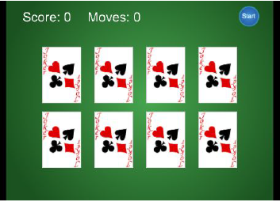
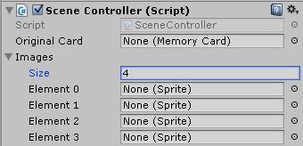

Con questo laboratorio, penseremo alla creazione di un progetto 2D, al rendere selezionabili oggetti 2D, alla visualizzazione del punteggio e delle mosse utilizzando il componente *Text Mesh* e al caricamento dei livelli e riavvio del gioco.

## Spiegazione del gioco da implementare
Finora abbiamo lavorato con la grafica 3D. Ma puoi anche lavorare con la grafica 2D in Unity, quindi durante questa lezione costruirai un gioco 2D.

Svilupperemo il classico "gioco di memoria": visualizzeremo una griglia di carte coperte, scoprendo il fronte della carta quando viene cliccato.

## Flusso di lavoro 2D
Il flusso di lavoro 2D in Unity è più o meno lo stesso del flusso di lavoro per sviluppare un gioco 3D: importa le art assets, trascinale in una scena e scrivi script da allegare agli oggetti.

Le art assets principali nei giochi 2D sono gli sprite: gli sprite sono immagini 2D visualizzate direttamente sullo schermo, al contrario delle immagini visualizzate sulla superficie dei modelli 3D (texture).

## Come funziona il gioco
Una serie di carte sarà disposta a faccia in giù. Ogni carta avrà una carta corrispondente situata da qualche altra parte. Il giocatore può girare due carte alla volta, cercando di trovare le carte corrispondenti. Se le due carte scelte non sono uguali, verranno nuovamente disposte a faccia in giù e quindi il giocatore potrà riprovare.
Questo è un mockup del gioco che costruiremo:



## Configura il progetto 2D
- Crea un nuovo progetto in Unity3D;
- Nella finestra *New Project* è possibile passare dalla modalità 2D alla modalità 3D, passare alla modalità 2D durante la creazione di questo nuovo progetto;
- Se si imposta l'editor in modalità 2D, le immagini importate vengono impostate su *Sprite*: nei progetti 3D le immagini vengono importate come *Texture*;
- Con il nuovo progetto creato e impostato per la modalità 2D, possiamo iniziare a inserire le nostre immagini nella scena.

## Visualizzazione degli sprite
Trascina tutti i file immagine nella vista *Project* per importarli, assicurati che le immagini siano importate come sprite e non come texture (questo è automatico se l'editor è impostato su 2D).

Ora trascina lo sprite di sfondo dalla vista *Project* nella scena vuota, quindi salva la scena. Come per gli oggetti mesh, nell'*Inspector* c'è un componente *Transform* per lo sprite, inserisci una posizione di *0, 0, 5* per l'immagine di sfondo.

## Telecamera
L'impostazione della fotocamera più importante da regolare è ***Projection***. La proiezione della telecamera è probabilmente già corretta perché hai creato il nuovo progetto in modalità 2D. Per la grafica 3D l'impostazione dovrebbe essere ***Perspective***, ma per la grafica 2D la proiezione della telecamera dovrebbe essere ***Orthographic***. 

*Orthographic* è il termine per una visuale piatta senza prospettiva. La dimensione ortografica della telecamera determina la dimensione della visuale della telecamera dal centro dello schermo fino alla parte superiore dello schermo. È possibile regolare le dimensioni della telecamera fino a quando la telecamera non si adatta all'altezza della nostra immagine di sfondo. Il colore di sfondo della fotocamera dovrebbe essere nero.

## Costruire un oggetto carta
Tutte le carte sono inizialmente a faccia in giù, e sono solo temporaneamente a faccia in su quando scegli una coppia di carte da girare: per implementare questa funzionalità, creeremo oggetti che consistono in più sprite impilati uno sopra l'altro . Quindi scriveremo il codice che fa rivelare le carte quando si fa clic con il mouse.

Trascina una delle immagini delle carte nella scena. Usa uno dei frontali delle carte, aggiungerai una carta in cima per nascondere l'immagine, posiziona la carta a *-3, 1, 0*. Ora trascina la carta di nuovo nella scena, crea questo figlio della carta precedente e poi imposta la sua posizione su *0, 0, -0.1*.

## Input del mouse
Per rispondere quando il giocatore fa clic su di essi, gli sprite delle carte devono avere un componente collider. I nuovi sprite non hanno un collisore per impostazione predefinita, quindi non possono essere cliccati. Attaccheremo un collider all'oggetto della carta principale, ma non al dorso della carta, in modo che solo la parte anteriore della carta e non il dorso della carta ricevano clic del mouse.

Per fare ciò, seleziona l'oggetto della scheda radice in Gerarchia e quindi fai clic sul pulsante Aggiungi componente nell'*Inspector*: seleziona *Physics 2D* e quindi scegli un *box collider*.

## Script *MemoryCard*
La carta ora ha bisogno di uno script per essere reattiva al giocatore che fa clic su di essa, quindi scriviamo del codice. Crea una cartella "script", aggiungi un nuovo script chiamato *MemoryCard.cs* e allega questo script all'oggetto della scheda principale.

Proprio come *Update()*, *OnMouseDown()* è un'altra funzione fornita da *MonoBehaviour*, questa verrà chiamata quando si fa clic sull'oggetto:
```csharp
using System.Collections;
using UnityEngine;

public class MemoryCard : MonoBehaviour {
    // questa funzione viene chiamata quando si fa clic sull'oggetto
    public void OnMouseDown() {
        // per ora basta inviare un messaggio di prova alla console
        Debug.Log("testing 1 2 3");
    }
}
```

## Scoprire la carta
Vogliamo che la carta venga scoperta! Modifichiamo il nostro *MemoryCard.cs* come mostrato qui e ricordiamo di allegare il nostro "cardBack" al nostro script:
```csharp
using System.Collections;
using UnityEngine;

public class MemoryCard : MonoBehaviour {
    [SerializeField] private GameObject cardBack;

    public void OnMouseDown() {
        if (cardBack.activeSelf && controller.canUncover) {
            cardBack.SetActive(false);
        }
    }
}
```

## Visualizzazione di varie carte
Il gioco ha bisogno di una griglia di carte, con immagini diverse sulla maggior parte delle carte. Implementeremo la griglia delle schede: utilizzando un componente *SceneController* invisibile, istanziando cloni di un oggetto (il nostro primo oggetto *MemoryCard*).

Ci sono quattro immagini di carte nel gioco. Tutte le otto carte sul tavolo (due per ogni simbolo) verranno create clonando lo stesso originale, quindi inizialmente tutte le carte avranno lo stesso simbolo. Dovremo cambiare l'immagine sulla scheda nello script, caricando immagini diverse dallo script.

## Impostazione delle immagini da uno SceneController
Utilizzeremo questo approccio utilizzando un oggetto invisibile per controllare più funzioni che non sono correlate a nessun oggetto specifico nella scena: prima crea un *GameObject* vuoto, quindi crea un nuovo script *SceneController.cs* e trascina il nuovo script sul controller *GameObject*.

Prima di scrivere codice nel nostro *SceneController*, aggiungiamo in *MemoryCard.cs* i due metodi pubblici mostrati nella prossima diapositiva.

## Nuovi metodi pubblici
Ricordarsi di fare riferimento all'oggetto controller all'ispettore del componente Memory Card:
```csharp
...
[SerializeField] private SceneController controller;

public int id {
    get { return _id; }
}

public void SetCard(int id, Sprite image) {
    _id = id;
    GetComponent<SpriteRenderer>().sprite = image;
}
...
```

## Metodo *SetCard()*
*SetCard()* accetta uno sprite e un numero ID come parametri e il codice memorizza quel numero ID. Perché presto scriveremo un codice che confronta le carte per le partite e questo confronto si baserà sugli ID delle carte.

## Script *SceneController*
Per ora questo è un breve esempio per mostrare come manipolare le carte usando *SceneController*:
```csharp
using System.Collections;
using UnityEngine;

public class SceneController : MonoBehaviour {
    [SerializeField] private MemoryCard originalCard;
    [SerializeField] private Sprite[] images;
    
    void Start() {
        int id = Random.Range(0, images.Lenght);
        originalCard.SetCard(id, images[id]);
    }
}
```
Il risultato dovrebbe essere il seguente:



## Istanziare una griglia di carte
Giocando ora vedrai diverse immagini applicate alla carta ogni volta che esegui la scena. Il prossimo passo è creare un'intera griglia di carte, invece di una sola!

*SceneController* ha già un riferimento all'oggetto card, quindi ora utilizzerai il metodo *Instantiate()* per clonare l'oggetto numerose volte:
```csharp
...
public const int gridRows = 2;
public const int gridCols = 4;
public const float offsetX = 2f;
public const float offsetY = 2.5f;

[SerializeField] private MemoryCard originalCard;
[SerializeField] private Sprite[] images;
...
```
Nel metodo *Start()* andiamo a creare graficamente la griglia:
```csharp
...
void Start() {
    Vector3 startPos = originalCard.transform.position;
    for (int i = 0; i < gridCols; i++) {
        for (int j = 0; j < gridRows; j++) {
            MemoryCard card;
            if (i == 0 && j == 0) {
                card = originalCard;
            } else {
                card = Instantiate(originalCard);
            }
            int id = Random.Range(0, images.Length);
            card.SetCard(id, images[id]);
            float posX = (offsetX * i) + startPos.x;
            float posY = -(offsetY * j) + startPos.y;
            card.transform.position = new Vector3(posX, posY, startPos.z);
        }
    }
}
...
```
Esegui ora il codice e verrà creata una griglia di otto carte. L'ultimo passaggio nella preparazione della griglia delle carte è organizzarle in coppie, invece di essere casuali. Per fare ciò, definiremo una matrice di tutti gli ID delle carte (numeri da 0 a 3 due volte, per una coppia di ciascuna carta) e quindi mescoleremo quella matrice. Utilizzeremo quindi questa serie di ID delle carte durante l'impostazione delle carte, anziché renderle casuali.

Ecco un modo semplice per mescolare gli elementi di un array. Aggiungiamo questo metodo nel nostro *SceneController.cs*:
```csharp
private int[] ShuffleArray(int[] numbers) {
    int[] newArray = numbers.Clone() as int[];
    for (int i = 0; i < newArray.Length; i++ ) {
        int tmp = newArray[i];
        int r = Random.Range(i, newArray.Length);
        newArray[i] = newArray[r];
        newArray[r] = tmp;
    }
    return newArray;
}
```
Aggiustando il codice del metodo *Start()* aggiungendo la novità del nuovo metodo, il codice diventa:
```csharp
void Start() {
    Vector3 startPos = originalCard.transform.position;
    int[] numbers = {0, 0, 1, 1, 2, 2, 3, 3};
    numbers = ShuffleArray(numbers);
    for (int i = 0; i < gridCols; i++) {
        for (int j = 0; j < gridRows; j++) {
            MemoryCard card;
            if (i == 0 && j == 0) {
                card = originalCard;
            } else {
                card = Instantiate(originalCard) as MemoryCard;
            }
            int index = j * gridCols + i;
            int id = numbers[index];
            card.SetCard(id, images[id]);
            float posX = (offsetX * i) + startPos.x;
            float posY = -(offsetY * j) + startPos.y;
            card.transform.position = new Vector3(posX, posY, startPos.z);
        }
    }
}
```

## Matchare le carte
L'ultimo passaggio è il controllo delle corrispondenze: ogni volta che viene scoperta una coppia di carte, dovremmo controllare se le carte scoperte corrispondono. Le schede notificheranno a *SceneController* quando vengono cliccate.

Quindi iniziamo a modificare *SceneController.cs* aggiungendo una funzione *getter* che restituisce *false* se c'è già una seconda carta scoperta:
```csharp
...
private MemoryCard _firstUncovered;
private MemoryCard _secondUncovered;

public bool canUncover {
    get {return _secondUncovered == null;}
}
...
```
Crea un metodo vuoto, per ora, chiamato *CardUncovered()*. Utilizzeremo questo metodo per informare *SceneController* quando si fa clic su una scheda:
```csharp
public void CardUncovered(MemoryCard card) {
    // vuoto, per ora
}
```
È necessario modificare *MemoryCard.cs* per chiamare il metodo *CardUncovered()* vuoto e notificare al controller quando questa scheda viene scoperta. *canUncover* controlla le proprietà del controller per assicurarti che vengano rivelate solo due carte alla volta. *Cover()* è definito per consentire al controller di nascondere nuovamente la carta:
```csharp
...
public void OnMouseDown() {
    if (cardBack.activeSelf && controller.canUncover) {
        cardBack.SetActive(false);
        controller.CardUncovered(this);
    }
}

public void Cover() {
    cardBack.SetActive(true);
}
...
```
Ora abbiamo le carte, l'oggetto card è stato passato al metodo *CardUncovered()*, vediamo come possiamo memorizzare le carte scoperte nel nostro *SceneController*:
```csharp
...
public void CardUncovered(MemoryCard card) {
    if (_firstUncovered == null) {
        _firstUncovered = card;
    } else {
        _secondUncovered = card;
        Debug.Log("Match? " + (_firstUncovered.id == _secondUncovered.id));
    }
}
...
```
Ora invece del *Debug.Log* quando entrambe le carte sono scoperte chiama una coroutine cambiando solo questa riga di codice aggiungendo:
```csharp
...
StartCoroutine(CardsCheck()); //instead of the Debug.Log(...)
...
```
Gestiamo la numerazione di punteggio e di mosse fatte:
```csharp
...
private int _score = 0;
private int _moves = 0;
...
private IEnumerator CardsCheck() {
    if (_firstUncovered.id == _secondUncovered.id) {
        _score++;
        _moves++;
        Debug.Log("Score: " + _score + " - Moves: " + _moves);
    }
    else {
        yield return new WaitForSeconds(0.5f);
        _firstUncovered.Cover();
        _secondUncovered.Cover();
        _moves++;
        Debug.Log("Moves: " + _moves);
    }
    _firstUncovered = null;
    _secondUncovered = null;
}
...
```

## Visualizza punteggio e mosse
Unity ha diversi modi per creare display di testo (conosci già alcune tecniche).

Un altro modo è creare un oggetto *3D Text* nella scena: questo è un componente mesh speciale. Dal menu *GameObject* crea un oggetto *3D Text*. Non dimenticare che tecnicamente questa è una scena 3D che sembra piatta perché viene vista attraverso una telecamera ortografica. Ciò significa che possiamo inserire oggetti 3D nel gioco 2D, se lo desideri.

Creiamo una *Text Mesh* per il punteggio e una per le mosse: gestisci lo Z-index della tua *Text Mesh*. Quindi usa una dimensione del carattere più grande *(50)* e ridimensiona X e Y a *0,1*.

Aggiorna *SceneController* per utilizzare i due componenti *Text Mesh*:
```csharp
...
[SerializeField] private TextMesh scoreLabel;
[SerializeField] private TextMesh movesLabel;
...
```
Trascina le due etichette nel controller (*Inspector*), quindi definiamo i valori che le etichette devono mostrare:
```csharp
...
// Debug.Log("Score: " + _score + " - Moves: " + _moves);
scoreLabel.text = "Score: " + _score;
movesLabel.text = "Moves: " + _moves;
...
// Debug.Log("Moves: " + _moves);
movesLabel.text = "Moves: " + _moves;
...
```

## Riavvio del gioco
Posiziona lo sprite del pulsante nella scena, trascinalo dalla vista *Project*, posiziona il pulsante nell'angolo in alto a destra. Per poter fare clic su questo oggetto, assegnagli un collisore (*Add Component -> Physics 2D -> Box Collider*). Ora crea un nuovo script chiamato *UIButton.cs* e assegna quello script all'oggetto pulsante.

## Script *UIButton*
Iniziamo con il nostro script *UIButton*, quindi definiamo *OnMouseEnter()* per impostare un colore evidenziato sul pulsante:
```csharp
using UnityEngine;
using System.Collections;

public class UIButton : MonoBehaviour {
    [SerializeField] private GameObject targetObject;
    [SerializeField] private string targetMessage;
    public Color highlightColor = Color.cyan;
    
    public void OnMouseEnter() {
        SpriteRenderer sprite = GetComponent<SpriteRenderer>();
        if(sprite != null) { sprite.color = highlightColor; }
    } ...
```
La maggior parte di questo codice avviene all'interno di una serie di funzioni *OnMouseSomething*. Come *Start()* e *Update()*, queste sono una serie di funzioni automaticamente disponibili per tutti i componenti di script in Unity. Puoi usare la funzione *OnMouseExit()* per impostare il colore normale del tuo pulsante sprite:
```csharp
    ...
    public void OnMouseExit() {
        SpriteRenderer sprite = GetComponent<SpriteRenderer>();
        if (sprite != null) { sprite.color = Color.white; }
    }
    ...
```
*OnMouseDown* e *OnMouseUp* vengono utilizzati per definire le azioni quando il pulsante viene premuto e quando il pulsante viene rilasciato:
```csharp
    ...
    public void OnMouseDown() {
        transform.localScale = new Vector3(1.1f, 1.1f, 1.1f);
    }
    
    public void OnMouseUp() {
        transform.localScale = Vector3.one;
        if (targetObject != null) {
            targetObject.SendMessage(targetMessage);
        }
    }
}
```
*SendMessage()* viene chiamato quando il mouse viene rilasciato. *SendMessage()* chiama la funzione del nome dato in tutti i componenti di quel *GameObject*. Unity fornisce il metodo *SendMessage()* per comunicare messaggi specifici con un oggetto target anche se non si sa esattamente che tipo di oggetto sia: l'utilizzo di *SendMessage()* è meno efficiente per la CPU rispetto alla chiamata di metodi pubblici su tipi noti, quindi usa *SendMessage()* solo quando è una grande vittoria in termini di semplificazione del codice.

Usiamo le variabili pubbliche nell'*Inspector* del pulsante: il colore di evidenziazione può essere impostato su qualsiasi cosa desideri, inserire l'oggetto *Controller* nello slot dell'oggetto di destinazione, quindi digitare "Restart" come messaggio.

Ora *SendMessage()* tenta di chiamare il metodo *Restart()* nell'oggetto *Controller*, quindi aggiungiamo il seguente metodo al nostro *SceneController.cs*:
```csharp
...
using UnityEngine.SceneManagement;
...
public void Restart() {
    SceneManager.LoadScene("Scena1"); //Name of your scene
}
...
```
*SceneManager.LoadScene(...)* carica un asset di scena salvato: il metodo prende il nome della scena che vuoi caricare, nel mio caso è "Scena1".

Ma, prima di tutto, in *File -> Build Settings* premi su *Add Open Scenes* per aggiungere la tua scena alle *Scenes In Build*.

Ora premi *Play* e facendo clic sul pulsante *Start* giocherai ancora e ancora e ancora!
