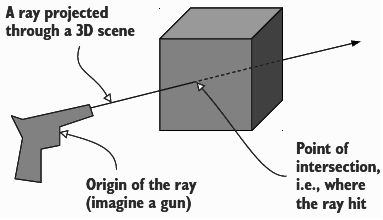
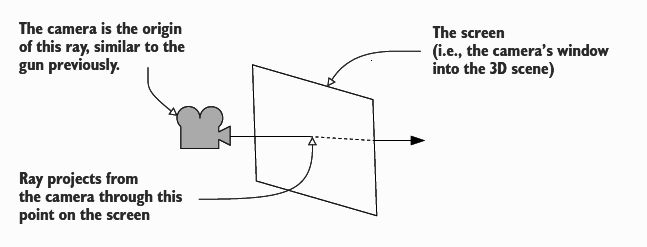
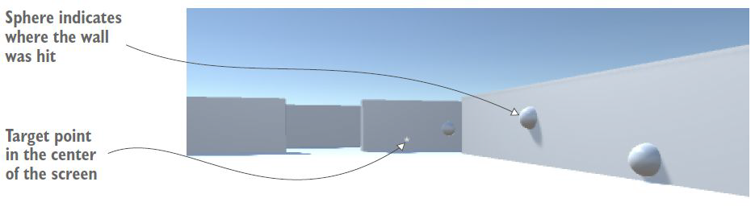

Con questo laboratorio, pensiamo all'implementazione dell'input da tastiera per completare i controlli FPS con gli script MouseLook e FPSInput con cui prendere la mira e sparare e il rilevamento e risposta ai colpi.

## Muovere un oggetto
Nel capitolo precedente usiamo *Rotate()* per ruotare un oggetto. Ora utilizziamo *Translate()* per spostare un oggetto come di seguito:
```csharp
using System.Collections;
using UnityEngine;

public class Spin : MonoBehaviour {
    public float speed = 6.0f;
    
    void Update () {
        transform.Translate (0, speed, 0);
    }
}
```

## Input da tastiera (FPSInput)
*MouseLook* ti consente di guardarti intorno in tutte le direzioni mentre muovi il mouse, ma sei ancora bloccato in un punto.

Il *Player* deve muoversi in risposta all'input della tastiera: quindi, creiamo un nuovo script C# chiamato *FPSInput* e colleghiamolo all'oggetto *Player*. Per il momento, impostiamo il componente *MouseLook* solo sulla rotazione orizzontale.

**I controlli della tastiera e del mouse sono suddivisi in script separati, un sistema di componenti, come quello di [[Unity3D]], tende ad essere più flessibile quando le funzionalità sono suddivise in diversi componenti più piccoli.** Il codice dovrebbe essere il seguente:
```csharp
using System.Collections;
using System.Collections.Generic;
using UnityEngine;

[RequireComponent(typeof(CharacterController))]
[AddComponentMenu("Control Script/FPS Input")]
public class FPSInput : MonoBehaviour
{
    private CharacterController _charController;
    public float speed = 6.0f;
    public float gravity = -9.8f;

    void Start() {
        _charController = GetComponent<CharacterController>();
    }

    void Update() {
        float deltaX = Input.GetAxis("Horizontal")*speed;
        float deltaY = Input.GetAxis("Vertical")*speed;
        Vector3 movement = new Vector3(deltaX, 0, deltaY);
        movement = Vector3.ClampMagnitude(movement, speed);

        movement.y = gravity;

        movement *= Time.deltaTime;
        movement = transform.TransformDirection(movement);
        _charController.Move(movement);
    }
}
```
Abbiamo introdotto diversi nuovi concetti: 
- **la variabile per fare riferimento a *CharacterController*:** questo è un riferimento locale all'oggetto e il metodo *Move()* sul controller;
- **_GetComponent()_** restituisce altri componenti collegati allo stesso GameObject;
- **_Vector3.ClampMagnitude()_** per limitare la grandezza del vettore alla velocità di movimento;
- **_transform.TransformDirection()_** per convertire il vettore dello spazio locale nello spazio globale.


### Rispondere all'input del tasto
I valori di *GetAxis()* vengono moltiplicati per la velocità per determinare la quantità di movimento:
- "Horizontal" e "Vertical" sono astrazioni per le impostazioni di input in [[Unity3D]]: 
    - le lettere A/D e sinistra/destra sono mappate su Horizontal;
    - le lettere W/S e su/giù sono mappate su Vertical;
- i valori di movimento vengono applicati alle coordinate X e Z.

```csharp
...
void Update() {
    // "Horizontal" e "Vertical" sono nomi indiretti per le mappature della tastiera
    float deltaX = Input.GetAxis("Horizontal")*speed;
    float deltaY = Input.GetAxis("Vertical")*speed;
    Vector3 movement = new Vector3(deltaX, 0, deltaY);
}
...
```

### Frame rate indipendente
Alcuni computer possono elaborare codice e grafica più velocemente di altri: se esegui lo script di movimento su macchine diverse, funziona a velocità diverse.

Il codice ora è *frame rate dipendente*: se "PC1" esegue il codice a 30 fps e "PC2" esegue il codice a 60 fps, con un valore di velocità pari a 6, il risultato su PC1 sarà un movimento di 180 unità/secondo e su PC2 saranno 360 unità/secondo.

L'obiettivo è rendere il codice di movimento *frame rate indipendente*: ciò si ottiene moltiplicando il valore di velocità per il **_deltaTime_**.

### *Time.deltaTime*
La classe *Time* ha una serie di proprietà e metodi utili per la temporizzazione: una di queste proprietà è *deltaTime*.

*deltaTime* è la quantità di tempo tra i fotogrammi: per esempio: 30 fps è un *deltaTime* di 1/30 di secondo. Moltiplicando il valore della velocità per *deltaTime* ridimensionerà il valore della velocità su computer diversi.
```csharp
...
void Update() {
    float deltaX = Input.GetAxis("Horizontal")*speed;
    float deltaY = Input.GetAxis("Vertical")*speed;
    Vector3 movement = new Vector3(deltaX*Time.deltaTime, 0, deltaY*Time.deltaTime);
}
...
```

### CharacterController
Useremo il componente *CharacterController* per applicare il rilevamento delle collisioni nel seguente modo:
```csharp
...
// variabile per fare riferimento a CharacterController
private CharacterController _charController;

void Start() {
    // accedere ad altri componenti collegati allo stesso oggetto
    _charController = GetComponent<CharacterController>();
}

void Update() {
    float deltaX = Input.GetAxis("Horizontal")*speed;
    float deltaY = Input.GetAxis("Vertical")*speed;
    Vector3 movement = new Vector3(deltaX, 0, deltaY);
    // limitare il movimento diagonale alla stessa velocita' del movimento lungo un asse
    movement = Vector3.ClampMagnitude(movement, speed);
    
    movement.y = gravity;
    
    movement *= Time.deltaTime;
    // trasformare il vettore di movimento da coordinate locali a globali
    movement = transform.TransformDirection(movement);
    // dire al CharacterController di spostarsi in base a quel vettore
    _charController.Move(movement);
}
...
```

### Gravità
```csharp
...
public float gravity = -9.8f;
...
void Update() {
    ...
    movement = Vector3.ClampMagnitude(movement, speed);
    // usa il valore di gravita' invece di solo 0
    movement.y = gravity;
    ...
}
```
Dichiara una variabile di gravità e quindi usa quel valore per l'asse Y, come forza costante verso il basso sul giocatore, ma non è sempre puntato verso il basso, perché l'oggetto del giocatore può inclinarsi su e giù con il mouse:
- imposta il componente *MouseLook* sul lettore solo sulla rotazione orizzontale;
- aggiungere il componente *MouseLook* all'oggetto fotocamera e impostare solo la rotazione verticale.

L'oggetto *Player* ora ruota solo orizzontalmente e non ci sono più problemi con l'inclinazione della forza di gravità.

### *RequireComponent()*
Utilizziamo il metodo *RequireComponent()* per garantire che siano allegati anche altri componenti necessari allo script: aggiungi il metodo all'inizio dello script.

Utilizziamo anche il metodo *AddComponentMenu()*: lo script verrà aggiunto al menu dei componenti nell'editor di Unity.
```csharp
using System.Collections;
using System.Collections.Generic;
using UnityEngine;

[RequireComponent(typeof(CharacterController))]
[AddComponentMenu("Control Script/FPS Input")]
public class FPSInput : MonoBehaviour {
...
```

## Raycasting (RayShooter)
Le riprese nei giochi 3D possono essere implementate in diversi modi e uno degli approcci più importanti è il **raycasting**.

Il raycasting è quando si proietta un raggio nella scena: è quando crei un raggio e poi determini cosa interseca quel raggio:
- un raggio è una linea invisibile nella scena che inizia in un punto di origine e si estende in una direzione specifica;
- un raggio è analogo al percorso del proiettile e il raycasting è analogo a sparare il proiettile e vedere dove colpisce.



Creiamo un nuovo script C# *RayShooter* e alleghiamo questo script alla fotocamera. Il codice dovrebbe essere il seguente:
```csharp
using System.Collections;
using System.Collections.Generic;
using UnityEngine;

public class RayShooter : MonoBehaviour
{
    private Camera _camera;

    void Start() {
        _camera = GetComponent<Camera>();

        Cursor.lockState = CursorLockMode.Locked;
        Cursor.visible = false;
    }

    void OnGUI() {
        int size = 12;
        float posX = _camera.pixelWidth/2 - size/4;
        float posY = _camera.pixelHeight/2 - size/2;
        GUI.Label(new Rect(posX, posY, size, size),  "*");
    }

    void Update() {
        if(Input.GetMouseButtonDown(0)) {
            Vector3 point = new Vector3(_camera.pixelWidth/2, _camera.pixelHeight/2, 0);
            Ray ray = _camera.ScreenPointToRay(point);
            RaycastHit hit;
            if(Physics.Raycast(ray, out hit)) {
                GameObject hitObject = hit.transform.gameObject;
                ReactiveTarget target = hitObject.GetComponent<ReactiveTarget>();
                if(target != null)
                    target.ReactToHit();
                else 
                    StartCoroutine(SphereIndicator(hit.point));
            }
        }
    }

    private IEnumerator SphereIndicator(Vector3 pos) {
        GameObject sphere = GameObject.CreatePrimitive(PrimitiveType.Sphere);
        sphere.transform.position = pos;

        yield return new WaitForSeconds(1);

        Destroy(sphere);
    }
}
```

### *ScreenPointToRay()*
Attueremo la ripresa proiettando un raggio che parte dalla telecamera e si estende in avanti attraverso il centro della visuale: la proiezione di un raggio attraverso il centro della visuale della telecamera è un caso speciale di un'azione denominata *mouse picking*.

Unity fornisce il metodo *ScreenPointToRay()* per eseguire questa azione.



### Physics.Raycast()
I giochi di tiro sono un ottimo modo per insegnare il raycasting. Per ora devi solo sapere che il raycasting è utile per molti compiti diversi nelle simulazioni 3D.

Di solito le coordinate della posizione del mouse vengono utilizzate per la selezione del mouse, ma per le riprese in prima persona viene utilizzato il centro dello schermo. Una volta che hai un raggio, può essere passato al metodo *Physics.Raycast()* per eseguire il raycasting usando quel raggio.

### Indicatori visivi
Un passaggio successivo consiste nell'aggiungere due tipi di indicatori visivi: un punto di mira al centro dello schermo e un segno nella scena in cui il raggio ha colpito.



### Indicatori a sfera
Modifica di una riga nel metodo *Update()* esistente. Il metodo *SphereIndicator()* assicura che ci saranno indicatori visivi che mostrano esattamente dove il raggio ha colpito.

Questa funzione è definita con *IEnumerator* e quel tipo è legato al concetto di co-routine.
```csharp
using System.Collections;
using System.Collections.Generic;
using UnityEngine;

public class RayShooter : MonoBehaviour {
    private Camera _camera;

    void Start() {
        _camera = GetComponent<Camera>();
    }

    void Update() {
        if(Input.GetMouseButtonDown(0)) {
            Vector3 point = new Vector3(_camera.pixelWidth/2, _camera.pixelHeight/2, 0);
            Ray ray = _camera.ScreenPointToRay(point);
            RaycastHit hit;
            if(Physics.Raycast(ray, out hit)) {
                // lancia una coroutine in risposta a un colpo
                StartCoroutine(SphereIndicator(hit.point));
            }
        }
    }

    private IEnumerator SphereIndicator(Vector3 pos) {
        // le coroutine usano le funzioni IEnumerator
        GameObject sphere = GameObject.CreatePrimitive(PrimitiveType.Sphere);
        sphere.transform.position = pos;

        // la parola chiave yield indica alle coroutine dove fermarsi
        yield return new WaitForSeconds(1);
        
        // rimuovi questo GameObject e cancella la sua memoria
        Destroy(sphere);
    }
}
```

### Coroutine
Le **coroutine** sono un modo specifico di Unity per gestire le attività che vengono eseguite in modo incrementale nel tempo, al contrario del modo in cui la maggior parte delle funzioni fa attendere il programma fino al termine.

**Il segreto nelle coroutine è la parola chiave "yield" che fa sospendere temporaneamente la coroutine.**
*StartCoroutine()* mette in moto una coroutine: una volta avviata una coroutine, continua a funzionare fino al termine della funzione, si ferma solo lungo il percorso, la funzione chiamata viene eseguita fino a quando non raggiunge un comando *yield*, a quel punto la funzione si interrompe.

*SphereIndicator()* crea una sfera in un punto specifico, si ferma per l'istruzione *yield* e quindi distrugge la sfera dopo il ripristino della coroutine. La restituzione di *WaitForSeconds(1)* fa sì che la coroutine si metta in pausa per un secondo.

### *OnGUI()*
Unity offre diversi modi per gestire l'[[Interfaccia utente|interfaccia utente]]: un sistema di [[Interfaccia utente|interfaccia utente]] di base (IMGUI) e un sistema di [[Interfaccia utente|interfaccia utente]] avanzato (Unity UI).
Useremo l'[[Interfaccia utente|interfaccia utente]] di base per visualizzare un punto al centro dello schermo. 

Come *Start()* e *Update()*, *MonoBehaviour* risponde automaticamente a un metodo *OnGUI()*: quella funzione esegue ogni fotogramma subito dopo il rendering della scena 3D e tutto viene disegnato durante *OnGUI()* che appare sopra la scena 3D.

### Indicatore visivo per la mira
All'interno di *OnGUI()* definiamo le coordinate 2D per la visualizzazione: quindi si chiama *GUI.Label()* quel metodo che mostra un'etichetta di testo.

All'interno di *Start()* aggiungiamo alcune impostazioni del cursore e impostiamo il valore per la visibilità e il blocco del cursore.
```csharp
...
void Start() {
    _camera = GetComponent<Camera>();
    
    // nascondere il cursore del mouse al centro dello schermo
    Cursor.lockState = CursorLockMode.Locked;
    Cursor.visible = false;
}

void OnGUI() {
    int size = 12;
    float posX = _camera.pixelWidth/2 - size/4;
    float posY = _camera.pixelHeight/2 - size/2;
    // il comando GUI.Label() mostra il testo sullo schermo
    GUI.Label(new Rect(posX, posY, size, size),  "*");
}
...
```

### Nemico
Modifichiamo il codice raycasting di *RayShooter.cs* con i seguenti passaggi: 
- i messaggi di debug vengono visualizzati nella console al posto degli indicatori a sfera quando viene colpito un oggetto "bersaglio";
- le informazioni Raycast restituiscono il risultato del componente *Transform*, possiamo accedere a *GameObject* come proprietà di trasformazione;
- verificare quindi la presenza del componente *ReactiveTarget* nell'oggetto colpito

```csharp
...
if(Physics.Raycast(ray, out hit)) {
    // recuperare l'oggetto colpito dal raggio
    GameObject hitObject = hit.transform.gameObject;
    ReactiveTarget target = hitObject.GetComponent<ReactiveTarget>();
    // verificare la presenza del componente ReactiveTarget sull'oggetto
    if(target != null)
        Debug.Log("Target hit");
    else 
        StartCoroutine(SphereIndicator(hit.point));
}
...
```

### *ReactToHit()*
Se l'oggetto *hit* è un target reattivo, il codice chiama un metodo del target invece di emettere il messaggio di debug.
```csharp
...
if(target != null)
    // chiamare un metodo della destinazione invece di emettere semplicemente il messaggio di debug
    target.ReactToHit();
else 
    StartCoroutine(SphereIndicator(hit.point));
...
```

## Bersagli reattivi (ReactiveTarget)
Al momento non abbiamo niente da girare: iniziamo a creare un oggetto target e gli diamo uno script che risponderà all'*hit* e modificheremo il codice di tiro per avvisare il bersaglio quando viene colpito, quindi lo script allegato al bersaglio reagirà quando notificato.

Crea un nuovo oggetto cubo e ridimensionalo verticalmente impostando Y su *2*, posiziona il bersaglio a *0, 1, 0* (al centro della stanza), chiama questo oggetto *Enemy* e allega a questo *Enemy* un nuovo script chiamato *ReactiveTarget*. Il codice dovrebbe essere il seguente:
```csharp
using System.Collections;
using System.Collections.Generic;
using UnityEngine;

public class ReactiveTarget : MonoBehaviour
{
    public void ReactToHit() {
        // metodo chiamato dallo script di ripresa
        StartCoroutine(Die());
    }    

    private IEnumerator Die() {
        // rovescia l'energia, attendi 1,5 secondi, quindi distruggi il nemico
        this.transform.Rotate(-75, 0, 0);
        
        yield return new WaitForSeconds(1.5f);
        
        // l'oggetto puo' autodistruggersi proprio come un oggetto separato
        Destroy(this.gameObject);
    }
}
```
Il codice di tiro chiama un metodo del bersaglio, in questo metodo l'oggetto bersaglio cadrà e scomparirà quando lo spari.
