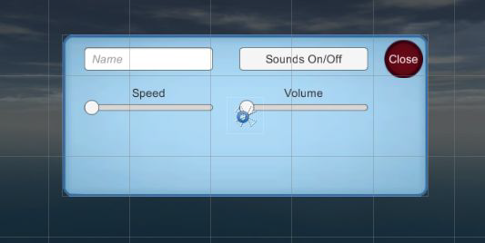
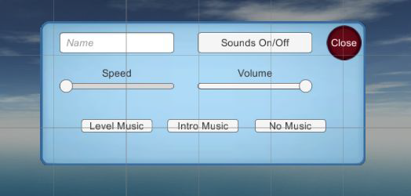
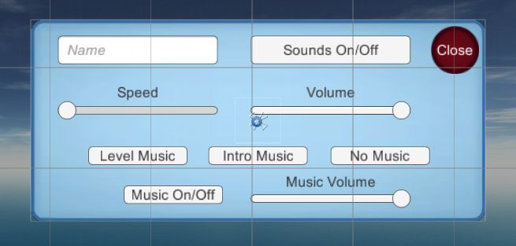

Con questo laboratorio, penseremo all'importazione e riproduzione di clip audio per vari effetti sonori e all'utilizzo dell'[[Interfaccia utente|interfaccia utente]] per gestire le impostazioni audio.

## Funzionalità audio
Nei videogiochi, **gli effetti audio sono importanti quanto gli effetti visivi**. Ogni gioco generalmente riproduce una **musica di sottofondo** e ha **effetti sonori**. Unity fornisce **funzionalità audio** in modo da poter inserire effetti sonori e musica nei tuoi giochi: Unity può importare e riprodurre una varietà di formati di file audio, regolare il volume dei suoni e persino gestire i suoni riprodotti da una posizione specifica all'interno della scena.

## Effetti sonori
Gli **effetti sonori** sono *brevi clip* che vengono riprodotte insieme alle *azioni* del gioco. Considerando che i **clip audio per la musica sono più lunghi** e la riproduzione non è direttamente collegata agli [[Eventi|eventi]] del gioco: i file audio per la musica sono generalmente molto più grandi dei clip brevi utilizzati per gli effetti sonori (i file per la musica sono spesso i file più grandi del gioco).

## Importazione di effetti sonori
Prima di poter riprodurre qualsiasi suono, devi importare i file audio nel tuo progetto Unity. Unity supporta una varietà di formati audio: *WAV*, *AIF*, *MP3*, *OGG*, *MOD*, *XM*, ecc.

**Come per le texture**, la considerazione principale sui file audio è la** compressione applicata**: la compressione riduce le dimensioni del file ma **riduce** anche la **qualità** dell'audio. Generalmente sceglieremo l'audio non compresso quando la **clip audio è breve**. Per **clip audio più lunghe (musicali)** è necessario utilizzare audio compresso.

Poiché **Unity comprimerà** l'audio dopo che è stato **importato**, dovresti sempre scegliere il formato di file *WAV* o *AIFF* (formato di file non compresso). *Probabilmente dovrai regolare le impostazioni di importazione in modo diverso per effetti sonori brevi e musica più lunga, ma i file originali dovrebbero sempre essere decompressi.*

Esistono vari modi per creare file audio, creando o registrando suoni. Per i nostri scopi **scaricheremo** alcuni suoni da uno dei tanti siti di suoni gratuiti: ad esempio puoi scaricare clip da *www.freesound.org*.

## Impostazioni delle risorse audio
Dobbiamo **importare le risorse audio**, come hai fatto con le risorse artistiche, nel progetto prima che possano essere utilizzate nel gioco. I meccanismi di importazione dei file sono semplici e **sono gli stessi delle altre risorse**: trascina i file scaricati dalla loro posizione alla vista *Project* in Unity. Crea una cartella chiamata *Sound FX*: ora, proprio come le altre risorse, ci sono impostazioni di importazione da regolare nell'*Inspector*.

Lascia deselezionato **Force To Mono**. Ciò si riferisce al suono mono anziché stereo. Poi ci sono le caselle di controllo per **Load In Background** e **Preload Audio Data**: *il precaricamento dell'audio consumerà memoria mentre il suono attende di essere utilizzato, ma eviterà di dover attendere per il caricamento*. Il caricamento dell'audio in background del programma consentirà al programma di continuare a funzionare durante il caricamento dell'audio: questa è generalmente una buona idea per clip musicali lunghi in modo che il programma non si blocchi. Di solito si desidera mantenere questa impostazione disattivata per brevi clip audio per assicurarsi che vengano caricati completamente prima della riproduzione.

Altre impostazioni importanti sono **Load Type** e **Compression Format**.

Il *Compression Format* controlla il formato dei dati audio memorizzati. La musica dovrebbe essere compressa, scegli *Vorbis* (è il nome di un formato audio compresso) in quel caso. Non è necessario comprimere brevi clip audio, quindi scegli *PCM (Pulse Code Modulation)* per queste clip. *ADPCM*, è una variazione del *PCM* e occasionalmente si traduce in una qualità del suono leggermente migliore.

Il *Load Type* controlla il modo in cui i dati del file verranno caricati dal computer. A volte vuoi che l'audio venga riprodotto mentre è in streaming nella memoria, salvando il computer dalla necessità di caricare l'intero file in una volta. Puoi scegliere se i dati audio caricati saranno in forma compressa o se verranno decompressi per una riproduzione più veloce. Poiché questi clip audio sono brevi, non hanno bisogno di essere trasmessi in streaming e possono essere impostati su *Decompress On Load*.

Ora hai tutte le informazioni per importare correttamente gli effetti sonori, scaricarli e importarli.

## Riproduzione di effetti sonori
Ora che hai aggiunto alcuni file audio al progetto, puoi **riprodurre i suoni**. Il codice per attivare gli effetti sonori è facile da capire, ma il sistema audio in Unity ha un numero di parti diverse che devono funzionare insieme. È necessario definire tre parti diverse per riprodurre i suoni in Unity: *AudioClip*, *AudioSource* e *AudioListener*.

## *AudioClip*, *AudioSource* e *AudioListener*
Il motivo per dividere il sistema audio in **più componenti** ha a che fare con il supporto di Unity per i suoni 3D, perché i diversi componenti comunicano a Unity le **informazioni posizionali** che utilizza per manipolare i suoni 3D.
I suoni 3D sono specifici delle simulazioni 3D, questi sono suoni che hanno una posizione specifica all'interno della simulazione. Il loro volume e tono sono influenzati dal movimento dell'ascoltatore.
La musica dovrebbe essere suoni 2D, ma l'utilizzo di suoni 3D per la maggior parte degli effetti sonori creerà un audio coinvolgente nella scena.

### *AudioClip*
La prima delle tre diverse parti è una **AudioClip**. Ciò si riferisce al file audio effettivo che abbiamo importato.
Questi dati della forma d'onda sono la base per tutto il resto che fa il sistema audio, ma **le clip audio non fanno nulla da sole**.

### *AudioSource*
**AudioSource è l'oggetto che riproduce clip audio.** Un suono 3D riprodotto da una sorgente audio specifica si trova nella posizione di quella sorgente audio (*anche i suoni 2D devono essere riprodotti da una sorgente audio, ma la posizione non ha importanza*).

### *AudioListener*
Il terzo oggetto coinvolto nel sistema audio di Unity è un **Audio Listener**. Questo è l'oggetto che sente i suoni proiettati dalle sorgenti audio, *l'ascoltatore vero e proprio è il player del gioco*. La posizione dell'ascoltatore audio fornisce la posizione da cui viene ascoltato il suono. Il componente *AudioListener* è già sulla videocamera predefinita quando crei una nuova scena e **ogni scena può avere un solo Audio Listener**.

## Modifica il prefabbricato *Fireball*
Puoi modificare l'asset prefabbricato direttamente nella cartella del progetto perché stai semplicemente aggiungendo un componente all'oggetto:
- seleziona il prefabbricato *Fireball* in modo che le sue proprietà appaiano nell'*Inspector*;
- aggiungi un nuovo componente, scegli *Audio -> Audio Source*;
- trascina un file audio dalla vista *Project* fino allo slot Clip audio nell'*Inspector*, useremo l'effetto sonoro "fireplace" per questo esempio;
- seleziona sia *Play On Awake* (indica alla sorgente audio di iniziare la riproduzione non appena inizia la scena) che *Looping* (dice alla sorgente audio di continuare a riprodurre continuamente). 

Si desidera impostare questa sorgente audio per i **suoni 3D**. I suoni 3D hanno una posizione distinta all'interno della scena. Quell'aspetto della sorgente audio viene regolato utilizzando l'**impostazione Spatial Blend**. Quell'impostazione è un cursore tra 2D e 3D, impostalo su 3D. Ora gioca e sentirai un crepitio di fuoco provenire dalla palla di fuoco: noterai che il suono diventa debole se ti allontani perché hai utilizzato una sorgente audio 3D.

## Effetti sonori dal codice
Impostare il componente *AudioSource* in modo che venga riprodotto automaticamente è facile per alcuni suoni in loop, ma più **in generale per gli effetti sonori ti consigliamo di attivare il suono dallo script**.

Questo approccio richiede ancora un componente *AudioSource*, ma ora la sorgente audio riprodurrà solo clip audio tramite script, invece che automaticamente tutto il tempo.

**Aggiungi un componente *AudioSource* al prefabbricato nemico.** Non è necessario collegare sempre una clip audio specifica perché le clip audio verranno definite nello script. Puoi disattivare *Play On Awake* perché i suoni da questa sorgente verranno attivati. Infine, regola *Spatial Blend* su 3D perché questo suono si trova nella scena.

Quindi modifichiamo *RayShooter.cs*: definire due variabili per *AudioSource* e *AudioClip* e, quindi, se il bersaglio non è nullo, il giocatore ha colpito un nemico e se lo stato del nemico è *Alive* possiamo riprodurre il nostro effetto sonoro (nel nostro *Update()*).

```csharp
...
private AudioSource _soundSource;
[SerializeField] private AudioClip hitEnemySound;
        ...
        if (target != null) {
            WanderingAI enemy = hitObject.GetComponent<WanderingAI> ();
            if (enemy.Alive) {
                Messenger.Broadcast (GameEvent.ENEMY_HIT);
                _soundSource = enemy.GetComponent<AudioSource> ();
                _soundSource.PlayOneShot (hitEnemySound);
            }
            target.ReactToHit();
        } else { ...
```

## Effetto sonoro dei passi
Ora definiremo per il nostro giocatore un effetto sonoro dei passi. Per fare ciò, dobbiamo aggiungere un componente *AudioSource* nel lettore (ricorda di disattivare *Play On Awake*), quindi possiamo **aggiustare lo script *FPSInput*** per riprodurre correttamente il suono del "passo". Innanzitutto definiamo le variabili di cui abbiamo bisogno per raggiungere il nostro obiettivo.

```csharp
    ...
    private AudioSource _soundSource;
    [SerializeField] private AudioClip footStepSound;
    private float _footStepSoundLength;
    private bool _step;
    ...
```
Quindi regoliamo *Start()* e *Update()* per riprodurre il suono.

```csharp
    ...
    void Start() {
        ...
        _soundSource = GetComponent<AudioSource>();
        _step = true;
        _footStepSoundLength = 0.30f;
    }
    ...
    void Update() {
        ...
        if (_charController.velocity.magnitude > 1f && _step) {
            _soundSource.PlayOneShot(footStepSound);
            StartCoroutine(WaitForFootSteps(_footStepSoundLength));
        }
    }
    ...
```
Infine definiamo il metodo *coroutine* chiamato nel nostro *Update()*: qui aspettiamo solo *stepsLength* per riprodurre nuovamente il suono del passo.

```csharp
    ...
    IEnumerator WaitForFootSteps(float stepsLength) {
        _step = false;
        yield return new WaitForSeconds(stepsLength);
        _step = true;
    }
    ...
```

## Effetto sonoro della ferita del giocatore
È ora di aggiungere un "suono del ferito" quando il giocatore viene colpito. Abbiamo già un componente *AudioSource* collegato al lettore, quindi lo useremo. Dobbiamo modificare lo **script *PlayerCharacter***, in modo da riprodurre il suono: prima di tutto definiamo queste nuove variabili, una per la sorgente audio e l'altra per il nostro clip audio.

```csharp
    ...
    private AudioSource _soundSource;
    [SerializeField] private AudioClip playerHurtSound;
    ...
```
In *Start()* prendiamo il componente *AudioSource* già collegato al nostro *Player*: quindi nella funzione *Update()* riproduciamo il nostro suono quando il player è “danneggiato”.

```csharp
    ...
    void Start() {
        ...
        _soundSource = GetComponent<AudioSource>();
    }
    ...
    void Update() {
        ...
        if(damaged) {
            ...
            _soundSource.PlayOneShot (playerHurtSound);
        } else {
            ...
        }
    }
    ...
```

## Effetto sonoro delle porte
Vedremo ora come aggiungere un effetto sonoro alle nostre porte: iniziamo aggiungendo il componente *AudioSource* alle nostre porte. Ricordati di deselezionare la proprietà *Play On Awake*. Quindi imposta la fusione spaziale su suono 3D. Infine, dobbiamo modificare il nostro script *DoorOpenAnimated*. Questa volta possiamo fare riferimento alla clip audio direttamente sul componente *Audio Source*. Quindi trascina il file audio nello slot *AudioClip*. Regoliamo il nostro *DoorOpenAnimated.cs* come mostrato di seguito.

```csharp
public class DoorOpenAnimated : MonoBehaviour {
    ...
    private AudioSource _soundSource;
    ...
    void Start () {
        ...
        _soundSource = GetComponent<AudioSource>();
    }
    ...
    public void Operate() {
        if (!triggerDoor) {
            _soundSource.Play ();
        ...
    }
    
    public void Activate() {
        _soundSource.Play ();
        ...
    }
    
    public void Deactivate() {
        _soundSource.Play ();
        ...
    }
    
    void doorAnimation (){
        if (!_open) {
            if (transform.position != _openPos) {
                ...
            } else {
                ...
                _soundSource.Stop();
            }
        } else {
            if (transform.position != _closePos) {
                ...
            } else {
                ...
                _soundSource.Stop();
            }
        }
    }
}
```

## Interfaccia di controllo audio (*AudioManager*)
Continuando l'**[[Architettura|architettura]] del codice** stabilita nelle lezioni precedenti, creerai un **_AudioManager_**. Questo modulo audio centrale ti consentirà di **modulare il volume** dell'audio (e/o della musica) nel gioco e persino silenziarlo.

Crea un nuovo script chiamato *AudioManager.cs* a cui il codice *Manager* può fare riferimento: questo codice iniziale ha l'aspetto dei manager delle lezioni precedenti, questa è la quantità minima che *IGameManager* richiede che la classe implementi.

```csharp
using UnityEngine;
using System.Collections;
using System.Collections.Generic;

public class AudioManager : MonoBehaviour, IGameManager {
    public ManagerStatus status {get; private set;}
    
    public void Startup() {
        Debug.Log("Audio manager starting...");
        status = ManagerStatus.Started;
    }
}
```
Lo script *Manager* può ora essere modificato con il nuovo manager: ricorda di allegare *AudioManager* all'oggetto *Game Manager*.

```csharp
...
[RequireComponent(typeof(AudioManager))]
...
    public static AudioManager Audio {get; private set;}
    ...
    void Awake() {
        ...
        Audio = GetComponent<AudioManager>();
        ...
        _startSequence.Add(Audio);
        StartCoroutine(StartupManagers());
    } // Awake
    ...
```

## UI per il controllo del volume
Con *AudioManager* impostato, è ora di dargli la funzionalità di controllo del volume. Questi metodi di controllo del volume verranno quindi utilizzati dai **display dell'[[Interfaccia utente|interfaccia utente]]** per **disattivare gli effetti sonori o regolare il volume**: in particolare, **aggiornerai la finestra pop-up** con un pulsante e uno slider per controllare le impostazioni del volume. Creerai un nuovo pulsante dell'[[Interfaccia utente|interfaccia utente]] e un nuovo dispositivo di scorrimento dell'[[Interfaccia utente|interfaccia utente]] (con un'etichetta di testo dell'[[Interfaccia utente|interfaccia utente]] "volume").



Ora il pop-up è stato aggiornato, scriviamo il codice con cui funzionerà. Ciò comporterà lo script sull'oggetto popup, *SettingsPopup.cs* e il nostro *Audio Manager*.

Per prima cosa regola il codice in *AudioManager* come mostrato di seguito: aggiungi ad *AudioManager* due proprietà per *soundVolume* e *soundMute*. Per entrambe le proprietà, le funzioni *get* e *set* implementano valori globali su *AudioListener*.

```csharp
    ...
    public float soundVolume {
        get {return AudioListener.volume;}
        set {AudioListener.volume = value;}
    }
    public bool soundMute {
        get {return AudioListener.pause;}
        set {AudioListener.pause = value;}
    }
    public void Startup() {
        Debug.Log("Audio manager starting...");
        soundVolume = 1f;
        status = ManagerStatus.Started;
    }
}
```
Con questi metodi aggiunti ad *AudioManager*, ora puoi scrivere metodi per il pop-up nel nostro *SettingsPopup.cs*: *OnSoundToggle()* imposta la proprietà *soundMute* e *OnSoundValue()* imposta la proprietà *soundVolume*.

```csharp
    ...
    public void OnSoundToggle() {
        Managers.Audio.soundMute = !Managers.Audio.soundMute;
    }
    public void OnSoundValue(float volume) {
        Managers.Audio.soundVolume = volume;
    }
} // SettingsPopup
```
Per richiamare le funzioni dal pulsante e dal dispositivo di scorrimento, collegare l'oggetto a comparsa agli **[[Eventi|eventi]] di interazione** in quei controlli.

Nell'*Inspector* del pulsante, cerca il pannello denominato **_OnClick_**. Fare clic sul pulsante *+* per aggiungere una **nuova voce a questo evento**. Trascina il *Popup (oggetto)* nello slot dell'oggetto nella nuova voce e quindi cerca *SettingsPopup* nel menu; selezionare **_OnSoundToggle()_** per fare in modo che il pulsante chiami quella funzione.

Fai la stessa azione per lo **slider**, il pannello si chiama **_OnValueChanged_**. Fare clic sul pulsante *+* per aggiungere una **nuova voce**. Trascina il *Popup (oggetto)* nello slot dell'oggetto nella nuova voce. Nel menu delle funzioni trova lo script *SettingsPopup* e quindi scegli **_OnSoundVolume()_** in *Dynamic Float*.

## Riproduzione del suono dell'UI
Ora farai un'altra aggiunta ad *AudioManager* per consentire all'[[Interfaccia utente|interfaccia utente]] di **riprodurre suoni** quando si **fa clic sui pulsanti**: quando gli effetti sonori emessi da oggetti nella scena, era ovvio dove allegare *AudioSource* ma gli effetti sonori dell'[[Interfaccia utente|interfaccia utente]] non fanno parte di la scena, quindi imposterai un *AudioSource* speciale solo per *AudioManager*.

Crea un **nuovo *GameObject* vuoto** e collegalo all'oggetto *Game Managers* principale, questo nuovo oggetto avrà un *AudioSource* utilizzato da *AudioManager*, quindi chiama il nuovo oggetto *Audio*: aggiungi un componente *AudioSource* a questo oggetto.

Regola l'*AudioManager* aggiungendo un nuovo slot variabile che apparirà nell'*Inspector*, come mostrato di seguito: quindi trascina l'oggetto Audio vuoto su questo slot.
```csharp
    ...
    [SerializeField] private AudioSource soundSource;
    ...
    public void PlaySound(AudioClip clip) {
        soundSource.PlayOneShot(clip);
    }
    ...
```

Ora aggiungi l'effetto sonoro dell'[[Interfaccia utente|interfaccia utente]] allo script pop-up: trascina l'effetto sonoro dell'[[Interfaccia utente|interfaccia utente]] sullo slot variabile, ho usato il suono *thump* e quando premi il pulsante dell'[[Interfaccia utente|interfaccia utente]], quell'effetto sonoro viene riprodotto contemporaneamente.
```csharp
    ...
    [SerializeField] private AudioClip sound;
    ...
    public void OnSoundToggle() {
        Managers.Audio.soundMute = !Managers.Audio.soundMute;
        Managers.Audio.PlaySound(sound);
    }
    ...
```

## Musica di sottofondo
Aggiungerai della **musica di sottofondo** al gioco e lo farai aggiungendo musica ad *AudioManager*.
Come spiegato in precedenza, i brani musicali tendono a consumare una grande quantità di memoria sul computer e il consumo di memoria deve essere ottimizzato.
Ottimizzando il caricamento della musica tramite *Resources.Load()*, questo comando consente di caricare le risorse per nome: normalmente Unity carica tutte le risorse in una scena non appena la scena viene caricata, ma le risorse da. Le risorse non vengono caricate finché il codice non le recupera manualmente.

Trascina i file in Unity per importarli e quindi regola le loro impostazioni di importazione nell'*Inspector*. I clip audio per la musica generalmente hanno impostazioni diverse rispetto ai clip audio per gli effetti sonori: il formato audio dovrebbe essere impostato su *Vorbis*, impostare la *Quality* su *50%* nel dispositivo di scorrimento. Quindi regola *Load Type*: scegli *Streaming from Load Type* e *Load in background*.

Tutte le impostazioni di importazione sono state eseguite. Possiamo spostare le nostre risorse audio nella cartella corretta **_Resources_**: il comando *Resources.Load()* richiede che le risorse si trovino nella cartella Risorse. Crea una nuova cartella chiamata *Resources*, crea una cartella all'interno di quella chiamata *Music* e trascina i file audio nella cartella *Music*.

Crea una **nuova *AudioSource*** per la musica. Crea un altro **_GameObject_ vuoto**, denomina questo oggetto *Music* e abbinalo all'oggetto *Audio*. Aggiungi un componente *AudioSource* a *Music* e quindi regola le impostazioni nel componente: seleziona *Play On Awake* ma questa volta attiva l'opzione *Loop* e lascia l'impostazione *Spatial Blend* su 2D.

La sorgente audio *Music* è stata impostata: **aggiustiamo *AudioManager.cs***. Le nuove variabili serializzate saranno visibili nell'*Inspector* quando selezioni l'oggetto *Game Managers*. Trascina *Music* nello slot della sorgente audio. Quindi digita i nomi dei file musicali nelle due variabili di stringa: **intro** e **loop**.

```csharp
    ...
    [SerializeField] private AudioSource musicSource;
    [SerializeField] private string introBGMusic;
    [SerializeField] private string levelBGMusic;
    ...
```
Definire in *AudioManager* i seguenti metodi per caricare e riprodurre musica:
```csharp
    ...
    public void PlayIntroMusic() {
        PlayMusic((AudioClip)Resources.Load("Music/"+introBGMusic));
    }
    public void PlayLevelMusic() {
        PlayMusic((AudioClip)Resources.Load("Music/"+levelBGMusic));
    }
    private void PlayMusic(AudioClip clip) {
        musicSource.clip = clip;
        musicSource.Play();
    }
    public void StopMusic() {
        musicSource.Stop();
    }
    ...
```

## Controlli della musica dell'[[Interfaccia utente|interfaccia utente]]
Aggiungiamo più pulsanti all'[[Interfaccia utente|interfaccia utente]] che riprodurranno musica diversa quando premuti: crea tre nuovi pulsanti in modo da ottenere un popup di impostazione come mostrato nella figura seguente (*Level Music* - *Intro Music* - *No Music*).



Scrivi questo metodo in *SettingsPopup* che sarà collegato a ciascun pulsante.

```csharp
    ...
    public void OnPlayMusic(int selector) {
        Managers.Audio.PlaySound(sound);
        switch (selector) {
        case 1:
            Managers.Audio.PlayIntroMusic();
            break;
        case 2:
            Managers.Audio.PlayLevelMusic();
            break;
        default:
            Managers.Audio.StopMusic();
            break;
        }
    }
    ...
```

Aggiungi una voce al **pannello _OnClick_** nell'*Inspector*, trascina il pop-up nello slot dell'oggetto e scegli la funzione appropriata dal menu.
Questa volta, ci sarà una casella di testo per digitare un numero, perché *OnPlayMusic()* prende un numero per un parametro. Digita *1* per *Intro Music*, *2* per *Level Music* e lascia *0* (o qualsiasi altra cosa) per *No Music*.
Ora puoi cambiare la musica nel tuo gioco dal *Settings Popup*i.

## Controllo del volume della musica
Il gioco ha già il **controllo del volume** e attualmente ciò **influisce sia sulla musica che sugli effetti sonori**.
Il primo passo è dire alla musica *AudioSources* di **ignorare le impostazioni su *AudioListener***. Vogliamo che il volume e la disattivazione dell'audio sull'*AudioListener* globale continuino a influenzare tutti gli effetti sonori ma non i clip musicali.
**Modificheremo *AudioManager* per gestire il controllo del volume e la disattivazione dell'audio per i clip musicali**.

Definire la proprietà per il controllo del volume della musica.
```csharp
    ...
    public float musicVolume {
        get {
            return musicSource.volume;
        }
        set {
            if (musicSource != null) {
                musicSource.volume = value;
            }
        }
    }
    ...
```

Definisci la proprietà "Mute" per i clip musicali.
```csharp
    ...
    public bool musicMute {
        get {
            if (musicSource != null) {
                return musicSource.mute;
            }
            return false;
        }
        set {
            if (musicSource != null) {
                musicSource.mute = value;
            }
        }
    }
    ...
```

Il **metodo *Startup()*** inizializza la sorgente musicale con *ignoreListenerVolume* e *ignoreListenerPause* attivate. Quindi imposta il volume della musica su 1.
```csharp
    ...
    public void Startup() {
        Debug.Log("Audio manager starting...");
        musicSource.ignoreListenerVolume = true;
        musicSource.ignoreListenerPause = true;
        soundVolume = 1f;
        musicVolume = 1f;
        status = ManagerStatus.Started;
    }
    ...
```

Puoi premere *Play* ora per verificare che la musica non sia più influenzata dal controllo del volume esistente. Ora aggiungiamo un secondo controllo dell'[[Interfaccia utente|interfaccia utente]] per il volume della musica, iniziamo regolando *SettingsPopup* come mostrato di seguito.
```csharp
    ...
    public void OnMusicToggle() {
        Managers.Audio.musicMute = !Managers.Audio.musicMute;
        Managers.Audio.PlaySound(sound);
    }
    public void OnMusicValue(float volume) {
        Managers.Audio.musicVolume = volume;
    }
    ...
```

Ora il nostro codice nello script *SettingsPopup* è pronto per essere utilizzato, quindi dobbiamo aggiungere un altro pulsante nella nostra UI Settings Popup e uno slider per modificare il volume della musica, come mostrato nella figura seguente.



Infine, collega questi controlli dell'[[Interfaccia utente|interfaccia utente]] al codice in *SettingsPopup*, utilizzando il pannello *OnClick*. Le funzioni che devi selezionare sono *OnMusicToggle()* e *OnMusicValue()* dalla sezione *Dynamic Float* del menu. **Premi *Play* e ora il tuo gioco avrà effetti sonori e musica di sottofondo.**
