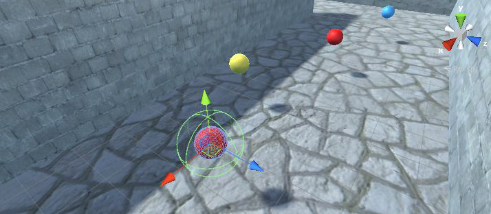
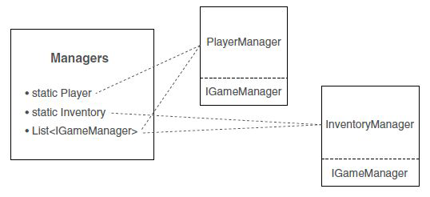
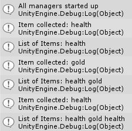
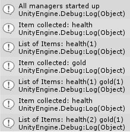

Con questo laboratorio, penseremo alla raccolta degli oggetti intorno al livello e alla gestione dell'inventario.

## Collezionare oggetti
Molti giochi includono oggetti che possono essere raccolti dal giocatore. Questi articoli includono pacchetti sanitari e chiavi. Il meccanismo di base della collisione con gli oggetti per raccoglierli è molto semplice. Crea un oggetto sfera e posizionalo in un'area aperta della scena.

Rendi l'oggetto piccolo, come Scale *.5 .5 .5*, ma per il resto preparalo con un volume di trigger grande (con un raggio del collisore impostato su 1). Seleziona l'impostazione *Is Trigger* nel collisore, imposta l'oggetto sul livello *Ignore Raycast* e quindi crea un nuovo materiale per dare all'oggetto un colore distinto.



Ora che l'oggetto nella scena è pronto, crea un nuovo script da allegare a questo oggetto. Chiama lo script *CollectibleItem*.

```csharp
using UnityEngine;
using System.Collections;

public class CollectibleItem : MonoBehaviour {
    [SerializeField] private string itemName;
    
    void OnTriggerEnter(Collider other) {
        if (other.GetComponent<CharacterController>()) {
            Debug.Log("Item collected: " + itemName);
            Destroy(this.gameObject);
        }
    }
}
```
Questo script è estremamente breve e semplice. Assegna all'elemento un valore di nome in modo che possano esserci elementi diversi nella scena. *OnTriggerEnter()* si autodistrugge. C'è anche un messaggio di debug che viene stampato sulla console, alla fine verrà sostituito con codice utile.

La variabile aggiunta al codice dovrebbe diventare visibile nell'*Inspector*. Digita un nome per identificare questo oggetto, per il mio primo oggetto ho usato *health*. Crea un altro articolo con un altro materiale e assegna un nuovo nome a questo articolo, può essere *key* e un altro chiamato *gold*: ricordati di utilizzare un colore diverso. Ora crea i prefab degli articoli.

Trascina le istanze dei prefabbricati e posiziona gli oggetti nelle aree aperte del livello. Gioca e incontra oggetti per "collezionarli" nel momento in cui non succede nulla quando raccogli un oggetto. Ora dobbiamo impostare la struttura del codice dell'inventario.

## Gestione dei dati di inventario
Ora che abbiamo programmato le funzionalità di raccolta degli oggetti, abbiamo bisogno di gestori di dati in background per l'inventario del gioco.
Il codice che scriveremo sarà simile alle **architetture MVC** alla base di molte applicazioni web.
Il loro vantaggio consiste nel disaccoppiare la memorizzazione dei dati dagli oggetti visualizzati sullo schermo.

Non tutti i giochi hanno le stesse esigenze di gestione dei dati, quindi non avrebbe senso per Unity imporre una regola secondo cui ogni gioco deve utilizzare un modello di progettazione anziché un altro: ad esempio, un gioco di ruolo avrà esigenze di gestione dei dati molto elevate , quindi probabilmente vorrai implementare qualcosa come un'[[Architettura|architettura]] MVC. Un puzzle game, tuttavia, ha pochi dati da gestire, quindi costruire una complessa struttura disaccoppiata di gestori di dati sarebbe eccessivo.
L'idea generale qui è quella di suddividere tutta la gestione dei dati in moduli separati che gestiscono ciascuno la propria area di responsabilità.

Creeremo moduli separati per mantenere lo stato del giocatore in *PlayerManager* e mantenere l'elenco dell'inventario in *InventoryManager*.
Ci sarà un manager di livello superiore (di manager) che terrà traccia di tutti i moduli separati: oltre a tenere un elenco di tutti i vari manager, questo manager di livello superiore controllerà il ciclo di vita dei vari manager, in particolare inizializzandoli al inizio. Tutti gli altri script del gioco potranno accedere a questi moduli centralizzati passando per il gestore principale.

*PlayerManager* e *InventoryManager* implementeranno un'interfaccia comune (chiamata *IGameManager* in questo caso) e quindi l'oggetto *Manager* principale può trattare sia *PlayerManager* che *InventoryManager* come tipo *IGameManager*.



L'[[Architettura|architettura]] del codice è costituita da moduli invisibili che esistono in background, Unity richiede ancora che gli script siano collegati agli oggetti nella scena per eseguire quel codice, quindi creeremo un *GameObject* vuoto a cui collegare questi gestori di dati.

## Script del *Game Managers*
Crea un nuovo script chiamato *IGameManager*: nota che non eredita nemmeno da *MonoBehaviour*; un'interfaccia non fa nulla da sola ed **esiste solo per imporre una struttura ad altre classi**. Questa interfaccia dichiara una proprietà (una variabile che ha una funzione *getter*) e un metodo; entrambi devono essere implementati in qualsiasi classe che implementa questa interfaccia.

```csharp
public interface IGameManager {
    ManagerStatus status {get;}
    
    void Startup();
}
```

Lo scopo di *Startup()* è gestire l'inizializzazione del manager, quindi le attività di inizializzazione si svolgono lì e la funzione imposta lo stato del manager. Quindi crea lo script *ManagerStatus.cs*.

```csharp
public enum ManagerStatus {
    Shutdown, Initializing, Started
}
```
*ManagerStatus.cs* definisce i diversi possibili stati in cui possono trovarsi i manager. Ora che *IGameManager* è scritto, possiamo implementarlo in altri script. Creiamo due script *PlayerManager* e *InventoryManager*.

***InventoryManager* e *PlayerManager* ereditano entrambi dalla classe *MonoBehaviour* e implementano l'interfaccia *IGameManager*:** ciò significa che i gestori ottengono entrambe tutte le funzionalità di *MonoBehaviour* mentre devono anche implementare la struttura imposta da *IGameManager*.
La proprietà dello stato è stata definita in modo che lo stato potesse essere letto da qualsiasi luogo (il *getter* è pubblico) ma impostato solo all'interno di questo script (il *setter* è privato).

Il metodo nell'interfaccia è *Startup()*, quindi entrambi i gestori definiscono quella funzione. In entrambi i gestori lo stato è impostato su *Startup*: *InventoryManager* non fa ancora nulla e *PlayerManager* imposta alcuni valori.

Scriviamo il nostro *InventoryManager*.
```csharp
using UnityEngine;
using System.Collections;
using System.Collections.Generic;

public class InventoryManager : MonoBehaviour, IGameManager {
    public ManagerStatus status {get; private set;}
    
    public void Startup() {
        Debug.Log("Inventory manager starting...");
        status = ManagerStatus.Started;
    }
}
```

Quindi definiamo il nostro *PlayerManager*. Anche questo script eredita dalla classe *IGameManager* e implementa un'interfaccia. Useremo i valori qui definiti nel nostro script *PlayerCharacter* per consumare pacchetti salute.

```csharp
using UnityEngine;
using System.Collections;
using System.Collections.Generic;

public class PlayerManager : MonoBehaviour, IGameManager {
    public ManagerStatus status {get; private set;}
    public int health {get; private set;}
    public int maxHealth {get; private set;}
    public int healthPackValue {get; private set;}
    public int barValueDamage {get; private set;}
    public void Startup() {
        Debug.Log("Player manager starting...");
        health = 5;
        maxHealth = 100;
        healthPackValue = 2;
        barValueDamage = maxHealth / health;
        status = ManagerStatus.Started;
    }
}
```

Siamo finalmente pronti per collegare il tutto insieme ad un manager principale: creare uno script e chiamalo *Manager* e prima di tutto dobbiamo essere sicuri che i vari gestori esistano.

```csharp
using UnityEngine;
using System.Collections;
using System.Collections.Generic;

[RequireComponent(typeof(PlayerManager))]
[RequireComponent(typeof(InventoryManager))]
...
```

Definiamo nel nostro script *Mangers*: proprietà statiche che altri codici utilizzano per accedere ai gestori e l'elenco dei gestori da scorrere durante la sequenza di avvio.

```csharp
...
public class Managers : MonoBehaviour {
    public static PlayerManager Player {get; private set;}
    public static InventoryManager Inventory {get; private set;}
    private List<IGameManager> _startSequence;
    ...
```

Le proprietà definite nella diapositiva precedente sono inizialmente vuote, ma vengono riempite immediatamente quando il codice viene eseguito nel metodo *Awake()*: il metodo *Awake()* ha anche la sequenza di avvio, quindi lancia la coroutine per avviare tutti i gestori. In particolare, la funzione crea un oggetto *List* e quindi utilizza *List.Add()* per aggiungere i gestori.

```csharp
    ...
    void Awake() {
        Player = GetComponent<PlayerManager>();
        Inventory = GetComponent<InventoryManager>();
        _startSequence = new List<IGameManager>();
        _startSequence.Add(Player);
        _startSequence.Add(Inventory);
        StartCoroutine(StartupManagers());
    }
    ...
```

Proprio come *Start()* e *Update()*, *Awake()* è un altro metodo fornito automaticamente da *MonoBehaviour*. È simile a *Start()*, in esecuzione una volta quando il codice inizia a essere eseguito per la prima volta. Ma nella sequenza di esecuzione del codice di Unity, *Awake()* è anche prima di *Start()*.

*List* è una struttura di dati di raccolta fornita da *C#*. Gli oggetti *List* sono simili agli array: sono dichiarati con un tipo specifico e memorizzano una serie di voci in sequenza. Ma una *List* può cambiare dimensione dopo essere stato creato, mentre gli array vengono creati con una dimensione statica che non può cambiare in seguito.

Poiché tutti i gestori implementano *IGameManager*, questo codice può elencarli tutti come quel tipo e può chiamare il metodo *Startup()* definito in ciascuno. La sequenza di avvio viene eseguita come una coroutine in modo che venga eseguita in modo asincrono, mentre anche altre parti del gioco procedono.
La funzione di avvio prima scorre l'intera *List* di gestori e chiama *Startup()* su ciascuno di essi. Quindi entra in un ciclo che continua a controllare se i gestori si sono avviati e non procederanno finché non l'hanno fatto tutti.
Una volta che tutti i gestori sono stati avviati, la funzione di avvio ci avvisa finalmente di questo fatto prima di completarlo definitivamente.

Aggiungiamo il metodo *StartupManagers* nel nostro script *Managers.cs*.

```csharp
    ...
    private IEnumerator StartupManagers() {
        foreach (IGameManager manager in _startSequence) {
            manager.Startup();
        }
        
        yield return null;
        
        int numModules = _startSequence.Count;
        int numReady = 0;
        
        while (numReady < numModules) {
            int lastReady = numReady;
            numReady = 0;
            foreach (IGameManager manager in _startSequence) {
                if (manager.status == ManagerStatus.Started) {
                    numReady++;
                }   
            }
            if (numReady > lastReady) {
                Debug.Log ("Progress: " + numReady + "/" + numModules);
            }
            yield return null;
        }
        Debug.Log("All managers started up");
    }
} // Managers
```
Ora tutta la struttura del codice è stata scritta: vai su Unity e crea un nuovo *GameObject* vuoto, posizionalo a *0, 0, 0* e dai all'oggetto un nome come *Game Manager*. Collega i componenti dello script *Manager*, *PlayerManager* e *InventoryManager* a questo nuovo oggetto.

Quando giochi ora non dovrebbero esserci cambiamenti visibili nella scena, ma nella console dovresti vedere una serie di messaggi con l'avanzamento della sequenza di avvio. Ora dobbiamo iniziare a programmare l'*Inventory Manager*.

## Conservazione dell'inventario
L'elenco effettivo degli elementi raccolti può anche essere archiviato in un oggetto raccolta come oggetto *List*. Aggiungiamo una *List* di elementi a *InventoryManager.cs*.

```csharp
    ...
    private List<string> _items;
    
    public void Startup() {
        Debug.Log("Inventory manager starting...");
        _items = new List<string>();
        status = ManagerStatus.Started;
    }
    ...
```
Altri script non possono manipolare direttamente la *List* degli elementi, quindi è necessario aggiungere un metodo pubblico per aggiungere elementi nel nostro oggetto *List*: quindi questo metodo chiamerà *DisplayItems()* per mostrare il contenuto del nostro inventario.

```csharp
    ...
    public void AddItem(string name) {
        _items.Add(name);
        DisplayItems();
    }
    ...
```

Ora apportiamo un piccolo aggiustamento nello script *CollectibleItem* per chiamare il nuovo metodo *AddItem()*.

```csharp
    ...
    void OnTriggerEnter(Collider other) {
        if (other.GetComponent<CharacterController> ()) {
            Debug.Log ("Item collected: " + itemName);
            Managers.Inventory.AddItem (itemName);
            Destroy (this.gameObject);
        }
    }
    ...
```
Ora, quando esegui la raccolta di articoli, dovresti vedere il tuo inventario crescere nei messaggi della console.



Quando raccogli più oggetti dello stesso tipo (come raccogli un secondo oggetto *Health*), vedrai elencate entrambe le copie, invece di aggregare tutti gli oggetti dello stesso tipo. A seconda del tuo gioco, potresti voler che l'inventario tenga traccia di ogni oggetto separatamente, ma nella maggior parte dei giochi l'inventario dovrebbe aggregare più copie dello stesso oggetto.
È possibile farlo utilizzando *Dictionary*: un'altra struttura di raccolta dati fornita da *C#*, in cui le voci nel dizionario sono accessibili tramite una chiave.

## Dizionario di elementi
Modificare il codice in *InventoryManager* per utilizzare *Dictionary* invece di *List*. Dichiarare un *Dictionary* con due tipi: la chiave e il valore. Mentre *List* è stato dichiarato con un solo tipo, un *Dictionary* dichiara sia il tipo di chiavi che il tipo di valori.

```csharp
    ...
    private Dictionary<string, int> _items;
    
    public void Startup() {
        Debug.Log("Inventory manager starting...");
        _items = new Dictionary<string, int>();
        status = ManagerStatus.Started;
    }
    ...
```
Continua a modificare il codice in *InventoryManager*: è ora di modificare il nostro metodo *DisplayItems()* come mostrato di seguito.

```csharp
    ...
    private void DisplayItems() {
        string itemDisplay = "List of Items: ";
        foreach (KeyValuePair<string, int> item in _items) {
            itemDisplay += item.Key + "(" + item.Value + ") ";
        }
        Debug.Log(itemDisplay);
    }
    ...
```
Infine, possiamo modificare il metodo *AddItem()*: qui dobbiamo verificare se il *Dictionary* contiene già quell'elemento, utilizzando il metodo *ContainsKey()*. Se si tratta di una nuova voce, inizieremo il conteggio da 1, ma se la voce esiste già, incrementeremo il valore memorizzato.

```csharp
    ...
    public void AddItem(string name) {
        if (_items.ContainsKey(name)) {
            _items[name] += 1;
        } else {
            _items[name] = 1;
        }
        DisplayItems();
    }
} // InventoryManager
```
Premi play e vedrai il messaggio della console con multipli dello stesso elemento aggregati.



## [[Interfaccia utente]] dell'inventario
La raccolta di oggetti nel tuo inventario può essere utilizzata in più modi all'interno del gioco, ma generalmente viene utilizzata per creare un'[[Interfaccia utente|interfaccia utente]] dell'inventario in modo che i giocatori possano vedere i loro oggetti raccolti. Ora vedremo come utilizzare gli oggetti raccolti.

Per utilizzare gli articoli è necessario **aggiungere alcuni metodi a *InventoryManager***. Ora l'elenco degli elementi è privato e per visualizzare l'elenco sono necessari metodi pubblici per l'accesso ai dati. Definiamo *GetItemList()* e *GetItemCount()*:
- *GetItemList()* restituisce un elenco di elementi nell'inventario, creando un elenco dalle chiavi nel *Dictionary*;
- *GetItemCount()* restituisce un conteggio di quante volte un articolo si trova nell'inventario.

```csharp
    ...
    public List<string> GetItemList() {
        List<string> list = new List<string>(_items.Keys);
        return list;
    }
    
    public int GetItemCount(string name) {
        if (_items.ContainsKey(name)) return _items[name];
        return 0;
    }
    ...
```

## Apri le porte chiuse con una chiave
Esaminiamo un paio di esempi utilizzando gli articoli di inventario. Il primo esempio utilizza una chiave per aprire la porta.
Al momento, lo script *DeviceTrigger* non presta attenzione ai tuoi elementi.
Quindi modifichiamo il nostro *DeviceTrigger.cs* come mostrato di seguito.

```csharp
    ...
    public bool requireKey;
    void OnTriggerEnter(Collider other) {
        if (requireKey && Managers.Inventory.GetItemCount("key") == 0) {
            return;
        }
        ...
```
Tutto ciò che serve è una nuova variabile pubblica nello script e una condizione che sembri se hai una chiave.
Il valore booleano *requireKey* viene visualizzato come casella di controllo nell'*Inspector* in modo che tu possa richiedere una chiave per alcuni trigger ma non per altri.
La condizione all'inizio di *OnTriggerEnter()* verifica la presenza di una chiave in *InventoryManager*.

```csharp
    ...
    public void ConsumeItem(string name) {
        if (_items.ContainsKey(name)) {
            _items[name]--;
            if (_items[name] == 0) {
                _items.Remove(name);
            }
        } else {
            Debug.Log("cannot consume " + name);
        }
        DisplayItems();
    }
    ...
```
Se usi una chiave per aprire la porta, dobbiamo chiamare *ConsumeItem()* nel nostro script *DeviceTrigger* aggiungendo le seguenti righe di codice.

```csharp
        ...
        target.SendMessage("Activate");
        if (requireKey) {
            Managers.Inventory.ConsumeItem ("key");
        }
        ...
```

## Consuma un cura
Modifichiamo il tuo script *PlayerCharacter* per abilitare l'uso degli health pack: cambia la variabile *public health* in private e aggiungi un private *healthPackValue*.

```csharp
using UnityEngine;
using UnityEngine.UI;
using System.Collections;

public class PlayerCharacter : MonoBehaviour {
    private int health;
    private int healthPackValue;
    ...
```
Puoi modificare *Start()* per prendere valori dal tuo *PlayerManager*.

```csharp  
    ...
    void Start() {
        health = Managers.Player.health;
        healthBar.maxValue = Managers.Player.maxHealth;
        healthPackValue = Managers.Player.healthPackValue;
        barValueDamage = Managers.Player.barValueDamage;
        
        healthBarBackground = healthBar.GetComponentInChildren <Image> ();
    }
    ...
```
Aggiungi questo codice in *Update()* per consumare correttamente la cura.

```csharp
    ...
    if (Input.GetKeyDown (KeyCode.H) && Managers.Inventory.GetItemCount ("health") != 0) {
        health += healthPackValue;
        healthBar.value += (barValueDamage * healthPackValue);
        
        if (health > Managers.Player.health) {
            health = Managers.Player.health;
            healthBar.value = healthBar.maxValue;
        }
        
        Managers.Inventory.ConsumeItem ("health");
    }
    ...
```
