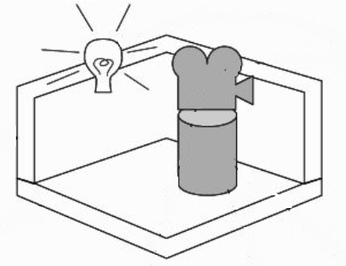
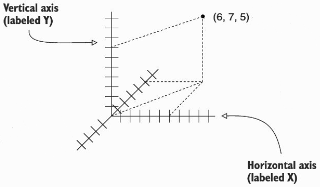
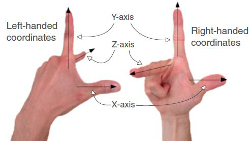
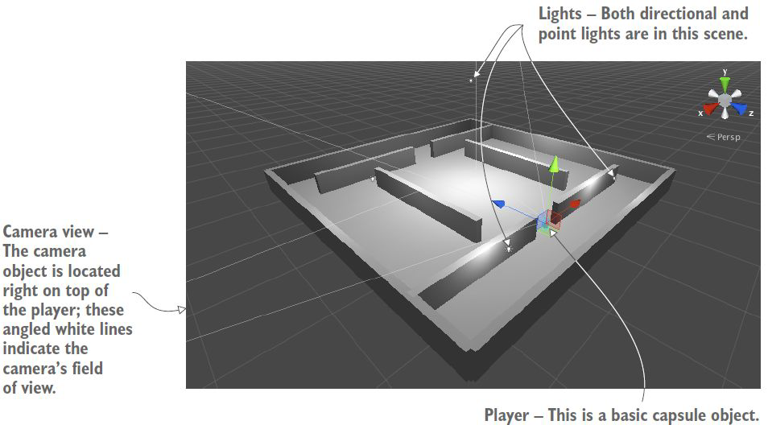
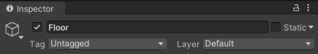
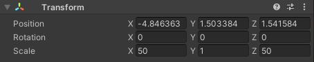
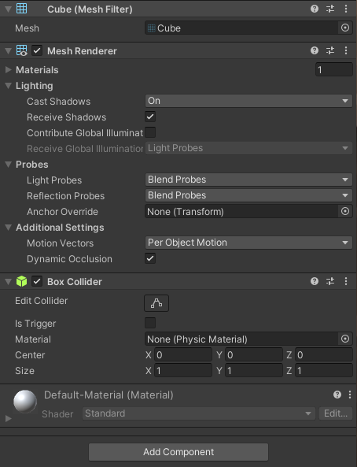
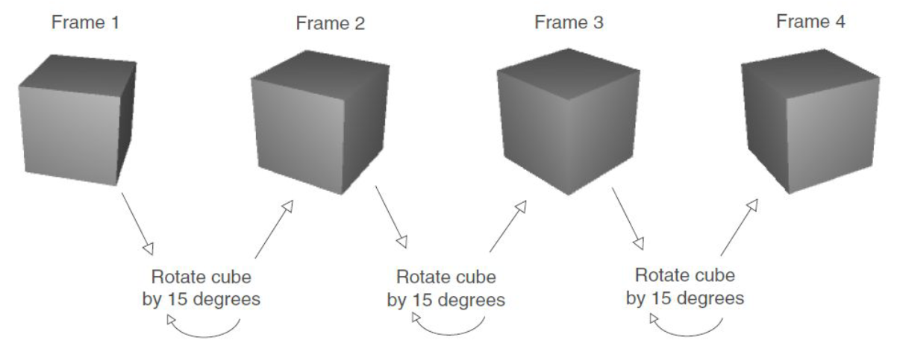
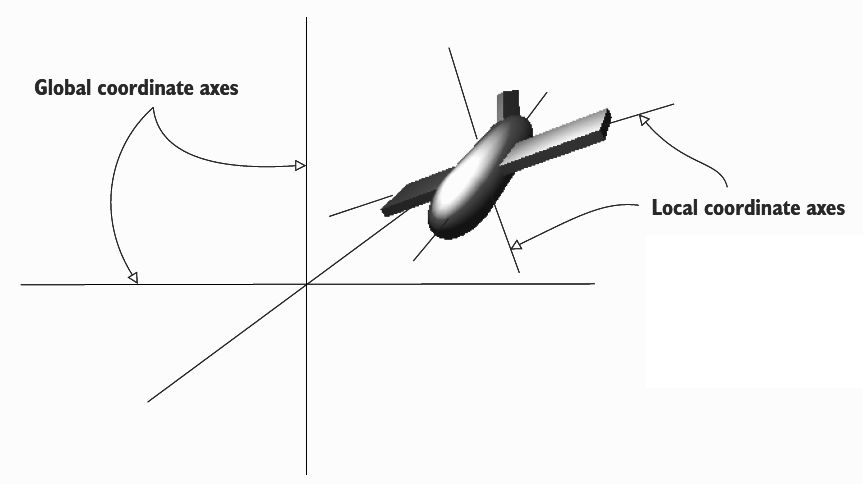

Con questo laboratorio, costruiremo una scena FPS di base: sarà una stanza in cui navigare, il giocatore vedrà il mondo dal punto di vista del suo personaggio e l'utente controllerà il personaggio usando il mouse e la tastiera.

## Tabella di marcia
1. Stabilisci i confini della stanza. Creare prima il pavimento, le pareti esterne, quindi posizionare le pareti interne;
2. I giocatori devono poter vedere la stanza. Metti delle luci nella stanza e posiziona la telecamera che sarà la visuale del giocatore;
3. Crea le forme primitive per il giocatore. Attacca la fotocamera alla parte superiore di questo, in modo che mentre questo oggetto si muove la fotocamera si muova con esso;
4. Scrivi script di movimento per il giocatore. Prima scrivi il codice per ruotare con il mouse, poi scrivi il codice per muoverti con la tastiera.



## Spazio delle coordinate 3D

I numeri sono ogni distanza lungo un asse: (X,Y). Laddove le coordinate 2D avevano due numeri, uno lungo ciascun asse, le coordinate 3D hanno tre numeri: (X,Y,Z).
L'asse Z è perpendicolare alla pagina; immagina questa linea che si conficca direttamente dentro e fuori la pagina.



## Coordinate mancine
Generalmente X va a destra e Y sale, ma ora abbiamo anche l'asse Z che entra o esce dalla pagina/schermo. [[Unity3D]] utilizza un **sistema di coordinate per mancini** come di seguito:



## Crea e posiziona oggetti
Questi sono i seguenti passaggi per configurare il nostro progetto:
1. Imposta tutto lo scenario statico cioè pavimento e pareti;
2. Posiziona le luci intorno alla scena e posiziona la telecamera;
3. Crea l'oggetto che sarà il giocatore: l'oggetto a cui allegheremo gli script di movimento.



## Oggetto del pavimento
- In alto puoi digitare un nome per l'oggetto. Ad esempio, chiamare l'oggetto piano "Piano";
    
- Posiziona e ridimensiona il cubo per creare un pavimento per la stanza. O meglio "cubo", dal momento che non sembrerà più un cubo dopo essere stato allungato con valori di scala diversi su assi diversi. Intanto la posizione si abbassa leggermente per compensare l'altezza; impostiamo la scala Y su I e l'oggetto è posizionato attorno al suo centro;
    
- I restanti componenti che riempiono la vista vengono forniti con un nuovo oggetto Cubo ma non è necessario modificarli in questo momento. Questi componenti includono un Mesh Filter (per definire la geometria dell'oggetto), un Mesh Renderer (per definire il materiale sull'oggetto) e un Box Collider (in modo che l'oggetto possa entrare in collisione durante il movimento).
    

## Pareti esterne ed interne
Bisogna ripetere gli stessi passaggi per creare pareti esterne ed interne: utilizza le pareti esterne per formare un perimetro attorno al pavimento.
Collega tutti gli oggetti insieme nella vista Hierarchy: i muri sono tutti figli di un oggetto radice vuoto (possiamo chiamare questo oggetto "Building").

## Luci
Tipicamente una scena 3D è illuminata da una luce direzionale e da una serie di luci puntiformi. Abbiamo diversi tipi di sorgenti luminose, definite da come e dove proiettano i raggi luminosi:
- **Luci puntiformi:** tutti i raggi luminosi provengono da un unico punto e si proiettano in tutte le direzioni (lampadina nel mondo reale);
- **Faretti:** tutto il raggio di luce proviene da un unico punto ma si proietta solo in un cono limitato;
- **Luci direzionali:** tutti i raggi di luce sono paralleli (è come il sole nel mondo reale). La posizione di una luce direzionale non influisce sul fascio di luce, ma solo sulla rotazione.

*Attenzione! Le prestazioni si degraderanno se il gioco ha molte luci.*

## Giocatore
Usiamo una semplice forma primitiva per rappresentare il giocatore:
- selezioniamo l'oggetto 3D *Capsule*;
- posiziona questo oggetto a 1.1 sull'asse Y;
- assegna all'oggetto il nome "Player";
- Rimuovi il *Capsule Collider*, quindi assegna un componente *Character Controller* all'oggetto *Player*.

## Character Controller
Il Character Controller viene utilizzato principalmente per il controllo del giocatore in **terza persona** o in **prima persona** che non fa uso della fisica *Rigidbody*.

Il Controller non reagisce alle forze da solo e non allontana automaticamente *Rigidbodies*: se vuoi spingere *Rigidbody* o oggetti con il Character Controller, puoi applicare forze a qualsiasi oggetto con cui entra in collisione tramite la funzione **OnControllerColliderHit()** tramite scripting; se vuoi che il tuo personaggio sia influenzato dalla fisica, allora potresti fare meglio a usare un *Rigidbody* invece del Character Controller.

## Punto di vista (viewpoint)
Gli occhi degli utenti possono essere simulati collegando la telecamera all'oggetto del giocatore nel seguente modo:
- nella vista *Hierarchy* trascina l'oggetto della telecamera nella capsula del giocatore;
- posizionare la telecamera in modo che assomigli agli occhi dei giocatori (*position 0, 0.5, 0*);
- reimpostare la rotazione della telecamera su *0, 0, 0*.

Come abbiamo già visto il concetto di punto di vista (**"controllo dinamico del punto di vista"** - definizione VR di F. Brooks nel 1999) è strettamente correlato con la VR e il punto di vista di VR è strettamente correlato (influenzato da) con il concetto di **chinetosi (mal di movimento)**.

## Chinetosi (mal di movimento)
La **chinetosi** è l'insieme dei disturbi provocati da viaggi per mare (**mal di mare**), in aereo (**mal d'aria**) o in automobile (**mal d'auto**), o comunque da ogni movimento che presenti frequenti e irregolari variazioni d'intensità e di direzione; è caratterizzata da nausea, vomito e vertigini, dovuti ad un'eccessiva stimolazione del labirinto e del nervo vago. Negli ultimi tempi si è evoluto anche il concetto di mal di VR o, detto in inglese, il **VR sickness**.

### VR sickness
I software VR, generalmente, rilevano il movimento della testa dell'utente. In alcuni casi (ritardo del sistema o arresto anomalo del software) dovremmo avere ritardi negli aggiornamenti dello schermo.

*L'orecchio interno trasmette al cervello che percepisce il movimento, ma gli occhi dicono al cervello che tutto è immobile.*

Come risultato di questa incongruenza, il cervello conclude che la persona sta avendo un'allucinazione a causa dell'ingestione di veleno. Il cervello risponde inducendo il vomito, per eliminare la presunta tossina.

## Movimento dell'oggetto
Facciamo un esempio di movimento dell'oggetto: ad esempio, per far girare un cubo, aggiungi il codice all'interno di *Update()* che ruota il cubo di una piccola quantità



Iniziamo a implementare ciò che è presente in figura: creiamo un nuovo script C#, chiamiamolo *"Spin"*, aggiungiamo il componente script all'oggetto (un cubo) e premi il pulsante *Play*.

*Fai attenzione! L'Inspector mostra tutte le variabili pubbliche dichiarate nello script.*

```csharp
using System.Collections;
using System.Collections.Generic;
using UnityEngine;

public class Spin : MonoBehaviour {
    // dichiarare una variabile pubblica per la velocita' di rotazione
    public float speed = 3.0f;

    void Update() {
        // metti qui il comando Rotate in modo che esegua ogni fotogramma
        transform.Rotate(0, speed, 0);    
    }
}
```
*Rotate()* è un metodo della classe *Transform*, viene chiamato con la notazione del punto tramite il componente *transform* di questo oggetto.

Questo metodo opera su coordinate locali: un altro tipo di coordinate che potresti usare sono le coordinate globali, usando un quarto parametro opzionale scrivendo: *Rotate(0, velocità, 0, Space.World)*.
In questo modo l'oggetto a cui affidiamo questo script, girerà sull'asse globale della scena (**_Space.World_**). Di default gira sull'asse locale, dell'oggetto a cui affidiamo lo script (**_Space.Self_**).

## Spazio delle coordinate locale e globale
Ogni singolo oggetto ha il suo punto di origine. La scena 3D ha anche un proprio punto di origine e una propria direzione per i tre assi, questo sistema di coordinate non si sposta mai, si riferisce a coordinate globali.



## MouseLook
Faremo in modo che la rotazione risponda all'input del mouse. Il giocatore potrà guardarsi intorno in tutte le direzioni, ruotando orizzontalmente e verticalmente allo stesso tempo. Creiamo, quindi, un nuovo script C# e lo chiamiamo "MouseLook". Il codice dovrebbe essere il seguente:

```csharp
using System.Collections;
using System.Collections.Generic;
using UnityEngine;

public class MouseLook : MonoBehaviour
{
    // definire una struttura di dati enum per associare i nomi alle impostazioni
    public enum RotationAxes {
        MouseXAndY = 0,  MouseX = 1, MouseY = 2
    }

    // dichiarare una variabile pubblica da impostare nell'editor di Unity
    public RotationAxes axes = RotationAxes.MouseXAndY;

    public float sensitivityHor = 9.0f;
    public float sensitivityVert = 9.0f;

    public float minimumVert = -45.0f;
    public float maximumVert = 45.0f;

    private float _rotationX = 0;

    void Start() {
        Rigidbody body = GetComponent<Rigidbody>();
        if(body != null) body.freezeRotation = true;
    }

    void Update() {
        if(axes == RotationAxes.MouseX) {
            // inserisci il codice qui solo per la rotazione orizzontale
            transform.Rotate(0, Input.GetAxis("Mouse X") * sensitivityHor, 0);
        } else if(axes == RotationAxes.MouseY) {
            // inserisci il codice qui solo per la rotazione verticale
            _rotationX -= Input.GetAxis("Mouse Y") * sensitivityVert;
            _rotationX = Mathf.Clamp(_rotationX, minimumVert, maximumVert);

            float rotationY = transform.localEulerAngles.y;

            transform.localEulerAngles = new Vector3(_rotationX, rotationY, 0);
        } else {
            // inserisci il codice qui sia per la rotazione orizzontale che verticale
            _rotationX -= Input.GetAxis("Mouse Y") * sensitivityVert;
            _rotationX = Mathf.Clamp(_rotationX, minimumVert, maximumVert);

            float delta = Input.GetAxis("Mouse X") * sensitivityHor;
            float rotationY = transform.localEulerAngles.y + delta;

            transform.localEulerAngles = new Vector3(_rotationX, rotationY, 0);
        }
    }
}
```
Con le variabili *sensitivityHor* e *sensitivityVert* intendiamo la velocità del mouse quando si muove nella visuale.
**Per assegnare questo script, bisogna trascinare questo script su *Player* e selezionare *Axes* su *Mouse X* e bisogna trascinare questo script su *Main Camera* e selezionare *Axes* su *Mouse Y*.**

### Rotazione orizzontale

*Con **rotazione orizzontale** definiamo la rotazione su noi stessi, per esempio per guardare a sinistra o a destra.*
Per definire la rotazione orizzontale, cominciamo a dichiarare una variabile pubblica per la velocità di rotazione *sensitivityHor*.
```csharp
...
public RotationAxes axes = RotationAxes.MouseXAndY;

// dichiarare una variabile per la velocita' di rotazione
public float sensitivityHor = 9.0f;

void Update() {
    if(axes == RotationAxes.MouseX) {
        // metti qui il comando Rotate in modo che esegua ogni fotogramma
        transform.Rotate(0, sensitivityHor, 0);
    }
    ...
```
Introduciamo il metodo *Input.GetAxis()* che serve per ottenere una rotazione controllata dal movimento del mouse.

Nel dettaglio, *GetAxis()* restituisce valori relativi al movimento del mouse e prende come parametro il nome dell'asse. *La rotazione sull'asse orizzontale viene eseguita utilizzando il "Mouse X".*
```csharp
...
// nota l'uso di GetAxis() per ottenere l'input del mouse
transform.Rotate(0, Input.GetAxis("Mouse X")*sensitivityHor, 0);
...
```

### Rotazione verticale

*Con **rotazione verticale** definiamo per esempio guardare sopra o sotto.*
La rotazione verticale necessita di limiti su quanto la vista può inclinarsi verso l'alto o verso il basso: usiamo *Mathf.Clamp()* per mantenere l'angolo di rotazione tra i limiti minimo e massimo.

Il valore di rotazione viene moltiplicato per *Input.GetAxis()* e, per farlo, chiediamo "Mouse Y" perché è l'asse verticale del mouse.

```csharp
...
// dichiara le variabili usate per la rotazione verticale
public float sensitivityHor = 9.0f;
public float sensitivityVert = 9.0f;

public float minimumVert = -45.0f;
public float maximumVert = 45.0f;

// dichiara una variabile privata per l'angolo verticale
private float _rotationX = 0;

void Update() {
    if(axes == RotationAxes.MouseX) {
        transform.Rotate(0, Input.GetAxis("Mouse X") * sensitivityHor, 0);
    } else if(axes == RotationAxes.MouseY) {
        // incrementa l'angolo verticale in base al mouse
        _rotationX -= Input.GetAxis("Mouse Y") * sensitivityVert;
        // blocca l'angolo verticale tra i limiti minimo e massimo
        _rotationX = Mathf.Clamp(_rotationX, minimumVert, maximumVert);

        // mantiene lo stesso angolo Y (cioe' nessuna rotazione orizzontale)
        float rotationY = transform.localEulerAngles.y;
        
        // crea un nuovo vettore dai valori di rotazione memorizzati
        transform.localEulerAngles = new Vector3(_rotationX, rotationY, 0);
    }
...
```

### Rotazione orizzontale e verticale
Entrambi gli angoli, verticale e orizzontale, vengono utilizzati per creare un nuovo vettore assegnato alla proprietà dell'angolo del componente di trasformazione.
```csharp
...
else {
    // inserisci il codice qui sia per la rotazione orizzontale che verticale
    _rotationX -= Input.GetAxis("Mouse Y") * sensitivityVert;
    _rotationX = Mathf.Clamp(_rotationX, minimumVert, maximumVert);

    // delta e' la quantita di cui modificare la rotazione
    float delta = Input.GetAxis("Mouse X") * sensitivityHor;
    // incrementare l'angolo di rotazione di delta
    float rotationY = transform.localEulerAngles.y + delta;

    transform.localEulerAngles = new Vector3(_rotationX, rotationY, 0);
}
...
```

### Rotazione fisica
La rotazione del giocatore deve essere controllata solo dal mouse e non deve essere influenzata dalla simulazione fisica: per questo, gli script di input del mouse di solito impostano la proprietà *freezeRotation* sul *Rigidbody* del giocatore.
```csharp
void Start() {
    Rigidbody body = GetComponent<Rigidbody>();
    // controlla se questo componente esiste
    if(body != null)
        body.freezeRotation = true;
}
```
