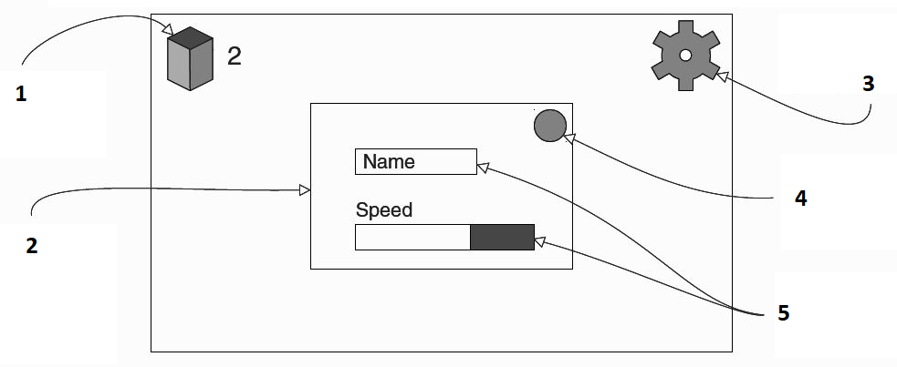
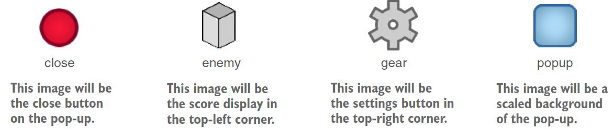
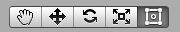
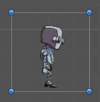
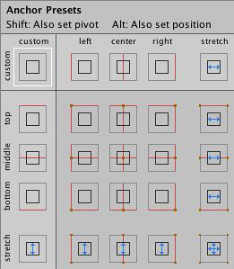
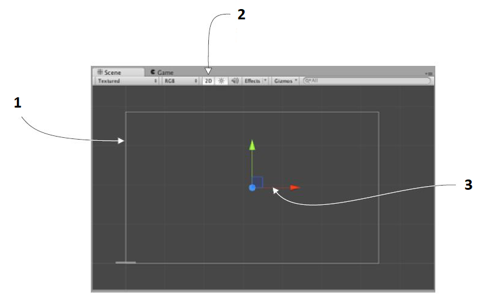

Con questo laboratorio, penseremo al confronto di diversi sistemi GUI, alla creazione di una tela per l'interfaccia e alla presentazione dei componenti dell'[[Interfaccia utente|interfaccia utente]].

## Introduzione
Ogni gioco ha bisogno di informazioni visualizzate oltre alla scena virtuale in cui si svolge il gioco e questo vale per tutti i tipi di giochi, 2D o 3D, sparatutto in prima persona o puzzle game.

Questi display di informazioni sono indicati come UI, o più specificamente GUI: GUI si riferisce alla parte visiva dell'interfaccia, come testo e pulsanti, ma tecnicamente l'[[Interfaccia utente|interfaccia utente]] include controlli non grafici, come la tastiera, generalmente tendiamo fare riferimento alle parti grafiche quando diciamo "[[Interfaccia utente|interfaccia utente]]".

## HUD
Qualsiasi software richiede una sorta di [[Interfaccia utente|interfaccia utente]] affinché l'utente di quel software possa controllarlo, i giochi spesso utilizzano la propria GUI in un modo diverso da altri software.

In un gioco il testo e i pulsanti sono spesso un'ulteriore sovrapposizione sulla parte superiore della vista di gioco, una sorta di display chiamato HUD: un "heads-up display" (HUD) sovrappone la grafica alla parte superiore del mondo di visualizzazione. Il concetto di HUD è nato con i jet militari in modo che i piloti potessero vedere le informazioni senza dover guardare in basso. Allo stesso modo, una GUI sovrapposta alla vista del gioco viene chiamata HUD

## Strumenti dell'[[Interfaccia utente|interfaccia utente]] in Unity
A partire da questa lezione daremo uno sguardo a come costruire l'HUD di gioco utilizzando uno degli strumenti UI Unity, esaminando le funzionalità di base fornite dall'**IMGUI** e i vantaggi dell'utilizzo dell'**uGUI**.

L'obiettivo è costruire il sistema dell'[[Interfaccia utente|interfaccia utente]] in cima al tuo progetto sparatutto in prima persona.

## Passaggi per lo sviluppo di un'[[Interfaccia utente|interfaccia utente]]
Il progetto prevede questi passaggi:
- pianificazione dell'interfaccia;
- posizionamento di elementi dell'[[Interfaccia utente|interfaccia utente]] sul display;
- interazioni di programmazione con gli elementi dell'[[Interfaccia utente|interfaccia utente]];
- fare in modo che la GUI risponda agli [[Eventi|eventi]] nella scena;
- fare in modo che la scena risponda alle azioni sulla GUI.

## Come funziona il sistema dell'[[Interfaccia utente|interfaccia utente]]
Dalla sua prima versione, Unity è stato fornito con un sistema **GUI in modalità immediata**, e quel sistema rende facile mettere sullo schermo un pulsante cliccabile: abbiamo già usato per la prima volta il sistema GUI nel nostro *Rayshooter.cs*, dove puoi trovare un esempio di *GUI.Label()*, vedremo un altro esempio che utilizza *GUI.Button()*.

**"Modalità immediata"** si riferisce all'emissione esplicita di comandi di disegno per ogni fotogramma, rispetto a un sistema in cui definisci tutti gli elementi visivi una volta e quindi per ogni fotogramma il sistema sa cosa disegnare senza che tu debba ripeterlo: l'approccio IMGUI non è raccomandato per il runtime UI ma potrebbe essere utile durante lo sviluppo.

## *GUI.Button()*
Crea un nuovo script e chiama questo script *BasicUI.cs*: allega semplicemente questo script a qualsiasi oggetto nella scena (puoi allegarlo al nostro "controller").
```csharp
using UnityEngime;
using System.Collections;

public class BasicUI:MonoBehaviour {
    void OnGUI() {
        // la funzione ha chiamato ogni fotogramma dopo il rendering di tutto il resto
        if(GUI.Button(new Rect(10, 10, 40, 20), "Test") {
            // parametri: posizione X, pos Y, larghezza, altezza, etichetta di testo
            Debug.Log("Test button");
        }
    }
}
```
Il cuore del nostro codice è il metodo ***OnGUI()***. Proprio come *Start()* e *Update()*, ogni *MonoBehaviour* risponde automaticamente a *OnGUI()*. Questa funzione esegue ogni fotogramma dopo il rendering della scena 3D.

Questo codice disegna un pulsante! Il comando del pulsante viene utilizzato come "espressione *if*" che risponde solo quando si fa clic sul pulsante: la GUI della modalità immediata rende facile ottenere alcuni pulsanti sullo schermo con il minimo sforzo e per questo lo useremo per fare alcuni esempi.

## Immediate Mode GUI (IMGUI)
L'IMGUI fornisce controlli di base e stilizzati da utilizzare nei tuoi giochi. Tutti i controlli IMGUI vengono disegnati durante la fase di rendering della GUI dal metodo *OnGUI* integrato.

I controlli disponibili nella GUI della modalità immediata sono: *Label*, *Texture*, *Button*, *Text fields* (singola/multilinea e variante password), *Box*, *Toolbars*, *Sliders*, *ScrollView*, *Window*.

Vedremo ora alcuni esempi di IMGUI per alcuni di questi controlli.

### Label
La maggior parte dei sistemi GUI inizia con un controllo *Label*; questo fornisce semplicemente un controllo stilizzato per visualizzare il testo di sola lettura sullo schermo:
```csharp
GUI.Label(new Rect(55, 10, 100, 30), "Label");
```
Il controllo *Label* supporta anche l'utilizzo di una *Texture* per il suo contenuto:
```csharp
GUI.Label(new Rect(55, 10, 100, 30), ourTexture);
```

### Text
Ne abbiamo di vari tipi:
- **TextField:** una casella di testo di base, supporta una singola riga di testo; 
```csharp
GUI.TextField(new Rect(25, 100, 100, 30), textString1);
```
- **TextArea:** un'estensione di TextField che supporta l'immissione di più righe di testo; 
```csharp
GUI.TextArea(new Rect(150, 100, 200, 75), textString2);
```
- **PasswordField:** una variante di TextField, sostituirà ogni carattere con un carattere sostitutivo; 
```csharp
GUI.PasswordField(new Rect(375, 100, 90, 30), textString3, '*');
```

## Sistema Unity UI (uGUI)
Il sistema **uGUI** si basa su grafici 2D disposti nell'editor. La configurazione richiede un po' più di sforzo, ma produce risultati più nitidi.

Questo sistema GUI funziona con la grafica che viene disposta una volta e poi disegnata ogni fotogramma senza che sia necessario ridefinire continuamente. In questo sistema la grafica per la GUI è posizionata nell'editor Unity. Ciò offre due vantaggi: puoi vedere come appare l'[[Interfaccia utente|interfaccia utente]] mentre inserisci gli elementi dell'[[Interfaccia utente|interfaccia utente]] e questo sistema semplifica la personalizzazione dell'[[Interfaccia utente|interfaccia utente]] con le tue immagini.

## Pianificazione del layout
Per il nostro progetto FPS inseriremo un display del punteggio e un pulsante delle impostazioni negli angoli dello schermo sopra la vista principale del gioco: il pulsante delle impostazioni farà apparire una finestra pop-up con un campo di testo e uno slider.



1. visualizzazione del punteggio con un'immagine e un testo;
2. finestra pop-up al centro dello schermo. Aprire con il pulsante dell'ingranaggio;
3. **pulsante delle impostazioni:** aprire la finestra pop-up quando si fa clic;
4. **pulsante di chiusura:** chiude la finestra pop-up;
5. **controlli di input:** input di testo per il cursore del nome per la velocità.

## Importazione di immagini dell'[[Interfaccia utente|interfaccia utente]]
La nostra [[Interfaccia utente|interfaccia utente]] pianificata richiede la visualizzazione di alcune immagini: prima trascina le immagini nella vista *Progetto* per importarle, quindi nell'*Inspector* cambia l'impostazione del tipo di trama su *Sprite* (2D e UI).

L'impostazione predefinita del *Texture Type* è *Texture* nei progetti 3D e Sprite nei progetti 2D. Se vuoi sprite in un progetto 3D, devi regolare questa impostazione manualmente.



## Rect Tool
Ogni elemento dell'[[Interfaccia utente|interfaccia utente]] è rappresentato come un rettangolo ai fini del layout. Questo rettangolo può essere manipolato nella vista scena utilizzando lo strumento Rettangolo nella barra degli strumenti. Lo strumento *Rect* viene utilizzato sia per le funzionalità 2D di Unity che per l'[[Interfaccia utente|interfaccia utente]] e può essere utilizzato anche per oggetti 3D.

Lo **strumento Rettitudine (Rect Tool)** può essere utilizzato per spostare, ridimensionare e ruotare gli elementi dell'[[Interfaccia utente|interfaccia utente]]. Dopo aver selezionato un elemento dell'[[Interfaccia utente|interfaccia utente]], puoi spostarlo facendo clic in un punto qualsiasi all'interno del rettangolo e trascinando. Puoi ridimensionarlo facendo clic sui bordi o sugli angoli e trascinando. L'elemento può essere ruotato spostando il cursore leggermente lontano dagli angoli finché il cursore del mouse non appare come un simbolo di rotazione.



### *Resizing* vs *Scaling*
Quando lo strumento *Rect* viene utilizzato per modificare la dimensione di un oggetto, normalmente per gli *Sprite* nel sistema 2D e per gli oggetti 3D cambierà la scala locale dell'oggetto. Tuttavia, quando viene utilizzato su un oggetto con una trasformazione *Rect* su di esso, cambierà invece la larghezza e l'altezza, mantenendo invariata la scala locale.

### Pivot
Le rotazioni, le dimensioni e le modifiche della scala si verificano attorno al pivot in modo che la posizione del pivot influisca sul risultato di una rotazione, ridimensionamento o ridimensionamento. Quando il pulsante *Pivot* della barra degli strumenti è impostato sulla modalità *Pivot*, è possibile spostare il pivot di *Rect Transform* nella vista scena.



## Rect Transform
Lo strumento *Rect* funziona bene su tutti gli oggetti 2D e 3D ed è un'ottima estensione del set di strumenti Unity. Ma il sistema uGUI introduce anche il componente *Rect Transform*.

Il componente **Rect Transform** è la controparte del layout 2D del componente *Transform*. Dove *Transform* rappresenta un singolo punto, *Rect Transform* rappresenta un rettangolo all'interno del quale è possibile posizionare un elemento dell'[[Interfaccia utente|interfaccia utente]]. Se il genitore di un *Rect Transform* è anche un *Rect Transform*, il figlio *Rect Transform* può anche specificare come deve essere posizionato e dimensionato rispetto al rettangolo genitore.

## Ancoraggi
*Rect Transforms* include un concetto di layout chiamato ancore. Gli **ancoraggi** sono mostrati come quattro piccole maniglie triangolari nella vista scena e le informazioni sull'ancora sono mostrate anche in *Inspector*. Se il genitore di un *Rect Transform* è anche un *Rect Transform*, il figlio *Rect Transform* può essere ancorato al genitore *Rect Transform* in vari modi. Ad esempio, il figlio può essere ancorato al centro del genitore o ad uno degli angoli.

L'ancoraggio permette inoltre al bambino di allungarsi insieme alla larghezza o all'altezza del genitore. In sintesi, gli stessi ancoraggi delle Windows Form di C#.

### Ancoraggi predefiniti
Nell'*Inspector*, il pulsante *Anchor Preset* si trova nell'angolo in alto a sinistra del componente *Rect Transform*. Facendo clic sul pulsante viene visualizzato il menu a discesa *Anchor Presets*. Da qui puoi selezionare rapidamente tra alcune delle opzioni di ancoraggio più comuni. Puoi ancorare l'elemento dell'[[Interfaccia utente|interfaccia utente]] ai lati o al centro del genitore o allungarlo insieme alla dimensione del genitore.



## Canvas
*Canvas* è un tipo speciale di oggetto che Unity rende come l'[[Interfaccia utente|interfaccia utente]] di un gioco.

Uno degli aspetti più fondamentali del funzionamento del sistema dell'[[Interfaccia utente|interfaccia utente]] è che tutte le immagini devono essere allegate a un oggetto canvas.

Apri il menu *GameObject* per vedere i vari tipi di oggetti che puoi creare. Nella categoria dell'[[Interfaccia utente|interfaccia utente]], scegli *Canvas*. Nella scena apparirà un oggetto canvas (potrebbe essere più chiaro rinominare l'oggetto HUD Canvas). Questo oggetto rappresenta l'intera estensione dello schermo.

Quando crei un oggetto canvas, viene creato automaticamente anche un oggetto *EventSystem*. Quell'oggetto è richiesto per l'interazione con l'[[Interfaccia utente|interfaccia utente]], ma per ora puoi ignorarlo.

Di seguito, l'oggetto *Canvas* nella vista *Scena*:



1. oggetto *Canvas* visualizzato nella vista *Scena*;
2. *modalità di visualizzazione 2D:* passa a questa visualizzazione quando si lavora in 2D, inclusa l'[[Interfaccia utente|interfaccia utente]];
3. se vedi le frecce colorate del manipolatore, significa che lo strumento *Rect* non è attivo. Quel pulsante si trova nell'angolo in alto a sinistra di Unity; vedrai punti blu su ogni angolo di un oggetto 2D.

### Impostazioni
La canvas ha una serie di impostazioni che puoi regolare. La prima è l'opzione *Render Mode*. Lascia questa impostazione predefinita, ma dovresti sapere cosa significano le tre possibili impostazioni:
- **Screen Space - Overlay**;
- **Screen Space - Camera**;
- **World Space**.

L'altra impostazione importante è *Pixel Perfect*. Questa impostazione fa sì che il rendering possa regolare la posizione delle immagini in modo che siano sempre perfettamente nitide e chiare.

### Screen Space Overlay
**Rende l'[[Interfaccia utente|interfaccia utente]] come grafica 2D sopra la vista della telecamera (questa è l'impostazione predefinita).** Questa modalità di rendering posiziona gli elementi dell'[[Interfaccia utente|interfaccia utente]] sullo schermo renderizzato sopra la scena. Se lo schermo viene ridimensionato o cambia risoluzione, il canvas cambierà automaticamente le dimensioni per corrispondere a questo.

### Screen Space Camera
**Esegue il rendering dell'[[Interfaccia utente|interfaccia utente]] nella parte superiore della vista della telecamera, ma gli elementi dell'[[Interfaccia utente|interfaccia utente]] possono ruotare per effetti prospettici.** È simile a *Screen Space - Overlay*, ma in questa modalità di rendering, la tela viene posizionata a una determinata distanza davanti a una telecamera specificata. Gli elementi dell'[[Interfaccia utente|interfaccia utente]] sono visualizzati da questa fotocamera, il che significa che le impostazioni della fotocamera influiscono sull'aspetto dell'[[Interfaccia utente|interfaccia utente]]. Se la fotocamera è impostata su *Perspective*, gli elementi dell'[[Interfaccia utente|interfaccia utente]] verranno renderizzati con la prospettiva e la quantità di distorsione prospettica può essere controllata dal campo visivo della fotocamera. Se lo schermo viene ridimensionato o cambia la risoluzione, o se la fotocamera è disturbata, anche il canvas cambierà automaticamente le dimensioni in modo che corrispondano.

### World Space
**Posiziona l'oggetto canvas all'interno della scena, come se l'[[Interfaccia utente|interfaccia utente]] facesse parte della scena 3D.** In questa modalità di rendering, la tela si comporterà come qualsiasi altro oggetto nella scena. La dimensione del canvas può essere impostata manualmente utilizzando *Rect Transform* e gli elementi dell'[[Interfaccia utente|interfaccia utente]] verranno visualizzati davanti o dietro ad altri oggetti nella scena in base al posizionamento 3D. Ciò è utile per le interfacce utente destinate a far parte del mondo. Questa è anche nota come "interfaccia diegetica".

### Disegna l'ordine degli elementi
Gli elementi dell'[[Interfaccia utente|interfaccia utente]] nel canvas vengono disegnati nello stesso ordine in cui appaiono nella *Hierarchy*. Il primo figlio viene disegnato per primo, poi il secondo figlio e così via. Se due elementi dell'[[Interfaccia utente|interfaccia utente]] si sovrappongono, quello successivo apparirà sopra quello precedente. 

Per cambiare quale elemento appare sopra ad altri elementi, riordina semplicemente gli elementi nella *Hierarchy* trascinandoli.

### Canvas Scaler Component
Il componente *Canvas Scaler* viene utilizzato per controllare la scala generale e la densità di pixel degli elementi dell'[[Interfaccia utente|interfaccia utente]] nel canvas. Questo ridimensionamento influisce su tutto ciò che si trova sotto il canvas, comprese le dimensioni dei caratteri e i bordi dell'immagine. La *UI Scale Mode* definisce come vengono ridimensionati gli elementi dell'[[Interfaccia utente|interfaccia utente]] nel canvas.

Utilizzando la modalità *Constant Pixel Size*, le posizioni e le dimensioni degli elementi dell'[[Interfaccia utente|interfaccia utente]] vengono specificate in pixel sullo schermo. Questa è anche la funzionalità predefinita del canvas quando non è collegato alcun *Canvas Scaler*.

Utilizzando la modalità *Scale With Screen Size*, è possibile specificare posizioni e dimensioni in base ai pixel di una risoluzione di riferimento specificata.

Utilizzando la modalità *Constant Physical Size*, le posizioni e le dimensioni degli elementi dell'[[Interfaccia utente|interfaccia utente]] vengono specificate in unità fisiche, ad esempio millimetri.

### Canvas Renderer Component
Il componente *Canvas Renderer* esegue il rendering di un oggetto dell'[[Interfaccia utente|interfaccia utente]] grafico contenuto in un canvas.

Gli oggetti dell'[[Interfaccia utente|interfaccia utente]] standard hanno tutti i *Canvas Renderers* collegati ovunque siano richiesti, ma molti devono aggiungere manualmente questo componente per gli oggetti dell'[[Interfaccia utente|interfaccia utente]] personalizzati.

## Componenti visivi
Con l'introduzione del sistema UI, sono stati aggiunti nuovi componenti che ti aiuteranno a creare funzionalità specifiche della GUI:
- **Text Component:** il controllo *Text* mostra all'utente una parte di testo non interattiva. Questo può essere utilizzato per fornire etichette per altri controlli della GUI o per visualizzare istruzioni o altro testo;
- **Image Component:** il controllo *Image* visualizza un'immagine non interattiva per l'utente. Questo può essere utilizzato per decorazioni, icone, ecc. e l'immagine può anche essere modificata da uno script per riflettere le modifiche in altri controlli. Il controllo è simile al controllo *Raw Image* ma offre più opzioni per archiviare accuratamente il rettangolo di controllo. Tuttavia, il controllo *Image* richiede che la sua trama sia uno *Sprite*, mentre l'immagine *Raw* può accettare qualsiasi trama;
- **Raw Image Component:** l'immagine grezza non richiede una texture sprite, puoi usarla per visualizzare qualsiasi texture disponibile per il player di Unity. Ad esempio, potresti mostrare un'immagine scaricata da un URL o una trama da un oggetto in un gioco. Le proprietà *UV Rectangle* consentono di visualizzare una piccola sezione di un'immagine più grande;
- **Mask Component:** una maschera (mask) non è un controllo dell'[[Interfaccia utente|interfaccia utente]] visibile, ma piuttosto un modo per modificare l'aspetto degli elementi figlio di un controllo. La maschera limita gli elementi figlio alla forma del genitore. Quindi, se il bambino è più grande del genitore, sarà visibile solo la parte del bambino che si adatta al genitore.

## Componenti di interazione
I componenti di interazione nel sistema dell'[[Interfaccia utente|interfaccia utente]] gestiscono l'interazione, come [[Eventi|eventi]] del mouse o del tocco:
- **Button Component:** il controllo *Button* risponde a un clic dell'utente e viene utilizzato per avviare o confermare un'azione. Il pulsante è progettato per avviare un'azione quando l'utente fa clic e la rilascia. Il pulsante ha un unico evento chiamato Al clic che risponde quando l'utente completa un clic;
- **Toggle Component:** il controllo *Toggle* è una casella di controllo che consente all'utente di attivare o disattivare un'opzione. Il *Toggle* ha un singolo evento chiamato *On Value Changed* che risponde quando l'utente modifica il valore corrente;
- **Toggle Group Component:** un *Toggle Group* non è un controllo dell'[[Interfaccia utente|interfaccia utente]] visibile, ma piuttosto un modo per modificare il comportamento di un insieme di *Toggle*. Gli interruttori che appartengono allo stesso gruppo sono vincolati in modo che solo uno di essi possa accendersi alla volta: premendo uno di essi per accenderlo si disattivano automaticamente gli altri. Il *Toggle Group* viene impostato trascinando l'oggetto *Toggle Group* nella proprietà *Group* di ciascuno dei *Toggle* nel gruppo;
- **Slider Component:** il controllo *Slider* consente all'utente di selezionare un valore numerico da un intervallo predeterminato trascinando il mouse. Si noti che il controllo *ScrollBar* simile viene utilizzato per lo scorrimento anziché per la selezione di valori numerici. Il dispositivo di scorrimento ha un singolo evento chiamato *On Value Changed* che risponde quando l'utente trascina la maniglia. Il valore numerico corrente dello slider viene passato alla funzione come parametro *float*;
- **Dropdown Component:** il *menu a discesa* può essere utilizzato per consentire all'utente di scegliere una singola opzione da un elenco di opzioni. Il controllo mostra l'opzione attualmente scelta. Una volta cliccato, si apre l'elenco delle opzioni in modo da poter scegliere una nuova opzione. Dopo aver scelto una nuova opzione, l'elenco si chiude nuovamente e il controllo mostra la nuova opzione selezionata. Il pulsante ha un unico evento chiamato *On Value Changed* che risponde quando l'utente completa un clic su una delle opzioni nell'elenco. Supporta l'invio di un valore numerico intero che è l'indice dell'opzione selezionata. 0 è la prima opzione, 1 è la seconda e così via;
- **Input Field Component:** un *campo di input* è un modo per rendere modificabile il testo di un controllo di testo. Come gli altri controlli di interazione, non è un elemento dell'[[Interfaccia utente|interfaccia utente]] visibile di per sé e deve essere combinato con uno o più elementi dell'[[Interfaccia utente|interfaccia utente]] visivi per essere visibile;
- **Scroll Rect Component:** è possibile utilizzare *Scroll Rect* quando il contenuto che occupa molto spazio deve essere visualizzato in una piccola area. *Scroll Rect* fornisce funzionalità per scorrere questo contenuto. Solitamente uno *Scroll Rect* viene combinato con una *Mask* per creare una vista a scorrimento, in cui è visibile solo il contenuto scorrevole all'interno di *Scroll Rect*. Può anche essere combinato con una o due barre di scorrimento che possono essere trascinate per scorrere orizzontalmente o verticalmente;

## Selectable Base Class
La maggior parte dei componenti di interazione ha alcune cose in comune. Sono **selezionabili**, il che significa che hanno funzionalità integrate condivise per visualizzare le transizioni tra gli stati (normale, evidenziato, premuto, disabilitato) e per la navigazione verso altri selezionabili utilizzando la tastiera o il controller.
L'*opzione interagibile* determina se questo componente accetterà l'input. Quando è impostato su false l'interazione è disabilitata.

## Opzioni di transizione
All'interno di un componente selezionabile ci sono diverse opzioni di transizione a seconda dello stato in cui si trova attualmente. I diversi stati sono: *normale*, *evidenziato*, *premuto* e *disabilitato*. Ciascuna opzione di transizione (tranne *None*) fornisce opzioni aggiuntive per il controllo delle transizioni:
- **Color Tint**;
- **Sprite Swap**;
- **Animation**.

## Opzioni di navigazione
Le opzioni di navigazione si riferiscono al modo in cui verrà controllata la navigazione degli elementi dell'[[Interfaccia utente|interfaccia utente]] in modalità di riproduzione:
- **None:** nessuna navigazione da tastiera. Garantisce inoltre che non riceva lo stato attivo facendo clic/toccando su di esso;
- **Horizontal:** naviga orizzontalmente;
- **Vertical:** naviga verticalmente;
- **Automatic:** navigazione automatica;
- **Explicit:** in questa modalità è possibile specificare in modo esplicito dove si sposta il controllo per i diversi tasti freccia.
