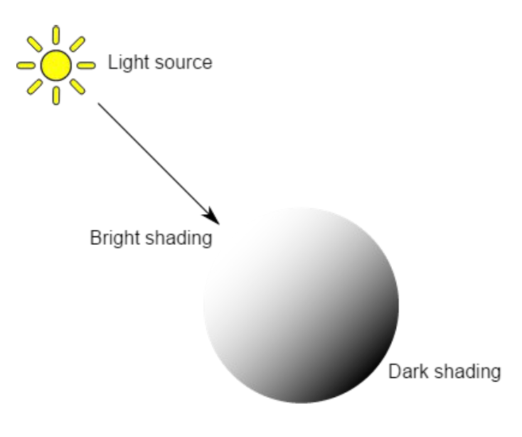
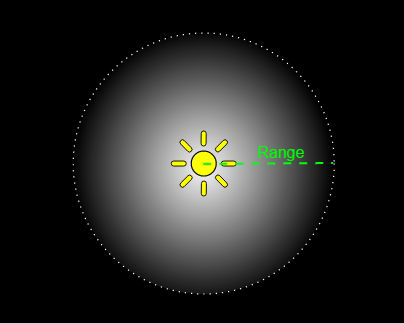
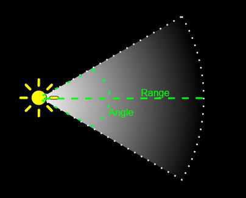
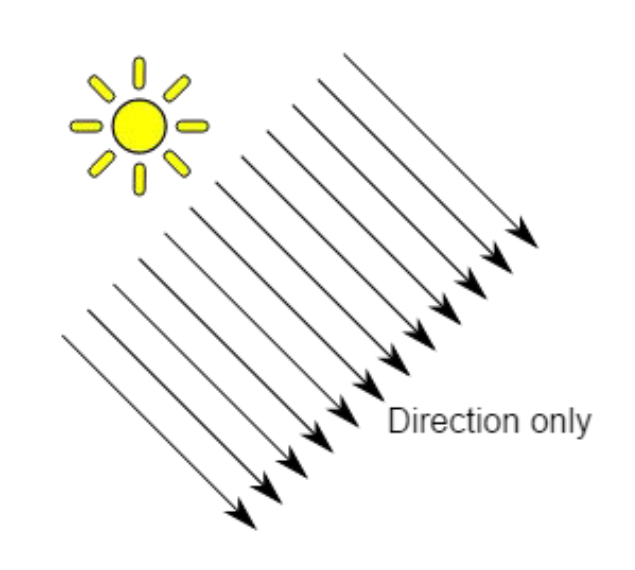
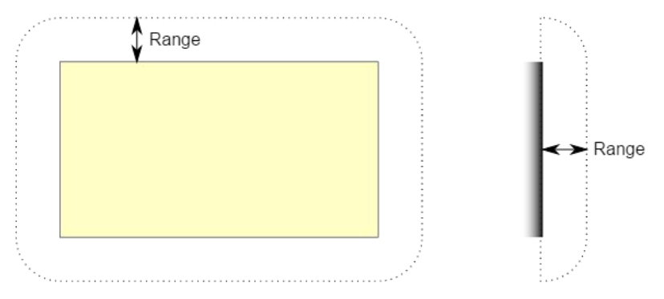
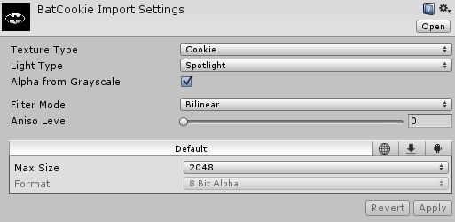
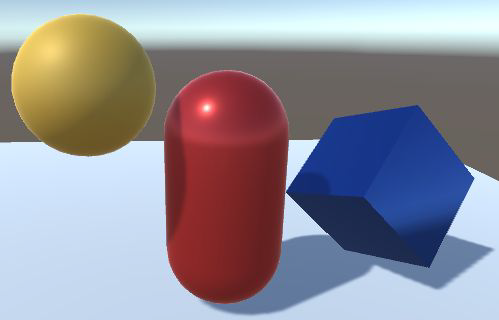
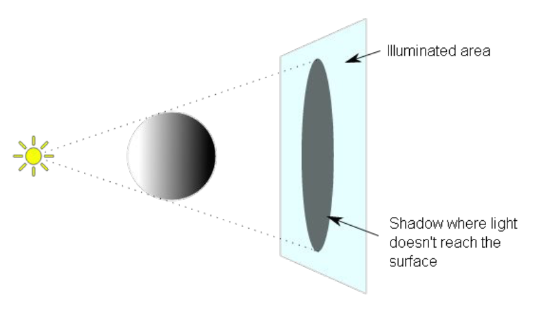
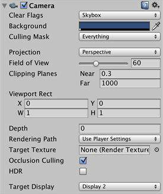
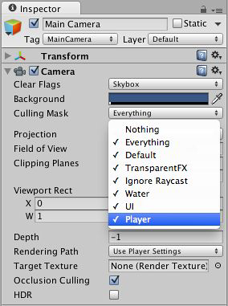

Con questo laboratorio, penseremo alle caratteristiche di illuminazione, all'utilizzo delle ombre e alle componenti della telecamere.

## Introduzione

Le **luci** sono una parte essenziale di ogni scena. Mentre mesh e texture definiscono l'aspetto di una scena, le luci definiscono il colore e l'atmosfera del tuo ambiente 3D.

Probabilmente lavoreremo con più di una luce in ogni scena e farle funzionare insieme richiede un po' di pratica, ma i risultati possono essere sorprendenti.

## Illuminazione diretta e indiretta
La **luce diretta** è la luce che viene emessa, colpisce una superficie una volta e viene quindi riflessa direttamente in un sensore (ad esempio, la retina dell'occhio o una fotocamera).

La **luce indiretta** è tutta l'altra luce che alla fine viene riflessa in un sensore, compresa la luce che colpisce più volte le superfici e la luce del cielo: per ottenere risultati di illuminazione realistici, è necessario simulare sia la luce diretta che quella indiretta.

## Illuminazione in tempo reale e "baked"
L'**illuminazione in tempo reale** è quando Unity calcola l'illuminazione in fase di esecuzione.

L'**illuminazione "baked"** è quando Unity esegue i calcoli dell'illuminazione in anticipo e salva i risultati come dati sull'illuminazione, che vengono quindi applicati in fase di esecuzione.

In Unity, il tuo progetto può utilizzare l'illuminazione in tempo reale, l'illuminazione "baked" o un mix dei due chiamato **illuminazione mista**.

## Panoramica sull'illuminazione
Per calcolare l'ombreggiatura di un oggetto 3D, Unity ha bisogno di conoscere l'intensità, la direzione e il colore della luce che cade su di esso: queste proprietà sono fornite dagli oggetti Luce nella scena. Il colore di base e l'intensità sono impostati in modo identico per tutte le luci, ma la direzione dipende dal tipo di luce che stai utilizzando.

## La componente *Lights*
Le proprietà principali sono elencate di seguito:
- **Type:** *Point*, *Spot*, *Direction* e *Area*;
- **Range**
- **Color**
- **Mode:** in tempo reale, misto e "baked";
- **Intensity**;
- **Indirect Multiplier:** intensità della luce indiretta.

### *Point Lights*
Un **point Light** (punti luce) si trova in un punto nello spazio e invia la luce in tutte le direzioni allo stesso modo. La direzione della luce che colpisce una superficie è la linea dal punto di contatto al centro dell'oggetto luminoso. L'intensità diminuisce con la distanza dalla luce, raggiungendo lo zero in un intervallo specificato. Le luci puntiformi sono utili per simulare lampade e altre fonti di luce locali in una scena.

### *Spot Lights*
Come una luce puntiforme, una **spot lights** (faretti) ha una posizione e un intervallo specifici in cui la luce si spegne. Tuttavia, il faretto è vincolato ad un angolo, risultando in una regione di illuminazione a forma di cono. Il centro del cono punta nella direzione in avanti (Z) dell'oggetto luminoso.

Gli spot lights sono generalmente utilizzati per sorgenti di luce artificiale come torce elettriche, fari di automobili e proiettori. Con la regia controllata da una sceneggiatura, una luce spot in movimento illuminerà solo una piccola area della scena e creerà effetti di luce drammatici.

### *Directional Lights*
Una directional lights (luce direzionale) non ha alcuna posizione della sorgente identificabile e quindi l'oggetto luminoso può generalmente essere posizionato ovunque nella scena. Tutti gli oggetti nella scena sono illuminati come se la luce provenisse sempre dalla stessa direzione. La distanza della luce dall'oggetto target non è definita e quindi la luce non diminuisce.

In una scena realistica, possono essere usati per simulare il sole o la luna. Una directional lights è spesso il modo più rapido per avere un'idea di come apparirà l'ombreggiatura di un oggetto.

### *Area Lights*
Un'**area light** è definita da un rettangolo (o un disco) nello spazio. La luce viene emessa in tutte le direzioni, ma solo da un lato del rettangolo. La luce si spegne in un intervallo specificato. Poiché il calcolo dell'illuminazione richiede un'elevata intensità del processore, le area light non sono disponibili in fase di esecuzione e possono essere integrate solo in mappe di luce.

Poiché una area light illumina un oggetto da diverse direzioni contemporaneamente, l'ombreggiatura tende ad essere più morbida.

## Utilizzo delle luci
Le luci sono molto facili da usare in Unity, devi semplicemente creare una luce del tipo desiderato (dal menu *GameObject -> Light -> Point Light*) e posizionarla dove vuoi nella scena. Se abiliti l'illuminazione della vista scena (il pulsante "sole" sulla barra degli strumenti), puoi vedere un'anteprima di come apparirà l'illuminazione mentre sposti gli oggetti luce e ne imposti i parametri.

## Posizionamento delle luci
Una luce direzionale spesso rappresenta il sole e ha un effetto significativo sull'aspetto di una scena. I faretti e le luci puntiformi di solito rappresentano sorgenti di luce artificiale e quindi le loro posizioni sono generalmente determinate dagli oggetti della scena. La gamma di una luce è il limite al quale la luminosità della luce si attenua a zero.

## Cookies
A volte gli effetti di luce sono stati a lungo utilizzati per creare un'impressione di oggetti che in realtà non esistono.

Le ombre si creano molto semplicemente inserendo una maschera sagomata tra la fonte di luce e l'oggetto.

La maschera è conosciuta come cookie. Le luci Unity ti consentono di aggiungere cookie sotto forma di trame. Questi forniscono un modo efficiente per aggiungere atmosfera a una scena.

### Creazione di un cookie
Un cookie è solo una trama ordinaria, ma solo il canale alfa/trasparenza è rilevante. Quando il cookie viene importato in Unity, selezionalo dalla vista *Project* e imposta il *Texture Type* su *Cookie* nell'ispettore.

Il *Light Type* influisce sul modo in cui il cookie viene proiettato dalla luce. Una luce spot dovrebbe utilizzare un cookie con il tipo impostato su *Spotlight*, ma una luce direzionale può effettivamente utilizzare le opzioni *Spotlight* o *Directional*.

*Nota che un cookie non deve essere completamente in bianco e nero ma può anche incorporare qualsiasi livello di scala di grigi. Potresti aggiungere atmosfera usando biscotti "sporchi" con rumore.*

## Ombre
Le luci in Unity possono proiettare ombre da un oggetto su altre parti di se stesso o su altri oggetti vicini. Le ombre aggiungono un certo grado di profondità e realismo a una scena poiché mettono in risalto la scala e la posizione di oggetti che altrimenti potrebbero sembrare "piatti".

### Proiezione d'ombra
Considera il caso più semplice di una scena con un'unica fonte di luce. Le ombre proiettate dall'oggetto sono semplicemente le aree che non sono illuminate perché la luce non potrebbe raggiungerle.

### Abilitazione delle ombre
Puoi abilitare le ombre per una singola luce con la proprietà *Shadow Type* nella finestra di ispezione:
- l'impostazione *Hard Shadows* produce ombre con un bordo nitido, comportano un sovraccarico di elaborazione inferiore rispetto alle più realistiche *Soft Shadows* e sono accettabili per molti scopi;
- la *Strength* determina quanto sono scure le ombre;
- la proprietà *Resolution* imposta la risoluzione del rendering.

Ogni componente *Mesh Renderer* dell'oggetto 3D ha proprietà denominate *Cast Shadows* e *Receive Shadows* che devono essere abilitate.

## Telecamere (cameras)
Le telecamere in Unity vengono utilizzate per mostrare il mondo di gioco al giocatore. Avrai sempre almeno una telecamera in una scena, ma puoi averne più di una. Più telecamere possono darti uno schermo diviso per due giocatori o creare effetti personalizzati avanzati. Puoi animare le telecamere o controllarle con la fisica.

### Componenti della fotocamera
Le telecamere possono essere personalizzate, con script o con genitori. Per un gioco di puzzle, potresti mantenere la fotocamera statica per una visione completa del puzzle. Per uno sparatutto in prima persona, devi collegare la fotocamera al personaggio del giocatore e posizionarla all'altezza degli occhi del personaggio. Per un gioco di corse, probabilmente vorrai che la fotocamera segua il veicolo del tuo giocatore.

### Camera Clip Planes
Le proprietà *Near* e *Far Clip Plane* determinano dove inizia e dove finisce la vista della telecamera. I piani sono perpendicolari alla direzione della telecamera e vengono misurati dalla sua posizione. Il piano Near è la posizione più vicina che verrà renderizzata e il piano Far è la più lontana.

I piani di clip vicino e lontano insieme ai piani definiti dal campo visivo della telecamera descrivono ciò che è noto come *camera frustum*.

Gli oggetti che sono completamente al di fuori di questo tronco non vengono visualizzati: questo è chiamato *Frustum Culling*. *Frustum Culling* è indipendente dal fatto che tu usi *Occlusion Culling* nel tuo gioco.

### Camera Occlusion Culling
L'*Occlusion Culling* è una funzione che disabilita il rendering degli oggetti quando non sono attualmente visti dalla telecamera perché sono oscurati (occlusi) da altri oggetti.

*Occlusion Culling* è diverso da *Frustum Culling* che disabilita i renderer solo per gli oggetti che si trovano al di fuori dell'area di visualizzazione della telecamera.

Quando usi l'*Occlusion Culling*, trarrai comunque beneficio da *Frustum Culling*.

### Camera Culling Mask
La Culling Mask viene utilizzata per il rendering selettivo di gruppi di oggetti utilizzando i *livelli*. Modifica la Culling Mask selezionando o deselezionando i livelli nella proprietà della Culling Mask.

### Layers (livelli)
I livelli sono più comunemente usati dalle videocamere per eseguire il rendering solo di una parte della scena e dalle luci per illuminare solo parti della scena. Ma possono anche essere usati dal raycasting per ignorare selettivamente i collisori.

Il primo passo è creare un nuovo livello, che possiamo quindi assegnare a un *GameObject*. Per creare un nuovo livello, apri il menu *Edit* e seleziona "Project Settings" - "Tags and Layers".

Ora puoi assegnare il livello a uno degli oggetti di gioco.

### Camera Depth
È possibile creare più telecamere e assegnarle a una *profondità (Depth)* diversa. Le telecamere sono disegnate da bassa profondità a alta profondità. In altre parole, una telecamera con una profondità di 2 verrà disegnata sopra una telecamera con una profondità di 1. È possibile regolare i valori della proprietà *Normalized Viewport Rectangle* per ridimensionare e posizionare la vista della telecamera sullo schermo. Questo può creare più mini-[[Viste|viste]] come [[Viste|viste]] della mappa, specchietti retrovisori, ecc.

### Camera Viewport Rectangle
*Normalized Viewport Rectangles* servono specificamente per definire una determinata porzione dello schermo su cui verrà disegnata la vista della telecamera corrente (esempio: puoi inserire una vista mappa nell'angolo inferiore destro dello schermo).

Puoi creare un effetto schermo diviso per due giocatori usando *Viewport Rectangle*. Dopo aver creato le tue due telecamere, cambia il valore H di entrambe le telecamere in modo che sia 0,5, quindi imposta il valore Y del giocatore uno su 0,5 e il valore Y del giocatore due su 0.

### Camera Orthographic
Contrassegnare una telecamera come ortogonale rimuove tutta la prospettiva dalla vista della telecamera. Questo è utile principalmente per creare giochi isometrici o 2D.

### Camera Render Texture
È possibile posizionare la vista della telecamera su una Texture che può quindi essere applicata a un altro oggetto. Ciò semplifica la creazione di monitor video per arene sportive, telecamere di sorveglianza, riflessi, ecc.

## Conclusioni
I **faretti (spot lights)** con i biscotti possono essere estremamente efficaci per creare effetti di luce. Le **luci puntiformi a bassa intensità (low-intensity point)** sono utili per fornire profondità a una scena.

Le **telecamere (cameras)** possono essere istanziate, genitoriali e sceneggiate come qualsiasi altro *GameObject*. Non c'è limite al numero di telecamere che puoi avere nelle tue scene.
