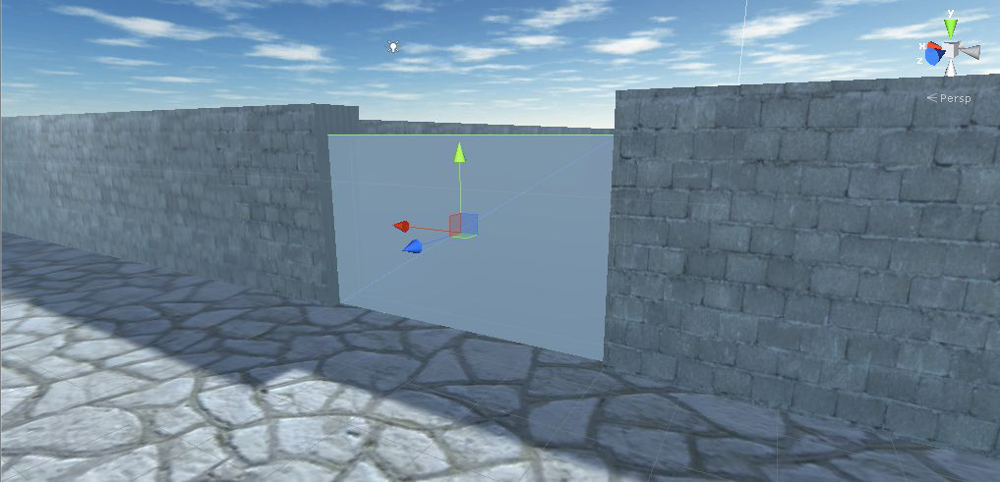
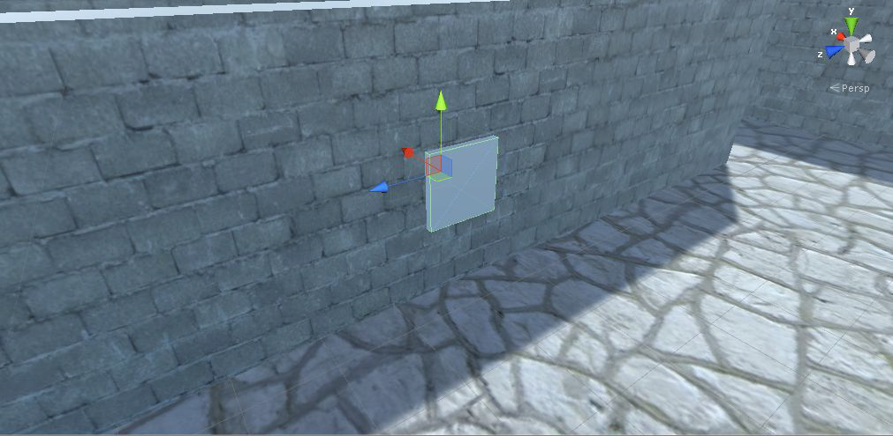
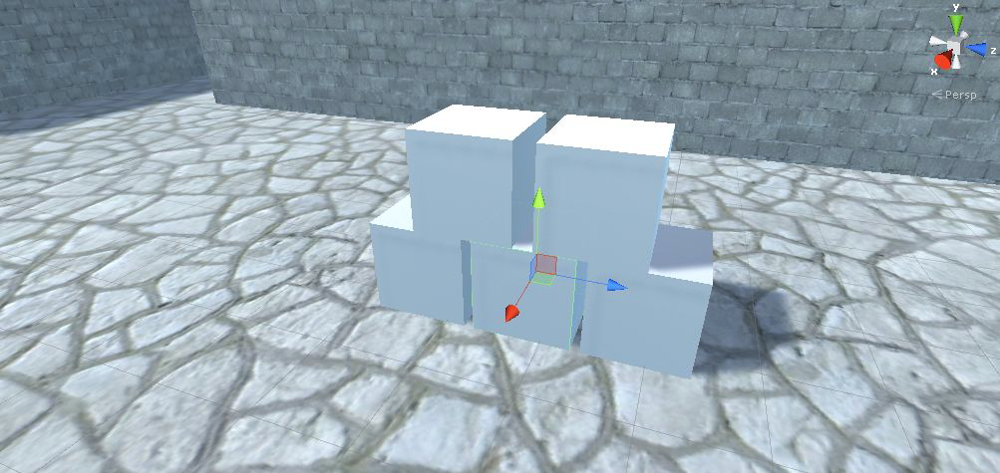
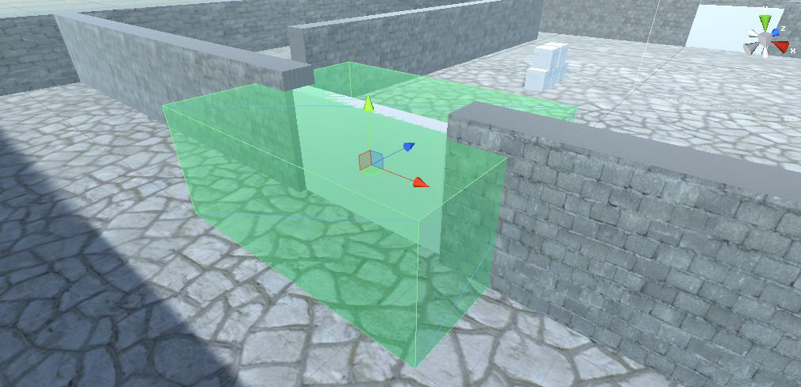

Con questo laboratorio, penseremo alla programmazione di porte che il giocatore può aprire, all'abilitazione delle simulazioni fisiche per rompere una pila di scatole e all'aggiunta di elementi interattivi al tuo gioco.

## Come creare oggetti funzionali
L'implementazione di elementi funzionali è il prossimo argomento su cui ci concentreremo. Durante questa lezione imparerai come creare oggetti funzionali come le porte. Inizieremo esplorando gli oggetti che vengono azionati premendo i tasti dal giocatore. Successivamente, scriverai il codice per rilevare quando il giocatore si scontra con oggetti nel livello, consentendo interazioni come spingere oggetti in giro.

## Dispositivi interattivi
Implementeremo un paio di esempi e quindi dovresti essere in grado di adattare questo stesso codice per funzionare con tutti gli altri elementi. Il primo tipo di dispositivo che programmeremo è una porta che si apre e si chiude e inizieremo con l'azionamento della porta premendo un tasto.

Ci sono molti tipi diversi di dispositivi che potresti avere in un gioco e molti modi diversi di utilizzare questi dispositivi, ma le porte sono gli oggetti interattivi più comuni che si trovano nei giochi e l'utilizzo di oggetti premendo un tasto è l'approccio più lineare per iniziare.

## Creazione di porte
La scena ha alcuni punti in cui esiste uno spazio vuoto tra i muri, quindi posiziona un nuovo oggetto che blocchi lo spazio. Ho creato un nuovo oggetto cubo e quindi ho impostato la sua trasformazione su *Position* 2.5, 1.5, 17 e *Scale* 5, 3, 0.5. Nel mio progetto questi valori funzionano bene, ma puoi creare la tua porta partendo da un cubo. Chiama questo nuovo oggetto *Door*.



Crea uno script, chiamalo *DoorOpenDevice* e metti quello script sull'oggetto porta: la prima variabile definisce l'offset che viene applicato all'apertura della porta. La porta sposterà questo importo quando si apre, quindi sottrarrà questo importo quando si chiude. La seconda variabile è un booleano privato per monitorare se la porta è aperta o chiusa.
```csharp
using UnityEngine;
using System.Collections;

public class DoorOpenDevice : MonoBehaviour {
    [SerializeField] private Vector3 dPos;
    private bool _open;
    ...
```
Nel metodo *Operate()*, la trasformazione dell'oggetto viene impostata su una nuova posizione, aggiungendo o sottraendo l'offset a seconda che la porta sia già aperta.
```csharp
    ...
    public void Operate() {
        if (_open) {
            Vector3 pos = transform.position - dPos;
            transform.position = pos;
        } else {
            Vector3 pos = transform.position + dPos;
            transform.position = pos;
        }
        _open = !_open;
    } // Operate
    ...
```
Come con altre variabili serializzate, *dPos* appare nell'*Inspector*. Ma questo è un valore di *Vector3*, quindi invece di una casella di input ce ne sono tre, tutte sotto lo stesso nome di variabile. Digitare la posizione relativa della porta quando si apre. Ho deciso di far scorrere la porta verso il basso per aprirsi, quindi l'offset era 0, -2.9, 0.

## Apri (e chiudi) la porta
Ora un altro script deve chiamare *Operate()* per aprire e chiudere la porta. Non abbiamo ancora quell'altro script sul lettore. Quindi crea un nuovo script e chiamalo *DeviceOperator*, questo script implementerà una chiave di controllo che aziona i dispositivi vicini.

Prima di tutto dobbiamo definire una variabile di raggio, per rilevare tutti gli oggetti vicini al giocatore e per stabilire un valore per quanto lontano azionare i dispositivi.
```csharp
using UnityEngine;
using System.Collections;

public class DeviceOperator : MonoBehaviour {
    public float radius = 1.5f;
    ...
```

Nella funzione *Update()*, cerca l'input da tastiera questa volta useremo *Fire2* (che è definito nelle impostazioni di input del progetto come il tasto *Alt sinistro*).
```csharp
    ...
    void Update() {
        if (Input.GetButtonDown("Fire2")) {
            Collider[] hitColliders = Physics.OverlapSphere(transform.position, radius);
            foreach (Collider hitCollider in hitColliders) {
                hitCollider.SendMessage("Operate", SendMessageOptions.DontRequireReceiver);
            }
        }
    } // Update
    ...
```
Il metodo *OverlapSphere()* restituisce un array di tutti gli oggetti che si trovano entro una data distanza da una data posizione: passando nella posizione del giocatore e la variabile raggio, questo rileva tutti gli oggetti vicini al giocatore. Ciò che effettivamente fai con questo script può variare, in questa situazione vogliamo provare a chiamare *Operate()* su tutti gli oggetti vicini.

Quel metodo viene chiamato tramite *SendMessage()* invece della tipica notazione del punto, il motivo per usare *SendMessage()* è perché non conosciamo il tipo esatto dell'oggetto target e quel comando funziona su tutti i GameObjects: questa volta andiamo per passare l'opzione *DontRequireReceiver* al metodo. Questo perché la maggior parte degli oggetti restituiti da *OverlapSphere()* non hanno un metodo *Operate()*.

Ora puoi allegare questo script all'oggetto giocatore, quindi puoi iniziare ad aprire e chiudere la porta premendo il tasto *Alt*.

Attualmente la porta può essere aperta a seconda che il giocatore sia abbastanza vicino, non importa quale oggetto il giocatore stia affrontando: possiamo **regolare lo script per azionare i dispositivi che il giocatore sta affrontando**.

Ricorda *Vector3.Dot()*, applicato su una coppia di vettori, restituisce un intervallo compreso tra -1 e 1, dove 1 significa che puntano esattamente nella stessa direzione e -1 quando puntano esattamente nella direzione opposta. Useremo il prodotto scalare con il vettore di direzione, ottenuto sottraendo la posizione del giocatore dalla posizione dell'oggetto, e la direzione in avanti del giocatore. Quando il prodotto scalare è vicino a 1, significa che i due vettori sono vicini a puntare nella stessa direzione.
```csharp
            ...
            foreach (Collider hitCollider in hitColliders) {
                Vector3 direction = hitCollider.transform.position - transform.position;
                if (Vector3.Dot(transform.forward, direction) > .5f) {
                    hitCollider.SendMessage("Operate", SendMessageOptions.DontRequireReceiver);
                }
            }
            ...
```

## Utilizzo di altri dispositivi
Lo stesso approccio utilizzato per azionare la porta può essere utilizzato con qualsiasi tipo di oggetto. Creiamo un altro esempio. Ora creeremo un display che cambia colore sul muro. Crea un nuovo cubo e posizionalo in modo che un lato sporga dal muro: nel mio progetto posiziono il mio cubo, chiamato *display*, con *Position* 10.9, 1.5, -5. Puoi posizionare il cubo ovunque nella scena, il risultato per ottenerlo è mostrato nella figura seguente.



Ora crea un nuovo script chiamato *ColorChangeDevice* e allega quello script al nuovo oggetto *Display*: prima di tutto dichiara un metodo con lo stesso nome dello script della porta, *Operate*. Questo è il nome della funzione utilizzata dallo script dell'operatore del dispositivo, quindi è necessario utilizzare quel nome per essere attivato.
```csharp
using UnityEngine;
using System.Collections;

public class ColorChangeDevice : MonoBehaviour {
    public void Operate() {
    }
}
```
All'interno del metodo *Operate* assegneremo un colore casuale al materiale dell'oggetto: ricordiamo che **il colore non è una proprietà dell'oggetto ma una proprietà del materiale collegato al renderer del nostro oggetto**. Definendo il nostro metodo *Operate* come mostrato di seguito, il nostro *display* cambierà colore ogni volta che interagiamo con esso.
```csharp
    ...
    public void Operate() {
        Color random = new Color(Random.Range(0f,1f), Random.Range(0f,1f), Random.Range(0f,1f));
        GetComponent<Renderer>().material.color = random;
    }
    ...
```

## Oggetti che interagiscono colpendoli
Nei paragrafi precedenti, gli oggetti venivano azionati dalla tastiera del giocatore, ma questo non è l'unico modo in cui i giocatori possono interagire con gli oggetti nel livello. Un altro approccio molto lineare è rispondere alle collisioni con il giocatore.
Unity gestisce la maggior parte di questo per te, avendo il rilevamento delle collisioni e la fisica integrati nel motore di gioco. Unity rileverà le collisioni per te, ma devi comunque programmare l'oggetto per rispondere.

Per iniziare, creeremo una pila di scatole e poi faremo crollare la pila quando il giocatore ci si imbatterà. Per impostazione predefinita, Unity non usa la sua simulazione fisica per spostare gli oggetti. Ciò può essere abilitato aggiungendo un componente *Rigidbody* all'oggetto. Come spiegato nelle lezioni precedenti (le palle di fuoco hanno un corpo rigido) il sistema fisico di Unity agirà solo su oggetti che hanno una componente *Rigidbody*.

Crea un nuovo oggetto cubo e quindi aggiungi un componente *Rigidbody*. Crea altri quattro cubi, copiando il primo, e posizionali in una pila, utilizzando le seguenti posizioni:
- *Cube 1*: -4.2, 0.5, -2.3;
- *Cube 2*: -4.2, 0.5, -1.2;
- *Cube 3*: -4.2, 0.5, -0.1;
- *Cube 4*: -4.2, 1.5, -1.8;
- *Cube 5*: -4.2, 1.5, -0.6.

Il risultato dovrebbe essere come lo stack mostrato nella figura seguente.



Le scatole sono ora pronte per reagire alle forze fisiche. Per fare in modo che il giocatore applichi una forza alle scatole, fai una piccola aggiunta nel nostro script *FPSInput*.
```csharp
    ...
    public float pushForce = 6.0f;
    ...
    void OnControllerColliderHit(ControllerColliderHit hit) {
        Rigidbody body = hit.collider.attachedRigidbody;
        if (body != null && !body.isKinematic) {
            body.velocity = hit.moveDirection * pushForce;
        }
    }
    ...
```

## Azionare la porta
Mentre in precedenza la porta era azionata premendo un tasto, questa volta la porta si aprirà e si chiuderà in risposta alla collisione del personaggio con un altro oggetto nella scena.
Crea un'altra porta e posizionala in un'altra fessura nel muro: duplico la porta precedente e spostato la nuova porta in posizione *-2.5, 1.5, -17*. Puoi posizionare quest'altra porta dove preferisci.

Creare anche un nuovo cubo, chiamato *DoorTrigger*, da utilizzare per l'oggetto trigger e selezionare la proprietà *IsTrigger*, nel componente collider, e poi le seguenti:
- imposta l'oggetto sul livello *Ignore Raycast* (angolo in alto a destra);
- disattiva la proiezione dell'ombra da questo oggetto, puoi trovare questa impostazione nel componente *Mesh Renderer*;
- impostare la posizione su *-2,5, 1,5, -17* (come la porta);
- impostare la scala su *7.5, 3, 6*;
- assegna a questo oggetto un materiale semitrasparente per distinguere i volumi trigger dagli oggetti solidi. Per fare ciò crea un nuovo materiale con una modalità di rendering "Transparent", quindi seleziona un colore verde con un valore alfa basso;
- trascina questo materiale dalla vista *Project* sull'oggetto *DoorTrigger*.



Quando utilizziamo oggetti trigger, in genere, è necessario aggiungere un componente *Rigidbody*. Questa volta *Rigidbody* non era necessario perché l'innesco avrebbe risposto al giocatore perché il giocatore ha il *CharacterController* collegato.

Gioca ora e puoi muoverti liberamente attraverso l'oggetto trigger. Unity registra già le collisioni con l'oggetto, ma queste collisioni non influiscono ancora sul gioco.

Per reagire alle collisioni, abbiamo bisogno di un nuovo script, vogliamo che questo trigger controlli la porta, quindi crea un nuovo script chiamato *DeviceTrigger*. La prima riga definisce un array di oggetti target per il trigger, perché è possibile avere più dispositivi controllati da un singolo trigger.
```csharp
using UnityEngine;
using System.Collections;

public class DeviceTrigger : MonoBehaviour {
    [SerializeField] private GameObject[] targets;
    ...
```
All'interno dei metodi *OnTriggerEnter()* e *OnTriggerExit()* scorre l'array di destinazioni per inviare un messaggio a tutte le destinazioni. Ora dobbiamo definire le funzioni *Activate()* e *Deactivate()* sulla porta.
```csharp
    ...
    void OnTriggerEnter(Collider other) {
        foreach (GameObject target in targets) {
            target.SendMessage("Activate");
        }
    }
    void OnTriggerExit(Collider other) {
        foreach (GameObject target in targets) {
            target.SendMessage("Deactivate");
        }
    }
    ...
```
Ora nello script *DoorOpenDevice* dobbiamo definire le funzioni *Activate()* e *Deactivate()*.
```csharp
    ...
    public void Activate() {
        if (!_open) {
            Vector3 pos = transform.position + dPos;
            transform.position = pos;
            _open = true;
        }
    }
    public void Deactivate() {
        if (_open) {
            Vector3 pos = transform.position - dPos;
            transform.position = pos;
            _open = false;
        }
    }
    ...
```
Metti lo script *DeviceTrigger* sull'oggetto *DoorTrigger* e quindi collega la porta alla proprietà target di quello script.
In *Inspector*, imposta prima la dimensione dell'array, quindi trascina gli oggetti dalla vista *Hierarchy* nello slot nell'array di destinazioni. Abbiamo solo una porta che vogliamo controllare con questo trigger, digita 1 nel campo *Size* dell'array e quindi trascina quella porta nello slot di destinazione.

## Apri le porte in modo fluido
Finora abbiamo applicato una nuova posizione alla porta aperta. Ma vogliamo vedere un'animazione durante l'apertura delle porte. Creiamo un nuovo script chiamato *DoorOpenAnimated*, questo script sarà allegato al nostro oggetto porte.

Innanzitutto definisci le variabili di cui abbiamo bisogno per raggiungere il nostro obiettivo.
```csharp
using UnityEngine;
using System.Collections;

public class DoorOpenAnimated : MonoBehaviour {
    [SerializeField] private Vector3 dPos;
    
    private Vector3 _closePos;
    private Vector3 _openPos;
    
    private bool _open;
    private bool _doorIsMoving;
    ...
```
Quindi usa *Start()* per memorizzare la posizione delle nostre porte, perché abbiamo bisogno di conoscere la posizione dell'oggetto quando la porta è chiusa o aperta.
```csharp
    ...
    void Start () {
        _closePos = transform.position;
        _openPos = _closePos + dPos;
    }
    ...
```
Per ricevere il *SendMessage()* anche qui, come nello script *DoorOpenDevice*, dobbiamo definire le nostre funzioni *Operate()*, *Activate()* e *Deactivate()*.
```csharp
    ...
    public void Operate() {
        if (!_open) {
            if (!_doorIsMoving) {
                _doorIsMoving = true;
            } else {
                _open = true;
            }
        } else {
            if (!_doorIsMoving) {
                _doorIsMoving = true;
            } else {
                _open = false;
            }
        }
    }
    ...
    public void Activate() {
        if (!_open) {
            _doorIsMoving = true;
        } else if (_doorIsMoving) {
            _open = false;
        }
    }
    ...
    public void Deactivate() {
        if (_open) {
            _doorIsMoving = true;
        } else if (_doorIsMoving) {
            _open = true;
        }
    }
    ...
```
Quindi in *Update()* chiamiamo il nostro metodo *doorAnimation()*.
```csharp
    ...
    void Update () {
        if (_doorIsMoving) { doorAnimation (); }
    }
    ...
```
Infine possiamo definire il metodo base del nostro script, *doorAnimation()*.
```csharp
    ...
    void doorAnimation (){
        if (!_open) {
            if (transform.position != _openPos) {
                transform.position = Vector3.Lerp (transform.position, _openPos, 3f * Time.deltaTime);
            } else {
                _doorIsMoving = false;
                _open = true;
            }
        } else {
            if (transform.position != _closePos) {
                transform.position = Vector3.Lerp (transform.position, _closePos, 3f * Time.deltaTime);
            } else {
                _doorIsMoving = false;
                _open = false;
            }
        }
    }
    ...
```
Il nostro nuovo script DoorOpenAnimated è stato completato. Ora possiamo allegare questo script all'oggetto porte.

Per poter utilizzare questo nuovo script è necessario rimuovere il vecchio DoorOpenDevice: puoi anche disattivare lo script ma continuerà a ricevere il messaggio di invio.

Quindi abbiamo due possibili soluzioni:
- rimuovi il vecchio script;
- disattiva il vecchio script e aggiungi alle funzioni *Operate()*, *Activate()* e *Deactivate()* il *if (enabled)* come mostrato di seguito: 
```csharp
    public void Operate (){
        if (enabled) {
            ... // utilizzare lo stesso approccio per Activate e Deactivate 
        }
    }
```
