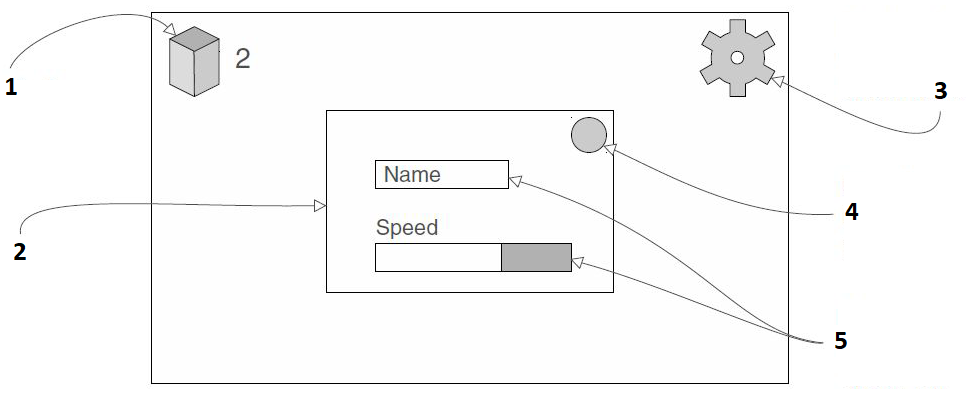
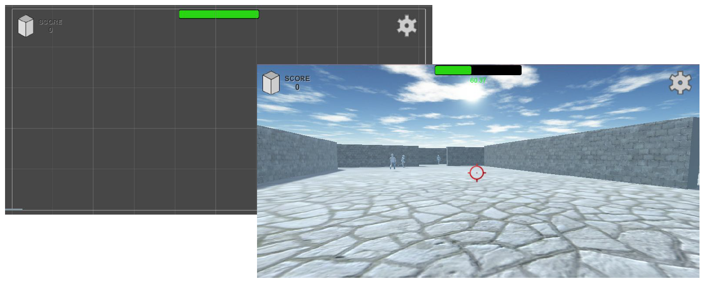
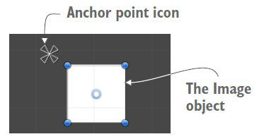
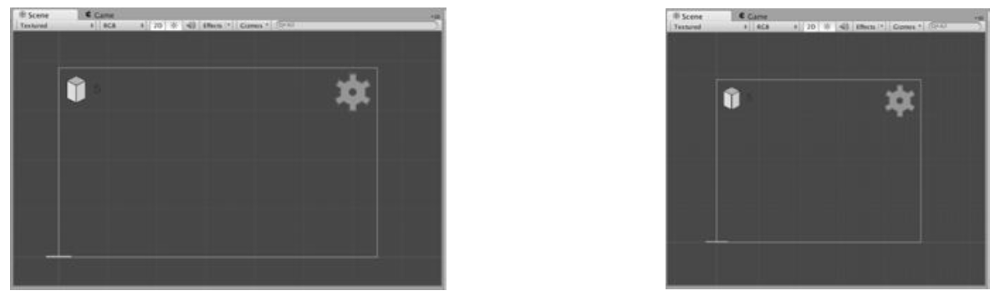
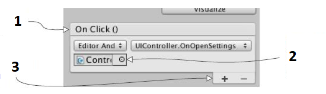

Con questo laboratorio, penseremo al posizionamento degli elementi dell'interfaccia utente utilizzando i punti di ancoraggio e all'aggiunta di interattività all'interfaccia utente.

## La nostra interfaccia utente pianificata
L'oggetto *Canvas* definisce un'area da visualizzare come interfaccia utente, ma richiede comunque *Sprite* da visualizzare. Se fai riferimento all'interfaccia utente pianificata, c'è un'immagine del "nemico" nell'angolo in alto a sinistra, il testo che mostra il punteggio accanto a quello e un pulsante a forma di ingranaggio nell'angolo in alto a destra.



1. visualizzazione del punteggio, con un'immagine e un testo;
2. finestra pop-up al centro dello schermo. Aprire con il pulsante dell'ingranaggio;
3. pulsante delle impostazioni, apre la finestra pop-up quando si fa clic;
4. pulsante chiudi, chiude la finestra pop-up;
5. controlli di input, input di testo per il nome, slider per la velocità;

## Posizionamento degli elementi dell'interfaccia utente

Iniziamo a posizionare i nostri elementi dell'interfaccia utente! Crea un'*Image UI*, un *Button* e un *Text*. Quindi scegli una posizione per l'oggetto dell'interfaccia utente nella *Canvas*.

Attacca gli *Sprite* alla proprietà *Source Image* dell'immagine del nemico e al pulsante dell'ingranaggio: cura l'aspetto sia dell'immagine del nemico che del pulsante dell'ingranaggio utilizzando la proprietà "imposta dimensione nativa".

Posiziona una *Text UI* per *ScoreText* e un'altra per *ScoreLabel*: aggiungi alla tua *Text UI* un componente effetto ombra.



## Controllo della posizione
Tutti gli oggetti dell'interfaccia utente hanno un *anchor*, visualizzata nell'editor come una X di destinazione. Un *anchor (ancora)* è un modo flessibile per posizionare gli oggetti nell'interfaccia utente.

L'*anchor* di un oggetto è il punto in cui un oggetto si attacca alla tela. Determina rispetto a cosa viene misurata la posizione di quell'oggetto. Ad esempio, la posizione dell'immagine X è 50 pixel... ma 50 pixel da cosa?

Lo scopo di un'*anchor* è che mentre l'oggetto rimane in posizione rispetto al punto di ancoraggio, l'*anchor* si sposta rispetto al *Canvas*.

Per impostazione predefinita, gli elementi dell'interfaccia utente hanno il loro ancoraggio impostato su *Center*, ma vuoi impostare l'ancora su *Top Left* a sinistra per questa immagine e *Top Right* per il pulsante a forma di ingranaggio.



Grazie agli *anchor*, gli oggetti dell'interfaccia utente rimarranno nei loro angoli mentre la tela cambia dimensione.



## Interattività di programmazione
Tutta la configurazione visiva è completata, quindi è il momento di programmare l'interattività.

Prima di poter interagire con l'interfaccia utente, è necessario disporre di un cursore del mouse. Se ricordi, questo gioco ha regolato le impostazioni del cursore nel metodo *Start()* del codice *RayShooter*.

Queste impostazioni bloccano e nascondono il cursore del mouse, un comportamento che funziona per i controlli in un gioco FPS ma che interferisce con l'interfaccia utente. Puoi commentare quelle righe da *RayShooter.cs* in modo da poter fare clic sull'HUD.

Puoi anche assicurarti di non sparare mentre interagisci con la GUI usando *IsPointerOverGameObject()*, una funzione *EventSystems*, nello script *Rayshooter.cs*:

```csharp
// includere framework di codice di sistema dell'interfaccia utente
using UnityEngine.EventSystems;
...
void Update() {
    if(Input.GetMouseButtonDown(0) && !EventSystem.current.IsPointerOverGameObject()) {
        Vector3 point = new Vector3(camera.pixelWidth/2, camera.pixelHeight/2, 0);
    }
}
```
Ora puoi giocare e fare clic sul pulsante, anche se non fa ancora nulla. Puoi guardare la colorazione del pulsante cambiare mentre fai clic con il mouse. Questo comportamento del clic è una tinta predefinita che può essere modificata per ciascun pulsante, ma per ora l'impostazione predefinita sembra a posto. Potresti accelerare il comportamento di dissolvenza predefinito: ade Duration è un'impostazione nel componente del pulsante, quindi prova a ridurlo a 0,01 per vedere come cambia il pulsante.

## UIController
L'interazione dell'interfaccia utente è programmata con una serie standard di passaggi uguali per tutti gli elementi dell'interfaccia utente:
- crea un oggetto dell'interfaccia utente nella scena (il pulsante creato nelle diapositive precedenti);
- scrivere uno script da chiamare quando si utilizza l'interfaccia utente;
- allega lo script a un oggetto nella scena;
- collegare gli elementi dell'interfaccia utente (come i pulsanti) all'oggetto con quello script.

Per seguire questi passaggi, dobbiamo prima creare un oggetto controller da collegare al pulsante. Crea uno script chiamato *UIController* e trascinalo sull'oggetto controller nella scena inserendo questo codice:
```csharp
using UnityEngine;
// importa il framework del codice dell'interfaccia utente
using UnityEngine.UI;
using System.Collections;

public class FPSCounter : MonoBehaviour {
    // fare riferimento all'oggetto Testo nella scena per impostare la proprieta' del testo
    [SerializeField] private Text scoreLabel;
    
    void Update() {
        scoreLabel.text = Time.realtimeSinceStartup.ToString()
    }
    
    public void OnOpenSettings() {
        // metodo chiamato dal pulsante delle impostazioni
        Debug.Log("Open settings");
    }
}
```
Ora trascina gli oggetti negli slot dei componenti. Trascina l'etichetta della partitura (l'oggetto di testo che abbiamo creato in precedenza) nello slot di testo di *UIController*. Il codice in *UIController* imposta il testo visualizzato su quell'etichetta: attualmente il codice visualizza un timer per testare la visualizzazione del testo che verrà modificato in seguito al punteggio.

Quindi, aggiungi una voce *OnClick* al pulsante e trascina l'oggetto controller: seleziona il pulsante per vedere le sue impostazioni nell'*Inspector*. Verso il basso dovresti vedere un pannello *OnClick*; inizialmente quel pannello è vuoto, ma puoi fare clic sul pulsante *+* per aggiungere una voce.

Ogni voce definisce una singola funzione che viene chiamata quando si fa clic su quel pulsante; l'elenco ha sia uno slot per un oggetto che un menu per la funzione da chiamare: trascina l'oggetto controller nello slot dell'oggetto, quindi cerca *UIController* nel menu; seleziona *OnOpenSettings()* in quella sezione.



1. pannello degli eventi *OnClick* vicino alla parte inferiore delle *Impostazioni*;
2. trascina un oggetto nella scena nello slot dell'oggetto, quindi scegli una funzione nel menu;
3. premere il pulsante *+* per aggiungere una voce nel pannello.

Gioca e fai clic sul pulsante per visualizzare i messaggi di debug nella console. Ora il codice è attualmente un output casuale per testare la funzionalità del pulsante. Quello che vogliamo fare è aprire un pop-up delle impostazioni, quindi creiamo quella finestra pop-up.

## Creazione di una finestra pop-up
Sarà un nuovo oggetto immagine, insieme a diversi controlli (come pulsanti e cursori) collegati a quell'oggetto. Il primo passo è creare una nuova immagine, quindi scegli *GameObject -> UI -> Image*. Proprio come prima, la nuova immagine ha uno slot nell'*Inspector* chiamato *Source Image* che dovremmo utilizzare nel seguente modo:
- trascina uno *Sprite* in quello slot per impostare questa immagine;
- lo *Sprite* viene esteso sull'intero oggetto immagine, fai clic sul pulsante *Set Native Size* per ridimensionare l'oggetto alle dimensioni dell'immagine;
- il componente immagine ha un'impostazione *Image Type*. Questa impostazione predefinita è *Simple*. Per il popup, imposta *Image Type* su *Sliced*.

## Immagine affettata
**Un'immagine affettata viene suddivisa in nove sezioni che si ridimensionano in modo diverso** l'una dall'altra. Ridimensionando i bordi dell'immagine separatamente dal centro, ti assicuri che l'immagine possa ridimensionarsi a qualsiasi dimensione desideri mantenendo i bordi nitidi e nitidi: dopo essere passati a un'immagine tagliata, Unity potrebbe visualizzare un errore nelle impostazioni del componente, perché l'immagine non ha un bordo. Questo perché lo sprite popup non ha ancora definito le nove sezioni. Per configurarlo, seleziona prima lo sprite popup nella vista *Project*. Nell'*Inspector* dovresti vedere un pulsante *Sprite Editor*, fai clic su quel pulsante e apparirà la finestra *Sprite Editor*.

## Modifica Sprite
Nello *Sprite Editor* puoi vedere delle linee verdi che indicano come l'immagine verrà tagliata. Inizialmente l'immagine non avrà alcun bordo (ovvero, tutte le impostazioni del bordo sono 0). Aumenta la larghezza del bordo di tutti e quattro i lati a 12 pixel, le linee del bordo si sovrapporranno in nove sezioni. Chiudi la finestra dell'editor e applica le modifiche.

Ora che lo sprite ha le nove sezioni definite, l'immagine affettata funzionerà correttamente. Le sezioni del bordo manterranno le loro dimensioni mentre la porzione centrale viene ridimensionata: poiché le sezioni del bordo mantengono le loro dimensioni, un'immagine tagliata può essere ridimensionata a qualsiasi dimensione e avere ancora bordi chiari. Per questo pop-up, inserisci una larghezza di 250 e un'altezza di 200.

## Script SettingsPopup
L'oggetto pop-up è ora configurato, quindi scrivi del codice per esso. Crea uno script chiamato SettingsPopup e trascinalo sull'oggetto popup.
```csharp
using UnityEngine;
using System.Collections;

public class SettingsPopup : MonoBehaviour {
    public void Open() {
        // accendere l'oggetto per aprire la finestra
        gameObject.SetActive(true);
    }

    public void OnOpenSettings() {
        // disattivare questo oggetto per chiudere la finestra
        gameObject.SetActive(false);
    }
}
```
Apri UIController.cs per apportare alcune modifiche:
```csharp
...
[SerializeField] private SettingsPopup settingsPopup;
    
void Start() {
    // chiudi il pop-up all'avvio del gioco
    settingsPopup.Close();
}
...
public void OnOpenSettings() {
    // sostituire il testo di debug con il metodo pop-up
    settingsPopup.Open();
}
...
```
Trascina il pop-up su *UIController*. Ora il pop-up verrà inizialmente chiuso quando giochi e si aprirà quando fai clic sul pulsante delle impostazioni. Al momento non c'è modo di richiuderlo, quindi aggiungi un pulsante di chiusura al popup: i passaggi sono gli stessi del pulsante creato in precedenza.

Aggiungi questi metodi a *SettingsPopup.cs*:
```csharp
...
public void OnSubmitName(string name) {
    // questo si attivera' quando l'utente digita nel campo di input
    Debug.Log(name);
}
public void OnSpeedValue(float speed) {
    // questo si attivera' quando l'utente regola il cursore
    Debug.Log("Speed: " + speed);
}
...
```

## Pulsante *Chiudi*
Scegli *GameObject -> UI -> Pulsante*, posiziona il nuovo pulsante nell'angolo in alto a destra del popup, trascina lo *Sprite* "chiudi" sulla proprietà *Source Image* di questo elemento dell'interfaccia utente, quindi fai clic su *Set Native Size* per ridimensionare correttamente l'immagine.

A differenza del pulsante precedente, in realtà vogliamo l'etichetta del testo, quindi seleziona il testo e digita *Chiudi* nel campo di testo e imposta *Colore* su bianco.

Nella vista *Hierarchy*, trascina questo pulsante sull'oggetto a comparsa in modo che sia figlio della finestra a comparsa. E regola la transizione del pulsante su un valore di *Fade Duration* di 0,01 e un'impostazione *Colore* normale più scura di 110, 110, 110, 255.

Per fare in modo che il pulsante chiuda il pop-up, è necessaria una voce *OnClick*; fai clic sul pulsante + nel pannello *OnClick* del pulsante, trascina la finestra a comparsa nello slot dell'oggetto e scegli *Close()* dall'elenco delle funzioni.
Ora gioca e questo pulsante chiuderà la finestra pop-up.

La finestra pop-up è stata aggiunta all'HUD. La finestra è attualmente vuota, quindi aggiungiamo alcuni controlli:
- i controlli di input di cui abbiamo bisogno sono un dispositivo di scorrimento e un campo di testo e ci sarà un'etichetta di testo statica per identificare il dispositivo di scorrimento. Scegli *GameObject -> UI -> Text* per creare l'oggetto di testo, *GameObject -> UI -> InputField* per creare il campo di testo e *GameObject -> UI -> Slider* per creare l'oggetto slider;
- imposta il testo su *Speed* in modo che possa essere un'etichetta per il dispositivo di scorrimento;
- impostare il *Slider Max Value* su 2, anziché su 1.

## Imposta il pannello degli eventi
Partendo dal campo di input, nelle impostazioni vedrai un pannello *End Edit*; gli eventi elencati qui vengono attivati quando l'utente finisce di digitare. Aggiungi una voce a questo pannello, trascina il pop-up nello slot dell'oggetto e scegli *OnSubmitName()* nell'elenco delle funzioni: assicurati di selezionare la funzione nella sezione superiore del pannello *End Edit*, *Dynamic String*, e non nella sezione inferiore, *Static Parameters*.

Segui questi stessi passaggi per il dispositivo di scorrimento. Fare clic su *+* per aggiungere una voce, trascinare nel menu a comparsa delle impostazioni e scegliere *OnSpeedValue()* nell'elenco delle funzioni di valore dinamico.

## Crea un nuovo obiettivo *Cursor*

Il nostro mirino ora è sempre in primo piano: dobbiamo risolvere questo problema utilizzando le nostre nuove conoscenze. Creiamo un nuovo mirino aggiungendolo al canvas:
- possiamo usare la stessa immagine ma dobbiamo importarla come *Sprite*;
- quindi aggiungi al centro del canvas una nuova interfaccia utente immagine;
- rimuovere l'*OnGUI()* in cui disegniamo il nostro mirino nello script *RayShooter*.
