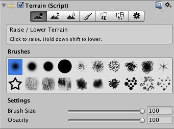

Con questo laboratorio, penseremo all'introduzione del sistema di navigazione Unity e alla presentazione di *Terrain Engine*.

## Introduzione
Il sistema di navigazione ti consente di creare personaggi che possono muoversi in modo intelligente nel mondo di gioco, utilizzando mesh di navigazione create automaticamente dalla geometria della tua scena. Il sistema Unity NavMesh è costituito dai seguenti pezzi:
- **NavMesh**;
- **NavMesh Agent**;
- **Off-Mesh Link**;
- **NavMesh Obstacle**.

### NavMesh
Il componente **NavMesh** (abbreviazione di *Navigation Mesh*) è una struttura che descrive le superfici percorribili del mondo di gioco e consente di trovare il percorso da una posizione percorribile all'altra nel mondo di gioco. La struttura dei dati viene creata automaticamente dalla geometria del tuo livello.

### NavMesh Agent
Il componente **NavMesh Agent** ti aiuta a creare personaggi che si evitano a vicenda mentre si muovono verso il loro obiettivo. Gli agenti ragionano sul mondo di gioco usando *NavMesh* e sanno come evitare gli ostacoli.

### Off-Mesh Link
Il componente *Off-Mesh Link* consente di incorporare scorciatoie di navigazione che non possono essere rappresentate utilizzando una superficie calpestabile. Ad esempio, saltare un fossato o una recinzione.

### NavMesh Obstacle
Il componente **NavMesh Obstacle** consente di descrivere gli ostacoli in movimento che gli agenti dovrebbero evitare durante la navigazione nel mondo. Mentre l'ostacolo si sta muovendo, gli agenti fanno del loro meglio per evitarlo, ma una volta che l'ostacolo è fermo, creerà un buco nella *NavMesh* in modo che gli agenti possano cambiare percorso per aggirarlo, o se l'ostacolo stazionario sta bloccando il nodo del percorso, gli agenti possono trovare un percorso diverso.

## Aree calpestabili
Le **aree calpestabili** definiscono i luoghi della scena in cui l'agente può sostare e muoversi. In Unity gli agenti sono descritti come cilindri. L'area percorribile viene costruita automaticamente dalla geometria nella scena testando le posizioni in cui l'agente può sostare. Quindi le posizioni sono collegate a una superficie che si trova sopra la geometria della scena. Questa superficie è chiamata *mesh di navigazione* (*NavMesh*)

## Percorso e ostacoli
La sequenza di poligoni che descrivono il percorso dall'inizio al poligono di destinazione è chiamata corridoio. L'agente raggiungerà la destinazione dirigendosi sempre verso il prossimo angolo visibile del corridoio.

Quando un ostacolo è in movimento, è meglio gestirlo utilizzando l'evitamento degli ostacoli locali. In questo modo l'agente può predittivamente evitare l'ostacolo. Quando l'ostacolo diventa stazionario e può essere considerato come un blocco del percorso di tutti gli agenti, gli ostacoli dovrebbero influenzare la navigazione globale.

## Costruire un *NavMesh*
Il processo di creazione di un *NavMesh* dalla geometria del livello è chiamato **NavMesh Baking**. Il processo raccoglie le mesh di rendering e i terreni di tutti gli oggetti di gioco contrassegnati come statici di navigazione, quindi li elabora per creare una mesh di navigazione che si avvicina alle superfici percorribili del livello.
In Unity, la generazione di *NavMesh* viene gestita dalla finestra di navigazione (menu: *Window -> AI -> Navigation*).

La creazione di un *NavMesh* per la tua scena può essere eseguita in 4 rapidi passaggi:
- *seleziona la geometria della scena che dovrebbe influenzare la navigazione* (superfici percorribili e ostacoli);
- *selezionare *Navigation Static* per includere gli oggetti selezionati nel processo di creazione* *NavMesh*;
- *regolare le impostazioni in base alle dimensioni dell'agente*: 
    - *Agent Radius* definisce quanto vicino il centro agenti può arrivare a un muro;
    - *Agent Height* definisce quanto sono bassi gli spazi che l'agente può raggiungere;
    - *Max Slope* definisce quanto sono ripide le rampe che l'agente percorre;
    - *Step Height* definisce l'altezza degli ostacoli che l'agente può calpestare.
 
Il *NavMesh* risultante verrà mostrato nella scena come una sovrapposizione blu sulla geometria del livello.

Al termine della creazione, troverai un file di risorse *NavMesh* all'interno di una cartella con lo stesso nome della scena.

Le impostazioni di build avanzate dell'area della regione minima consentono di eliminare piccole regioni *NavMesh* non connesse. La dimensione manuale del *voxel* ti consente di modificare la precisione con cui funziona il processo di completamento: se il tuo livello ha molti punti ristretti, potresti voler aumentare la precisione riducendo il *voxel*.

## Utilizzo di un NavMesh Angent
Una volta che hai preparato un *NavMesh* per il tuo livello, è tempo di creare un personaggio in grado di navigare nella scena. Questa operazione viene eseguita utilizzando un componente *NavMesh Agent* e un semplice script. Di seguito vengono mostrati alcuni esempi di codice per implementare attività comuni nella navigazione.

È possibile dire a un agente di iniziare a calcolare un percorso semplicemente impostando la proprietà *NavMeshAgent.destination* con il punto in cui si desidera che l'agente si sposti.

```csharp
using UnityEngine;

public class MoveDestination : MonoBehaviour {
    public Transform goal;
    void Start () {
        NavMeshAgent agent = GetComponent<NavMeshAgent>();
        agent.destination = goal.position;
    }
}
```
Questo script di esempio consente di scegliere il punto di destinazione su *NavMesh* facendo clic con il mouse sulla superficie dell'oggetto.

```csharp
using UnityEngine;

public class MoveToClickPoint : MonoBehaviour {
    NavMeshAgent agent;
    void Start() {
        agent = GetComponent<NavMeshAgent>();
    }
    void Update() {
        if (Input.GetMouseButtonDown(0)) {
            RaycastHit hit;
            if (Physics.Raycast(Camera.main.ScreenPointToRay(Input.mousePosition), out hit, 100)) {
                agent.destination = hit.point;
            }
        }
    }
}
```
Molti giochi presentano NPC che pattugliano automaticamente l'area di gioco.
I punti di perlustrazione vengono forniti allo script utilizzando un array pubblico di trasformazioni. Questa matrice può essere assegnata dall'ispettore utilizzando *GameObjects* per contrassegnare le posizioni dei punti. La funzione *GotoNextPoint* imposta il punto di destinazione per l'agente e quindi seleziona la nuova destinazione che verrà utilizzata alla chiamata successiva.
Nella funzione *Update*, lo script controlla quanto è vicino l'agente alla destinazione utilizzando la proprietà *RestantDistance*. Quando questa distanza è molto piccola, viene effettuata una chiamata a *GotoNextPoint* per avviare il punto di ricognizione successivo.

```csharp
using UnityEngine;
using System.Collections;

public class Patrol : MonoBehaviour {
    public Transform[] points;
    private int destPoint = 0;
    private NavMeshAgent agent;
    void Start () {
        agent = GetComponent<NavMeshAgent>();
        // la disabilitazione della frenata automatica consente un movimento continuo tra i punti
        agent.autoBraking = false;
        GotoNextPoint();
    }
    void GotoNextPoint() {
        // restituisce se non sono stati impostati punti
        if (points.Length == 0)
            return;
        // imposta l'agente per andare alla destinazione attualmente selezionata
        agent.destination = points[destPoint].position;
        // scegli il punto successivo nell'array come destinazione
        destPoint = (destPoint + 1) % points.Length;
    }
    void Update () {
        // scegli il prossimo punto di destinazione quando l'agente si avvicina a quello attuale.
        if (agent.remainingDistance < 0.5f)
            GotoNextPoint();
    }
}
```

## Utilizzo di un NavMesh Obstacle
I componenti **NavMesh Obstacle** possono essere utilizzati per descrivere gli ostacoli che gli agenti dovrebbero evitare durante la navigazione. Gli *NavMesh Obstacle* possono essere utilizzati per influenzare la navigazione dell'agente durante il gioco in due modi: **obstructing**, quando il carving non è attivato, oppure **carving**, quando il carving è attivato.

## Utilizzo di un Off-Mesh Link
I **Off-Mesh Link** vengono utilizzati per creare percorsi che si incrociano all'esterno della superficie della mesh di navigazione percorribile.
Se il percorso attraverso il collegamento fuori rete è più breve rispetto al percorso a piedi lungo il *Navmesh*, verrà utilizzato il collegamento fuori rete.
Il processo di cottura di *NavMesh* è in grado di rilevare e creare automaticamente collegamenti a scorrimento e a discesa comuni, come spiegato nella diapositiva successiva.

Alcuni casi d'uso per i collegamenti fuori rete possono essere rilevati automaticamente. I due più comuni sono: *Drop-Down* e *Jump-Across*. Questo viene fatto selezionando l'opzione *Generate Off-Mesh Links* nella finestra di navigazione nella scheda *Objects*.

La proprietà della mesh di altezza ti consente di posizionare il tuo personaggio in modo più accurato sulle superfici calpestabili. Durante la navigazione, l'*NavMesh Agent* è vincolato alla superficie di *NavMesh*: se il gioco richiede un posizionamento accurato dell'agente, è necessario abilitare la costruzione della maglia di altezza quando si esegue la cottura di *NavMesh*. L'impostazione può essere trovata nelle *Advanced settings* nella finestra di navigazione. Nota che la costruzione di *Height Mesh* richiederà un po' più di tempo per cuocere *NavMesh*.

## Aree di navigazione e costi
Le aree di navigazione definiscono quanto sia difficile attraversare un'area specifica, le aree a basso costo saranno preferite durante la ricerca del percorso. Inoltre, ciascun agente *NavMesh* dispone di una maschera di area che può essere utilizzata per specificare su quali aree può spostarsi l'agente.

Il tipo di area può essere assegnato a ogni oggetto incluso nella cottura *NavMesh*. Ciascun agente dispone di una maschera di area che descrive quali aree può utilizzare durante la navigazione. La maschera dell'area può essere impostata nelle proprietà dell'agente: la maschera dell'area è utile quando si desidera che solo alcuni tipi di caratteri possano attraversare un'area.

## Terrain Engine
Il **Terrain system** di Unity ti consente di aggiungere vasti paesaggi ai tuoi giochi. In fase di esecuzione, il rendering del terreno è altamente ottimizzato per l'efficienza del rendering, mentre nell'editor è disponibile una selezione di strumenti per rendere i terreni facili e veloci da creare.

### Creazione di terreni
Puoi aggiungere un oggetto terreno alla tua scena selezionando *GameObject -> 3D Object -> Terrain* dal menu: se guardi l'*Inspector* quando l'oggetto terreno è selezionato, vedrai che fornisce una serie di strumenti che puoi usare per creare qualsiasi caratteristica del paesaggio.



Gli strumenti sulla barra degli strumenti forniscono una serie di "pennelli": il terreno viene creato "dipingendo" i dettagli sul paesaggio. Se selezioni lo strumento sulla barra (*Raise/Lower Terrain*) e muovi il mouse sul terreno nella vista *Scene*, vedrai un cursore sulla superficie. Quando fai clic con il mouse, puoi dipingere cambiamenti graduali di altezza sul paesaggio nella posizione del mouse. Selezionando diverse opzioni dalla barra degli strumenti *Brushes*, puoi dipingere con forme diverse. Le opzioni *Brush Size* e *Opacity* variano rispettivamente l'area del pennello e la forza del suo effetto.

## Height Tools
Gli strumenti principali nel menu del terreno vengono utilizzati per dipingere i cambiamenti di altezza sul terreno:
- **Raise/Lower Height tool:** quando dipingi con questo strumento, l'altezza verrà aumentata spostando il mouse sul terreno. L'altezza si accumulerà se tieni il mouse in un punto. Se tieni premuto il tasto Maiusc, l'altezza verrà abbassata;
- **Set Height:** è simile allo strumento Raise/Lower, tranne per il fatto che ha una proprietà aggiuntiva per impostare l'altezza del target. Quando dipingi sull'oggetto, il terreno verrà abbassato nelle aree sopra quell'altezza e sollevato nelle aree sotto di essa;
- **Altezza liscia:** non alza o abbassa in modo significativo l'altezza del terreno, ma piuttosto fa una media nelle aree vicine.

## Lavorare con le heightmap
L'altezza di ogni punto sul terreno è rappresentata come un valore utilizzando un'immagine in scala di grigi nota come **heightmap**. A volte è utile lavorare su un'immagine di heightmap in un editor esterno, come *Photoshop*, o ottenere heightmap geografiche esistenti da utilizzare nel tuo gioco.
Unity offre la possibilità di importare ed esportare mappe di altezza per un terreno; se fai clic sullo strumento Impostazioni troverai i pulsanti etichettati *Import RAW* ed *Export RAW*.

## Aggiunta textures
Puoi aggiungere immagini di *texture* alla superficie di un terreno per creare colorazioni e dettagli fini. Poiché i terreni sono oggetti così grandi, è pratica standard utilizzare una trama che si ripeta senza interruzioni e piastrellarla sulla superficie.
Una *texture* fungerà da immagine di "sfondo" sul paesaggio, ma puoi anche dipingere aree con *texture* diverse per simulare diverse superfici del terreno come erba, deserto e neve. Le *texture* dipinte possono essere applicate con trasparenza variabile in modo da poter avere una transizione graduale tra le trame.

## Texture Painting
La prima texture che aggiungi verrà utilizzata come *background* per coprire il terreno. Tuttavia, puoi aggiungere tutte le textures che desideri; i successivi saranno disponibili per la pittura utilizzando i familiari strumenti del pennello.

## Alberi
Le *macchie* di alberi possono essere dipinte su un terreno più o meno allo stesso modo in cui vengono dipinte le mappe di altezza e le trame, ma gli alberi sono solidi oggetti 3D che crescono dalla superficie. Unity utilizza le ottimizzazioni per mantenere buone prestazioni di rendering, così puoi avere foreste fitte con migliaia di alberi e mantenere comunque un framerate accettabile.

Il pulsante albero sulla barra degli strumenti abilita la pittura ad albero.
Inizialmente, il terreno non avrà alberi disponibili, ma se fai clic sul pulsante *Edit Trees* e seleziona *Add Tree* vedrai una finestra per selezionare una risorsa albero dal tuo progetto.
Con un albero selezionato, puoi dipingere sul paesaggio nello stesso modo in cui dipingi trame o heightmap. L'opzione *Brush Size* è disponibile per la pittura ad albero, ma la proprietà *Opacity* è sostituita da *Tree Density*, che controlla il numero medio di alberi dipinti in una determinata unità di area.
C'è un cursore a distanza per controllare l'altezza minima e l'altezza massima dell'albero.
Il pulsante *Mass Place Trees* è un modo molto utile per creare una copertura generale degli alberi senza dipingere l'intero paesaggio.

## Wind Zone
Puoi creare l'effetto del vento sul tuo terreno aggiungendo uno o più oggetti con i componenti **Wind Zone**. Gli alberi all'interno di una *Wind Zone* si piegheranno in un modo animato realistico e il vento stesso si muoverà a impulsi per creare schemi naturali di movimento tra gli alberi.
È possibile creare direttamente un oggetto *Wind Zone* oppure aggiungere il componente a un oggetto nella scena.
La modalità può essere impostata su **Directional** o **Spherical**. In modalità *Directional*, il vento influenzerà l'intero terreno contemporaneamente mentre un vento sferico soffia verso l'esterno all'interno di una sfera definita dalla proprietà *Radius}.

## Altri dettagli
Un terreno può avere ciuffi d'erba e altri piccoli oggetti come rocce che ne ricoprono la superficie. L'erba viene renderizzata utilizzando immagini 2D per rappresentare i singoli grumi mentre altri dettagli vengono generati utilizzando oggetti mesh 3D.
