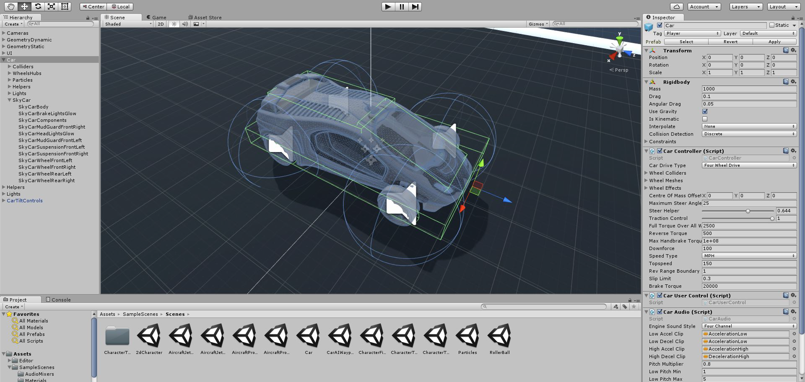
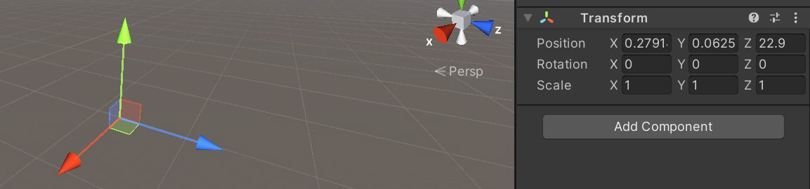
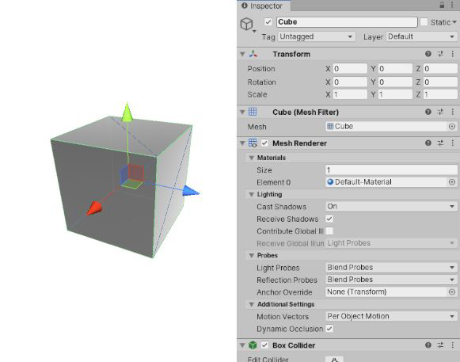
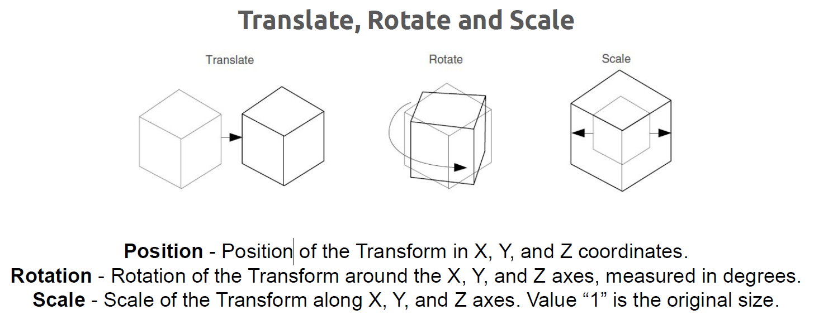
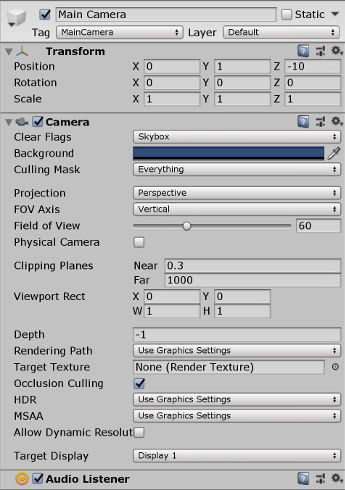
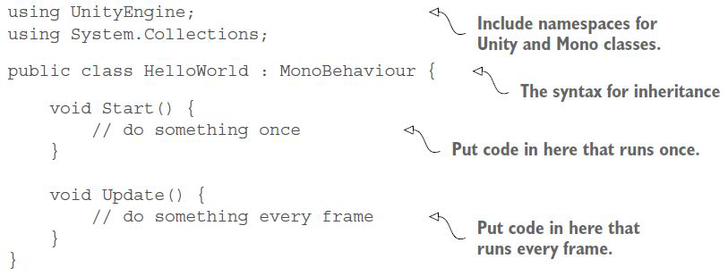
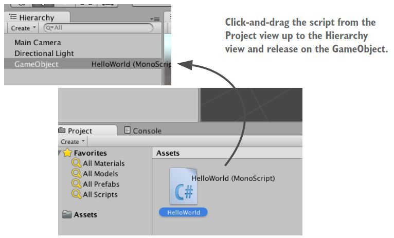
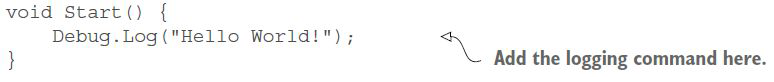

**Unity3D** è spesso rappresentato semplicemente come un elenco di funzionalità senza necessità di programmazione e questa è una visione fuorviante!
*Per ottenere risultati significativi è necessaria una programmazione rigorosa.* Ci sono numerosi giochi creati con Unity3D che hanno vinto dei premi come Fall Guys, Pokémon Unite oppure Call of Duty Mobile.

Unity3D è un motore di gioco di qualità professionale utilizzato per creare videogiochi o applicazioni interattive 3D destinate a una varietà di piattaforme. È uno **strumento di sviluppo professionale** utilizzato quotidianamente da migliaia di sviluppatori esperti, è anche uno degli strumenti moderni più accessibili per gli sviluppatori alle prime armi. *Il flusso di lavoro di sviluppo in Unity utilizza un sofisticato editor visivo.*

L'**editor** viene utilizzato per disporre le scene del gioco e per collegare insieme risorse artistiche e codice in oggetti interattivi. Unity3D è **multipiattaforma** in termini di obiettivi di distribuzione ed è multipiattaforma in termini di strumenti di sviluppo. Un altro vantaggio deriva dal **sistema di componenti** modulari utilizzato per creare oggetti di gioco.

## Interfaccia
L'interfaccia in Unity è suddivisa in diverse sezioni:

- la **barra degli strumenti** fornisce l'accesso alle funzioni di lavoro più essenziali. Sulla sinistra contiene gli strumenti di base per manipolare la vista *Scene* e i *GameObjects* al suo interno. Al centro ci sono i controlli di riproduzione/pausa;
- la **finestra Hierarchy (gerarchia)** è una rappresentazione testuale gerarchica di ogni *GameObject* nella scena. Ogni elemento nella scena ha una voce nella gerarchia. La gerarchia rivela la struttura genitoriale tra *GameObjects*. La Hierarchy collega gli oggetti di gruppo insieme, raggruppandoli visivamente come cartelle e consentendo di spostare l'intero gruppo di oggetti;
- la **vista Game** simula l'aspetto finale del tuo gioco renderizzato attraverso le tue Scene Camera. Quando si fa clic sul pulsante *Riproduci*, la simulazione inizia a spostare lo stato attivo dell'applicazione direttamente nella vista di gioco. Mentre il gioco è in esecuzione, puoi tornare alla vista *Scene*, che ti consente di ispezionare gli oggetti nella scena in esecuzione;
- la **vista Scene** ti consente di navigare visivamente e modificare la tua scena. La vista *Scene* può mostrare una prospettiva 3D o 2D, a seconda del tipo di *Project* su cui stai lavorando. Tutti gli oggetti sono visibili attraverso la vista *Scene* e possono essere spostati e manipolati;
- la **finestra Inspector** ti consente di visualizzare e modificare tutte le proprietà del *GameObject* attualmente selezionato. Poiché diversi tipi di *GameObject* hanno componenti diversi con diversi insiemi di proprietà, il layout e il contenuto della finestra dell'*Inspector* cambiano ogni volta che selezioni un *GameObject* diverso;
- la *finestra Project* mostra la tua libreria di risorse disponibili per l'uso nel tuo progetto. Quando importi le risorse nel tuo progetto, vengono visualizzate qui. Sulla sinistra abbiamo un elenco delle cartelle del progetto.

Il layout dell'interfaccia che stai vedendo ora è solo il layout predefinito in Unity. Tutte le varie viste sono in schede e possono essere spostate o ridimensionate, agganciandosi in diversi punti dello schermo.

Il funzionamento di Unity viene eseguito tramite mouse e tastiera, ma per un principiante non è ovvio come vengono utilizzati mouse e tastiera in Unity. Il tipo più semplice di input da mouse e tastiera è navigare all'interno della scena e guardare gli oggetti 3D tramite le azioni **Move**, **Orbit** e **Zoom**:
- **Move:** fare clic/trascinare il pulsante centrale;
- **Orbit:** tieni premuto *Alt+clic sinistro/trascina*;
- **Zoom:** tieni premuto *Alt+clic con il tasto destro/trascina*.

## GameObjects
**Il GameObject è il concetto più importante nell'editor di Unity.** Ogni oggetto nel tuo gioco è un *GameObject*, dai personaggi e oggetti collezionabili a luci, telecamere ed effetti speciali. Un *GameObject* non può fare nulla da solo, fungono da contenitori per i *Components*.

### Oggetto vuoto
**Un *GameObject* ha sempre un componente *Transform* collegato.** Gli altri componenti che conferiscono all'oggetto la sua funzionalità possono essere aggiunti dal menu *Component* dell'editor o da uno script.

### Cubo

Un oggetto cubo solido ha un componente **Mesh Filter** e **Mesh Renderer**, per disegnare la superficie del cubo, e un componente **Box Collider** per rappresentare il volume dei soldi dell'oggetto in termini di fisica.
Per nascondere graficamente l'oggetto, basta disattivare il *Mesh Renderer* mentre, per nascondere completamente l'oggetto, bisogna disattivare anche il *Box Collider*.

## Altri oggetti
Unity può funzionare con modelli 3D di qualsiasi forma che possono essere creati con un software di modellazione. Tuttavia, ci sono anche un certo numero di tipi di oggetti primitivi che possono essere creati direttamente all'interno di Unity: **Cube, Sphere, Capsule, Cylinder, Plane e Quad**.
Questi oggetti possono essere utilizzati in diversi modi e offrono una soluzione rapida per creare segnaposto e prototipi a scopo di test durante lo sviluppo.

## Components
**I *Component* definiscono il comportamento di quel *GameObject*.** Puoi interagire con i componenti direttamente nell'*Editor* o tramite script.

### Transform
Ogni *GameObject* in Unity ha un componente *Transform*. Questo componente definisce la **posizione**, la **rotazione** e la **scala** di *GameObject* nel mondo di gioco e nella vista *Scene*.

**Non è possibile rimuovere questo componente.** Il componente Trasforma abilita anche il concetto di **genitorialità**, che ti consente di rendere un *GameObject* figlio di un altro *GameObject* e controllarne la posizione tramite il componente *Transform* del genitore.

Quando selezioni un oggetto nella scena, puoi spostarlo, ruotare l'oggetto o ridimensionare quanto vuoi. Puoi passare da una funzione all'altra premendo W, E o R sulla tastiera (usando il **Transform gizmo**).

### Main Camera
Ogni nuova scena inizia, per impostazione predefinita, con un GameObject chiamato MainCamera. Questo GameObject è configurato per fungere da fotocamera principale nel tuo gioco. Contiene il componente Transform, il componente Camera (contentente il FOV, Field of View) e un Audio Listener per raccogliere l'audio nell'applicazione.

### Script
Quando crei uno script, per **aggiungere le tue funzionalità** e lo alleghi a un *GameObject*, lo script appare nell'*Inspector* di *GameObject* proprio come un componente integrato perché **qualsiasi script che crei viene compilato come un tipo di componente**.

## Parenting
Quando un *GameObject* è **padre** di un altro *GameObject*, il *GameObject* **figlio** si sposterà, ruoterà e ridimensionerà esattamente come fa il suo genitore. 

*Puoi pensare alla genitorialità come alla relazione tra le tue braccia e il tuo corpo, ogni volta che il tuo corpo si muove, anche le tue braccia si muovono insieme ad esso. Gli oggetti figlio possono anche avere figli propri e così via. Quindi le tue mani potrebbero essere considerate come "figli" delle tue braccia.*

**Qualsiasi oggetto può avere più figli, ma solo un genitore.** Questi livelli multipli di relazioni padre-figlio formano una **gerarchia di trasformazione**.

## Coordinate locali e globali
I valori di Trasformazione (posizione, rotazione e valori di scala) nell'*Inspector* per qualsiasi *GameObject* figlio vengono visualizzati **in relazione ai valori di Transform del genitore**.

Questi valori sono indicati come **coordinate locali**. *La posizione del tuo corpo può muoversi mentre cammini, ma le tue braccia saranno ancora attaccate nella stessa posizione relativa.*

Se la trasformazione non ha un genitore, le proprietà vengono misurate nello **spazio globale** (o **coordinate globali**).

## MonoBehaviour
La classe **MonoBehaviour** è la classe base da cui deriva ogni script Unity, per impostazione predefinita. Quando crei uno script C# dalla finestra del progetto Unity, eredita automaticamente da *MonoBehaviour*, fornendoti uno script modello.
La classe *MonoBehaviour* ti consente di allegare il tuo script a un *GameObject* nell'editor e fornisce anche l'accesso a un'ampia raccolta di messaggi di evento, che ti consente di eseguire il tuo codice in base a ciò che sta accadendo nel tuo progetto.

La classe *MonoBehaviour* prevede dei metodi predefiniti:
- **Start:** chiamato quando il *GameObject* inizia ad esistere;
- **Update:** chiamato ad ogni fotogramma;
- **FixedUpdate:** chiamato ad ogni passo temporale fisico;
- **OnBecameVisible** e **OnBecameInvisible:** chiamato quando un renderer *GameObject* entra o esce da una visuale della telecamera;
- **OnCollisionEnter** e **OnTriggerEnter:** chiamato quando si verificano collisioni fisiche o trigger;
- **OnDestroy:** chiamato quando il *GameObject* viene distrutto.

### Creare uno script
Quando creiamo un nuovo script, questo è ciò che contiene il file:

### Eseguire uno script
Abbiamo uno script vuoto nel progetto, ma hai anche bisogno di un oggetto nella scena per allegare lo script. 
Crea un *GameObject* "vuoto" e apparirà nell'elenco *Hierarchy*, quindi allega lo script nel *GameObject* vuoto come componente. Selezionando l'oggetto vedremo nell'*Inspector* due componenti: *Transform* e il nostro script. Ora, quando riproduciamo la scena, lo script verrà eseguito.

### Stampare nella console

Modifica lo script e inserisci in *Start()* un *Debug.Log("")* per stampare un messaggio nella vista *Console* in Unity3D.
Premi il pulsante *Play* e vedremo il messaggio nella vista *Console*.

### Errori dello script
I messaggi di errore vengono visualizzati nella scheda *Console* con un'icona di errore rossa
